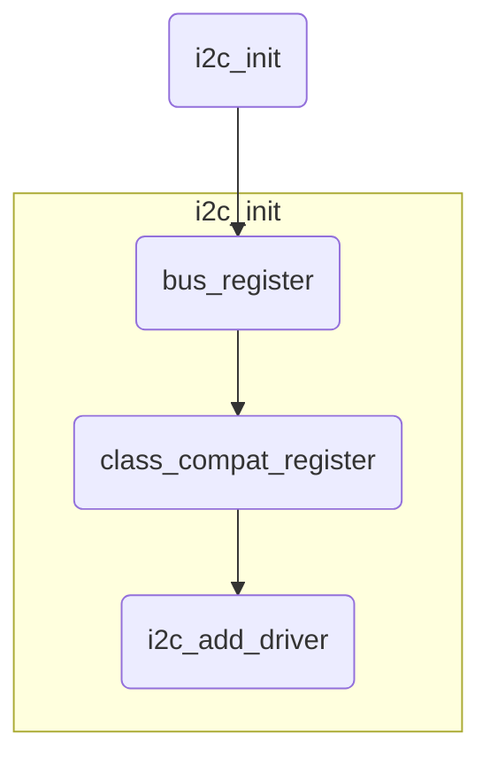
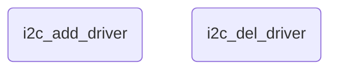
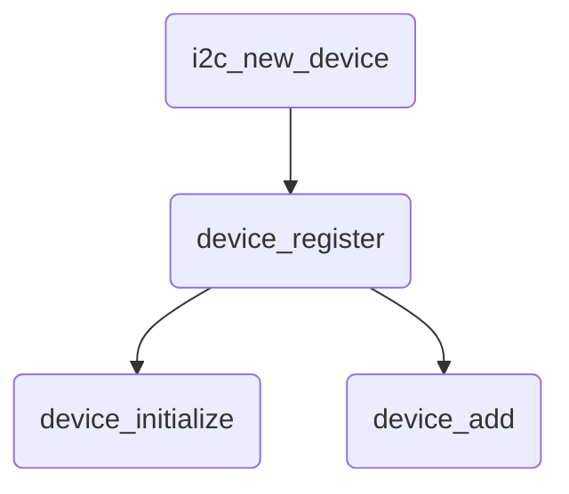
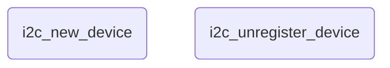
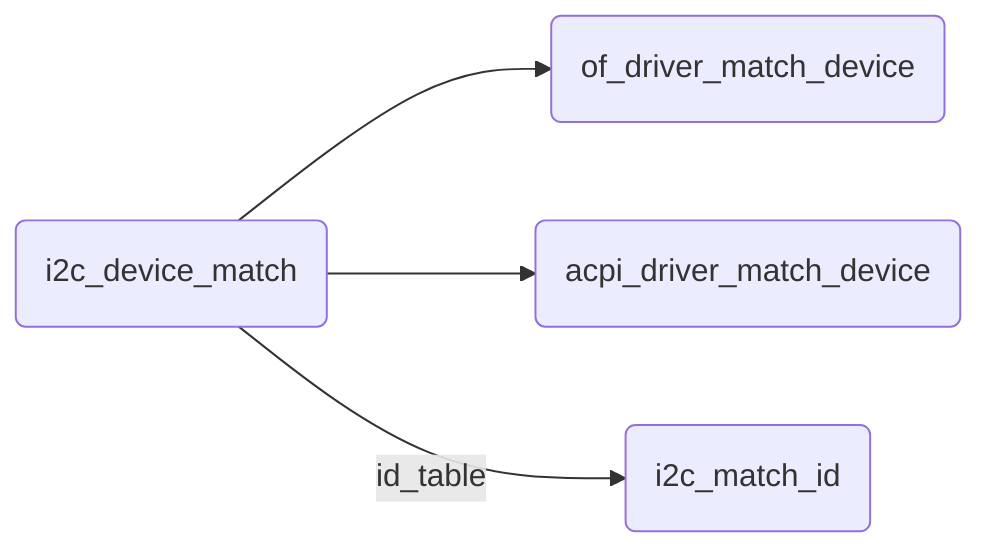
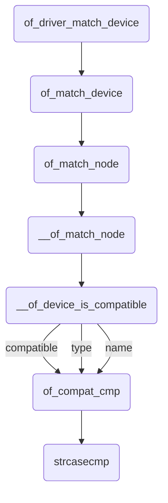

## Linux kernel中的I2C子系统


### 目录

[TOC]

Linux内核中的I2C驱动代码位于：drivers/i2c目录；


### 0. 简述


Linux内核中的I2C驱动代码位于：drivers/i2c目录；

Linux设备模型由bus、device、driver组成；


I2C驱动中有4个重要内容：I2C总线、I2C设备、I2C驱动、I2C适配器；

> I2C总线：维护I2C驱动和I2C设备两个链表，管理I2C驱动和I2C设备的匹配、删除等；
>
> I2C设备：具体硬件设备的一个抽象；
>
> I2C驱动：对应I2C设备的驱动程序；
>
> I2C适配器：用于I2C驱动和I2C设备间通信，是SOC上I2C控制器的一个抽象；


I2C总线上有两个链表，分别是i2c_driver和i2c_client链表；当任何一个driver或client注册时，I2C总线都会调用match函数，对client.name和driver.id_table.name进行遍历匹配；如果driver.id_table中所有的id都匹配不成功，说明client没有找到对应的driver；如果匹配成功，说明client和driver是配套的，那么I2C总线就会调用自己的probe函数，然后probe函数调用driver中提供的probe函数，driver中的probe函数会对设备进行硬件初始化和后续工作；


i2c_add_adapter	// 注册adapter

i2c_add_driver		// 注册driver

i2c_new_device		// 注册client


### 1. I2C驱动框架


Linux的I2C体系结构分为3个部分：

I2C核心

I2C总线驱动

I2C设备驱动


#### 1. I2C核心


I2C核心（i2c_core）维护了i2c_bus结构体，提供了：

> I2C总线驱动和设备驱动的注册、注销方法
>
> I2C的通信方法（i2c_algorithm）
>
> 上层的与具体适配器无关的代码
>
> 探测设备、检测设备地址的上层代码

此部分代码由Linux内核提供；


#### 2. I2C总线驱动


I2C总线驱动是对I2C硬件体系结构中适配器端的实现，适配器由CPU控制，或者直接集成在CPU内部；


I2C总线驱动主要包含：

> I2C适配器数据结构i2c_adapter
>
> I2C适配器的控制算法数据结构i2c_algorithm
>
> 控制I2C适配器产生通信信号的函数

通过I2C总线驱动代码，可以控制I2C适配器，以主设备方式产生开始位、停止位、读写周期，以及以从设备方式读写、产生ACK等；

此部分代码由具体的芯片厂商提供，如：高通、Samsung等；


#### 3. I2C设备驱动


I2C设备驱动是对I2C硬件体系结构中设备端的实现，设备一般挂接在I2C控制器（适配器）上，通过I2C适配器与CPU交换数据；

I2C设备驱动主要包含i2c_client和i2c_driver结构体，实现和用户交互的文件操作集fops、cdev等；

这两个数据结构中的成员函数，需要由驱动开发者根据具体设备去实现；


### 2. 核心数据结构


I2C驱动中最核心的4个数据结构：

> struct i2c_client
>
> struct i2c_driver
>
> struct i2c_adapter
>
> struct i2c_algorithm


#### 2.1 设备层


##### 2.1.1 I2C设备（i2c_client）

硬件上连接到I2C的SDA、SCL总线上的设备都是I2C设备，每一个I2C设备由一个i2c_client结构体进行描述；i2c_client对应真实的I2C物理设备，是具体硬件设备的抽象；一个i2c_client对象，表示连接到i2c总线的一个设备；


```
// include/linux/i2c.h
struct i2c_client {
    unsigned short flags;       /* div., see below      */
    unsigned short addr;        /* chip address - NOTE: 7bit    */
    char name[I2C_NAME_SIZE];
    struct i2c_adapter *adapter;    /* the adapter we sit on    */
    struct device dev;      /* the device structure     */
    int irq;            /* irq issued by device     */
    struct list_head detected;
#if IS_ENABLED(CONFIG_I2C_SLAVE)
    i2c_slave_cb_t slave_cb;    /* callback for slave mode  */
#endif
};
```

> unsigned short addr：表示7bit的设备芯片地址，地址被保存在低7bits
>
> struct i2c_adapter *adapter：表示这个i2c_client从属的i2c_adapter对象，驱动中使用这个指针操作发送
>
> struct device dev：表示device信息
>
> struct list_head detected：设备链表，将所有的i2c_client组成链表


i2c_client结构不是驱动开发者创建的，而是通过以下方式自动创建：

> 分配、设置、注册i2c_board_info
>
> 获取i2c_adapter，调用i2c_new_device
>
> 通过设备树（DeviceTree）创建


##### 2.1.2 I2C驱动（i2c_driver）


i2c_driver结构用于管理I2C的驱动和I2C设备的匹配探测，实现与用户层交互的文件操作集fops、cdev等；每一个I2C设备都对应一个I2C驱动，因此，每一个i2c_client结构，都对应一个i2c_driver结构，通过指针相连；编写一个i2c驱动的本质，就是要构造一个i2c_driver对象，并将其注册到内核；


```
// include/linux/i2c.h
struct i2c_driver {
    unsigned int class;

    int (*attach_adapter)(struct i2c_adapter *) __deprecated;

    /* Standard driver model interfaces */
    int (*probe)(struct i2c_client *, const struct i2c_device_id *); 
    int (*remove)(struct i2c_client *); 

    void (*shutdown)(struct i2c_client *); 
    void (*alert)(struct i2c_client *, enum i2c_alert_protocol protocol,
              unsigned int data);

    int (*command)(struct i2c_client *client, unsigned int cmd, void *arg);

    struct device_driver driver;
    const struct i2c_device_id *id_table;

    /* Device detection callback for automatic device creation */
    int (*detect)(struct i2c_client *, struct i2c_board_info *); 
    const unsigned short *address_list;
    struct list_head clients;
};
```

> probe：探测函数，匹配成功后执行，会将匹配到的i2c_client对象传入，完成申请资源、初始化、提供接口等操作
>
> remove：移除函数，设备消失时或驱动模块被卸载时会被调用，和probe操作相反
>
> struct device_driver driver：表明是一个设备的驱动类，用于匹配设备树的of_match_table域
>
> const struct i2c_device_id *id_table：用于使用平台文件或模块编写设备信息时进行匹配
>
> struct list_head clients：用于将所有i2c_driver联系到一起的链表


```
#define to_i2c_driver(d) container_of(d, struct i2c_driver, driver)
```


#### 2.2 总线层


##### 2.2.1 I2C适配器（i2c_adapter）


I2C适配器，即SOC中的I2C控制器，对应struct i2c_adapter结构体；Linux中用i2c_adapter来表示一个I2C控制器，一个i2c_adapter结构体对应的就是SOC上的I2C控制器；所有的设备驱动都需要经过i2c_adapter对象的处理才能和物理设备通信；通过i2c_core层将I2C设备与i2c adapter关联起来，用来完成i2c总线控制器相关的数据通信，此结构体在芯片厂商提供的代码中维护；


```
// include/linux/i2c.h
struct i2c_adapter {
    struct module *owner;
    unsigned int class;       /* classes to allow probing for */
    const struct i2c_algorithm *algo; /* the algorithm to access the bus */
    void *algo_data;

    /* data fields that are valid for all devices   */
    const struct i2c_lock_operations *lock_ops;
    struct rt_mutex bus_lock;
    struct rt_mutex mux_lock;

    int timeout;            /* in jiffies */
    int retries;
    struct device dev;      /* the adapter device */

    int nr;
    char name[48];
    struct completion dev_released;

    struct mutex userspace_clients_lock;
    struct list_head userspace_clients;

    struct i2c_bus_recovery_info *bus_recovery_info;
    const struct i2c_adapter_quirks *quirks;
};
```


```
#define to_i2c_adapter(d) container_of(d, struct i2c_adapter, dev)
```


##### 2.2.2 I2C总线算法（i2c_algorithm）

I2C总线数据通信算法，通过管理I2C总线控制器，实现对I2C总线上数据的发送和接收等操作；

struct i2c_algorithm数据结构，是i2c控制器数据通信需要的控制算法，对应的是I2C的时序；通过管理I2C总线控制器，实现对I2C总线上数据的发送和接收等操作；用来描述适配器和设备之间的通信方法，由芯片厂商实现；

最重要的成员是master_xfer()函数，这个接口是硬件相关的，操作内容都是I2C控制器的寄存器，最终完成将数据发送到物理I2C控制器；


```
// include/linux/i2c.h
struct i2c_algorithm {
    int (*master_xfer)(struct i2c_adapter *adap, struct i2c_msg *msgs,
               int num);
    int (*smbus_xfer) (struct i2c_adapter *adap, u16 addr,
               unsigned short flags, char read_write,
               u8 command, int size, union i2c_smbus_data *data);

    /* To determine what the adapter supports */
    u32 (*functionality) (struct i2c_adapter *);

#if IS_ENABLED(CONFIG_I2C_SLAVE)
    int (*reg_slave)(struct i2c_client *client);
    int (*unreg_slave)(struct i2c_client *client);
#endif
};
```

> master_xfer：最重要的接口，这个接口是硬件相关的，操作内容都是I2C控制器的寄存器，最终完成将数据发送到物理I2C控制器；该函数返回成功发送的消息数，错误返回负数；


device_driver

```
// include/linux/device.h
struct device_driver {
    const char      *name;
    struct bus_type     *bus;

    struct module       *owner;
    const char      *mod_name;  /* used for built-in modules */

    bool suppress_bind_attrs;   /* disables bind/unbind via sysfs */
    enum probe_type probe_type;

    const struct of_device_id   *of_match_table;
    const struct acpi_device_id *acpi_match_table;

    int (*probe) (struct device *dev);
    int (*remove) (struct device *dev);
    void (*shutdown) (struct device *dev);
    int (*suspend) (struct device *dev, pm_message_t state);
    int (*resume) (struct device *dev);
    const struct attribute_group **groups;

    const struct dev_pm_ops *pm; 

    struct driver_private *p;
};
```


##### 2.2.3 I2C总线类型


I2C总线对应着/bus/目录下的一个总线；维护I2C设备和I2C驱动两个链表，管理I2C设备和I2C的匹配和删除；是SOC上I2C控制器的抽象；


```
// include/linux/device.h
struct bus_type {
    const char      *name;
    const char      *dev_name;
    struct device       *dev_root;
    struct device_attribute *dev_attrs; /* use dev_groups instead */
    const struct attribute_group **bus_groups;
    const struct attribute_group **dev_groups;
    const struct attribute_group **drv_groups;

    int (*match)(struct device *dev, struct device_driver *drv);
    int (*uevent)(struct device *dev, struct kobj_uevent_env *env);
    int (*probe)(struct device *dev);
    int (*remove)(struct device *dev);
    void (*shutdown)(struct device *dev);

    int (*online)(struct device *dev);
    int (*offline)(struct device *dev);

    int (*suspend)(struct device *dev, pm_message_t state);
    int (*resume)(struct device *dev);

    const struct dev_pm_ops *pm; 

    const struct iommu_ops *iommu_ops;

    struct subsys_private *p;
    struct lock_class_key lock_key;
};
```


```
// drivers/i2c/i2c-core.c
struct bus_type i2c_bus_type = {
    .name       = "i2c",
    .match      = i2c_device_match,
    .probe      = i2c_device_probe,
    .remove     = i2c_device_remove,
    .shutdown   = i2c_device_shutdown,
};
EXPORT_SYMBOL_GPL(i2c_bus_type);
```


I2C总线bus_type结构体管理着i2c设备和i2c驱动的匹配、删除操作，i2c会调用i2c_device_match函数对比i2c设备和i2c驱动是否匹配，如果匹配就调用i2c_device_probe函数，进而调用i2c驱动的probe函数；


#### 2.3 总线层和设备层关系


#### 2.4 设备驱动开发步骤


### 3. 重要的操作函数


#### 3.1 I2C子系统初始化


##### 3.1.1 I2C总线初始化


```
// drivers/i2c/i2c-core.c
postcore_initcall(i2c_init);
module_exit(i2c_exit);
```


```
// include/linux/init.h
#define postcore_initcall(fn)       __define_initcall(fn, 2)
```


```
// include/linux/init.h
#define __define_initcall(fn, id) \
    static initcall_t __initcall_##fn##id __used \
    __attribute__((__section__(".initcall" #id ".init"))) = fn;
```

postcore_initcall(i2c_init)操作，会在编译内核时，将函数指针变量__initcall_i2c_init放到名称为initcall2.init的section中；即将i2c_init()函数的首地址放到名称为initcall2.init的section中；

Linux设备启动时，会在do_basic_setup()函数中，通过driver_init()和do_initcalls()函数，调用到i2c_init()函数，对I2C总线初始化；


```
// drivers/i2c/i2c-core.c
struct bus_type i2c_bus_type = {
    .name       = "i2c",
    .match      = i2c_device_match,
    .probe      = i2c_device_probe,
    .remove     = i2c_device_remove,
    .shutdown   = i2c_device_shutdown,
};
EXPORT_SYMBOL_GPL(i2c_bus_type);
```


```
// drivers/i2c/i2c-core.c
static int __init i2c_init(void)
{
	......
    retval = bus_register(&i2c_bus_type);
	......
    i2c_adapter_compat_class = class_compat_register("i2c-adapter");
	......
    retval = i2c_add_driver(&dummy_driver);
	......
}
```


通过bus_register()函数，在系统中注册一个新的总线i2c_bus_type，name: i2c；适配器设备、I2C设备、I2C设备驱动程序都会连接到这条总线上；

通过i2c_add_driver()函数，向I2C总线注册一个空的I2C设备驱动程序；可以不用关心；




注册过程中发生异常错误时，需要使用对应的函数进行反向操作：


##### 3.1.2 I2C总线退出


```
// drivers/i2c/i2c-core.c
static void __exit i2c_exit(void)
{
    if (IS_ENABLED(CONFIG_ACPI))
        WARN_ON(acpi_reconfig_notifier_unregister(&i2c_acpi_notifier));
    if (IS_ENABLED(CONFIG_OF_DYNAMIC))
        WARN_ON(of_reconfig_notifier_unregister(&i2c_of_notifier));
    i2c_del_driver(&dummy_driver);
#ifdef CONFIG_I2C_COMPAT
    class_compat_unregister(i2c_adapter_compat_class);
#endif
    bus_unregister(&i2c_bus_type);
    tracepoint_synchronize_unregister();
}
```


i2c_del_driver()函数，用来从I2C总线注销设备驱动程序；和i2c_add_driver()函数功能相反；




#### 3.2 适配器驱动程序


适配器驱动程序是I2C设备驱动程序需要实现的主要驱动程序，需要根据具体的适配器硬件编写；

i2c_adapter结构体为描述各种I2C适配器提供了通用的封装，但是i2c_adapter结构体只是所有适配器的共有属性，并不能代表所有类型的适配器；


#### 3.3 注册I2C驱动

注册I2C驱动需要完成的操作：

> 将I2C驱动添加到I2C总线的驱动链表中
>
> 遍历I2C总线上的I2C设备链表，根据i2c_device_match函数进行匹配，如果匹配就调用i2c_device_probe函数
>
> i2c_device_probe函数会调用I2C驱动的probe函数


##### 3.3.1 注册I2C驱动

在I2C驱动程序中，通过i2c_add_driver()函数，来注册驱动：

```
// include/linux/i2c.h
#define i2c_add_driver(driver) \
    i2c_register_driver(THIS_MODULE, driver)
```


```
// drivers/i2c/i2c-core.c
int i2c_register_driver(struct module *owner, struct i2c_driver *driver)
{
	......
    /* add the driver to the list of i2c drivers in the driver core */
    driver->driver.owner = owner;
    driver->driver.bus = &i2c_bus_type;		// 绑定I2C总线 
    INIT_LIST_HEAD(&driver->clients);

    res = driver_register(&driver->driver);		// 向I2C总线注册驱动
	......
    i2c_for_each_dev(driver, __process_new_driver);

    return 0;
}
EXPORT_SYMBOL(i2c_register_driver);
```


在i2c_add_driver()函数中，做了三件事：

> 绑定总线
>
> 向总线注册驱动 ---- 重点
>
> 遍历总线的设备，调用__process_new_driver


driver_register

```
// drivers/i2c/i2c-core.c
int driver_register(struct device_driver *drv)
{
    int ret;
    struct device_driver *other;
	......
    other = driver_find(drv->name, drv->bus);
	......
    ret = bus_add_driver(drv);

    ret = driver_add_groups(drv, drv->groups);
    if (ret) {
        bus_remove_driver(drv);
        return ret;
    }
    kobject_uevent(&drv->p->kobj, KOBJ_ADD);

    return ret;
}
EXPORT_SYMBOL_GPL(driver_register);
```


driver_find()函数，在I2C总线中，找到name对应的I2C device_driver；

bus_add_driver()函数，将驱动添加到总线上；


##### 3.3.2 注销I2C驱动

```
// drivers/i2c/i2c-core.c
void i2c_del_driver(struct i2c_driver *driver)
{
    i2c_for_each_dev(driver, __process_removed_driver);

    driver_unregister(&driver->driver);
    pr_debug("driver [%s] unregistered\n", driver->driver.name);
}
EXPORT_SYMBOL(i2c_del_driver);
```


#### 3.4 注册I2C设备

##### 3.4.1 注册I2C设备

I2C通过i2c_new_device()函数，来添加一个I2C设备；

```
// drivers/i2c/i2c-core.c
struct i2c_client *
i2c_new_device(struct i2c_adapter *adap, struct i2c_board_info const *info)
{
    struct i2c_client   *client;
    int         status;

    client = kzalloc(sizeof *client, GFP_KERNEL);

    client->adapter = adap;		// 指定设备的适配器

    client->dev.platform_data = info->platform_data;

    if (info->archdata)
        client->dev.archdata = *info->archdata;

    client->flags = info->flags;
    client->addr = info->addr;
    client->irq = info->irq;

    strlcpy(client->name, info->type, sizeof(client->name));

    status = i2c_check_addr_validity(client->addr, client->flags);

	/* Check for address business */
    status = i2c_check_addr_busy(adap, i2c_encode_flags_to_addr(client));

    client->dev.parent = &client->adapter->dev;
    client->dev.bus = &i2c_bus_type;	// 绑定I2C总线
    client->dev.type = &i2c_client_type;
    client->dev.of_node = info->of_node;
    client->dev.fwnode = info->fwnode;

    i2c_dev_set_name(adap, client);
    status = device_register(&client->dev);		// 向总线注册设备
	......
    return client;
}
EXPORT_SYMBOL_GPL(i2c_new_device);
```


```
// include/linux/i2c.h
struct i2c_board_info {
    char        type[I2C_NAME_SIZE];	// 设备名称，用于与驱动匹配
    unsigned short  flags;
    unsigned short  addr;	// 设备地址
    void        *platform_data;
    struct dev_archdata *archdata;
    struct device_node *of_node;
    struct fwnode_handle *fwnode;
    int     irq;
};
```

struct i2c_board_info结构体描述了设备的硬件信息；


```
// drivers/base/core.c
int device_register(struct device *dev)
{   
    device_initialize(dev);
    return device_add(dev);
}
EXPORT_SYMBOL_GPL(device_register);
```





device_initialize()函数用来初始化I2C设备的device结构体；

```
// drivers/base/core.c
void device_initialize(struct device *dev)
{
    dev->kobj.kset = devices_kset;
    kobject_init(&dev->kobj, &device_ktype);
    INIT_LIST_HEAD(&dev->dma_pools);
    mutex_init(&dev->mutex);
    lockdep_set_novalidate_class(&dev->mutex);
    spin_lock_init(&dev->devres_lock);
    INIT_LIST_HEAD(&dev->devres_head);
    device_pm_init(dev);
    set_dev_node(dev, -1);
#ifdef CONFIG_GENERIC_MSI_IRQ
    INIT_LIST_HEAD(&dev->msi_list);
#endif
}
EXPORT_SYMBOL_GPL(device_initialize);
```


```
int device_add(struct device *dev)
{
    struct device *parent = NULL;
    struct kobject *kobj;
    struct class_interface *class_intf;
    int error = -EINVAL;
    struct kobject *glue_dir = NULL;

    dev = get_device(dev);

    if (!dev->p) {
        error = device_private_init(dev);
        if (error)
            goto done;
    }

    if (dev->init_name) {
        dev_set_name(dev, "%s", dev->init_name);
        dev->init_name = NULL;
    }

    if (!dev_name(dev) && dev->bus && dev->bus->dev_name)
        dev_set_name(dev, "%s%u", dev->bus->dev_name, dev->id);

    parent = get_device(dev->parent);
    kobj = get_device_parent(dev, parent);

    if (kobj)
        dev->kobj.parent = kobj;
    if (parent && (dev_to_node(dev) == NUMA_NO_NODE))
        set_dev_node(dev, dev_to_node(parent));

    error = kobject_add(&dev->kobj, dev->kobj.parent, NULL);

    if (platform_notify)
        platform_notify(dev);

    error = device_create_file(dev, &dev_attr_uevent);

    error = device_add_class_symlinks(dev);

    error = device_add_attrs(dev);

    error = bus_add_device(dev);

    error = dpm_sysfs_add(dev);

    device_pm_add(dev);

    if (MAJOR(dev->devt)) {
        error = device_create_file(dev, &dev_attr_dev);

        error = device_create_sys_dev_entry(dev);

        devtmpfs_create_node(dev);
    }

    if (dev->bus)
        blocking_notifier_call_chain(&dev->bus->p->bus_notifier,
                         BUS_NOTIFY_ADD_DEVICE, dev);

    kobject_uevent(&dev->kobj, KOBJ_ADD);
    bus_probe_device(dev);
    if (parent)
        klist_add_tail(&dev->p->knode_parent,
                   &parent->p->klist_children);

    if (dev->class) {
        mutex_lock(&dev->class->p->mutex);
        klist_add_tail(&dev->knode_class,
                   &dev->class->p->klist_devices);

        list_for_each_entry(class_intf,
                    &dev->class->p->interfaces, node)
            if (class_intf->add_dev)
                class_intf->add_dev(dev, class_intf);
        mutex_unlock(&dev->class->p->mutex);
    }
}
EXPORT_SYMBOL_GPL(device_add);
```


device_addbus_add_devicebus_probe_device


##### 3.4.2 注销I2C设备


```
// drivers/i2c/i2c-core.c
void i2c_unregister_device(struct i2c_client *client)
{
    if (client->dev.of_node)
        of_node_clear_flag(client->dev.of_node, OF_POPULATED);
    if (ACPI_COMPANION(&client->dev))
        acpi_device_clear_enumerated(ACPI_COMPANION(&client->dev));
    device_unregister(&client->dev);
}
EXPORT_SYMBOL_GPL(i2c_unregister_device);
```





#### 3.5 适配器给设备发送数据


##### 3.5.1 i2c_transfer


在I2C设备和I2C驱动匹配之后，驱动程序和设备的通讯，通过i2c_transfer()函数来给设备发送信息；

```
// drivers/i2c/i2c-core.c
int i2c_transfer(struct i2c_adapter *adap, struct i2c_msg *msgs, int num)
{
    int ret;
    if (adap->algo->master_xfer) {
		......
        ret = __i2c_transfer(adap, msgs, num);
		......
}
EXPORT_SYMBOL(i2c_transfer);
```

i2c_transfer()函数是i2c核心提供给设备驱动的发送方法，该函数发送的数据需要被打包成i2c_msg结构，该函数最终会回调i2c_adapter->i2c_algorithm->master_xfer()函数，将i2c_msg对象发送到i2c的物理控制器；

```
// drivers/i2c/i2c-core.c
int __i2c_transfer(struct i2c_adapter *adap, struct i2c_msg *msgs, int num)
{
    unsigned long orig_jiffies;
    int ret, try;

    if (adap->quirks && i2c_check_for_quirks(adap, msgs, num))
        return -EOPNOTSUPP;

    if (static_key_false(&i2c_trace_msg)) {
        int i;
        for (i = 0; i < num; i++)
            if (msgs[i].flags & I2C_M_RD)
                trace_i2c_read(adap, &msgs[i], i);
            else
                trace_i2c_write(adap, &msgs[i], i);
    }

    orig_jiffies = jiffies;
    for (ret = 0, try = 0; try <= adap->retries; try++) {
        ret = adap->algo->master_xfer(adap, msgs, num);		// 发送、接收信息操作
        if (ret != -EAGAIN)
            break;
        if (time_after(jiffies, orig_jiffies + adap->timeout))
            break;
    }
	......
}
EXPORT_SYMBOL(__i2c_transfer);
```

最终，通过adap->algo->master_xfer()函数，将struct i2c_msg消息，通过适配器struct i2c_adapter发送给设备，或者从设备中读取信息；


##### 3.5.2 消息格式


经过mster_xfer()函数发送、接收的消息类型应该按照struct i2c_msg结构体格式：

```
// include/uapi/linux/i2c.h
struct i2c_msg {
    __u16 addr; /* slave address            */
    __u16 flags;
#define I2C_M_RD        0x0001  /* read data, from slave to master */
                    /* I2C_M_RD is guaranteed to be 0x0001! */
#define I2C_M_TEN       0x0010  /* this is a ten bit chip address */
#define I2C_M_RECV_LEN      0x0400  /* length will be first received byte */
#define I2C_M_NO_RD_ACK     0x0800  /* if I2C_FUNC_PROTOCOL_MANGLING */
#define I2C_M_IGNORE_NAK    0x1000  /* if I2C_FUNC_PROTOCOL_MANGLING */
#define I2C_M_REV_DIR_ADDR  0x2000  /* if I2C_FUNC_PROTOCOL_MANGLING */
#define I2C_M_NOSTART       0x4000  /* if I2C_FUNC_NOSTART */
#define I2C_M_STOP      0x8000  /* if I2C_FUNC_PROTOCOL_MANGLING */
    __u16 len;      /* msg length               */
    __u8 *buf;      /* pointer to msg data          */
};
```

> I2C传输数据是以字节为单位的，具体到i2c_msg结构体，buf表示要传输的数据，len表示传输的数据字节数；
>
> I2C读取，即封装的xxx_i2c_read()函数，需要两个i2c_msg组成的数组；第一个i2c_msg的buf，保存master向slave发出目标寄存器地址，len表示寄存器地址字节长度；第二个i2c_msg的buf，用来接收slave向master返回的数据，len表示期望读到的数据字节长度；
>
> I2C写入，即封装的xxx_i2c_write()函数，仅由一个i2c_msg组成；i2c_msg的buf，保存从slave的目标寄存器地址和要写入的数据，len表示期望写入的数据字节长度；

注意：以数组格式定义i2c_msg是为了访问连续，因为数组是连续内存存储的；


##### 3.5.3 发送、接收函数封装


###### 1）发送函数封装

```
// drivers/i2c/i2c-core.c
int i2c_master_send(const struct i2c_client *client, const char *buf, int count)
{
    int ret;
    struct i2c_adapter *adap = client->adapter;
    struct i2c_msg msg;

    msg.addr = client->addr;
    msg.flags = client->flags & I2C_M_TEN;
    msg.len = count;
    msg.buf = (char *)buf;

    ret = i2c_transfer(adap, &msg, 1);

    return (ret == 1) ? count : ret;
}
EXPORT_SYMBOL(i2c_master_send);
```


###### 2）接收函数封装

```
// drivers/i2c/i2c-core.c
int i2c_master_recv(const struct i2c_client *client, char *buf, int count)
{
    struct i2c_adapter *adap = client->adapter;
    struct i2c_msg msg;
    int ret;

    msg.addr = client->addr;
    msg.flags = client->flags & I2C_M_TEN;
    msg.flags |= I2C_M_RD;
    msg.len = count;
    msg.buf = buf;

    ret = i2c_transfer(adap, &msg, 1);

    return (ret == 1) ? count : ret;
}
EXPORT_SYMBOL(i2c_master_recv);
```


### 4. 添加设备


#### 4.1 添加设备树

// Image-fsl-lx2160a-rdb-new.dts  i2c@2030000 {            compatible = "fsl,vf610-i2c";            #address-cells = <0x1>;            #size-cells = <0x0>;            reg = <0x0 0x2030000 0x0 0x10000>;            interrupts = <0x0 0x23 0x4>;            scl-gpios=<&gpio4 8 0x0>;            clock-names = "i2c";            clocks = <0x2 0x4 0x7>;            status = "okay";            rtc@32 {                compatible = "Micro Crystal,rv8803";                reg = <0x32>;            };            eeprom_mcy@51 {                compatible = "mcy,eeprom_mcy";                reg = <0x51>;            };        };


```
# ls /sys/bus/i2c/devices/ 2-0032  2-0051  i2c-0   i2c-1   i2c-2   i2c-3 # ls /sys/bus/i2c/devices/ -l total 0 lrwxrwxrwx    1 root     root             0 Oct 15 03:26 2-0032 -> ../../../devices/platform/soc/2030000.i2c/i2c-2/2-0032 lrwxrwxrwx    1 root     root             0 Oct 15 03:26 2-0051 -> ../../../devices/platform/soc/2030000.i2c/i2c-2/2-0051 lrwxrwxrwx    1 root     root             0 Oct 15 03:26 i2c-0 -> ../../../devices/platform/soc/2000000.i2c/i2c-0 lrwxrwxrwx    1 root     root             0 Oct 15 03:26 i2c-1 -> ../../../devices/platform/soc/2010000.i2c/i2c-1 lrwxrwxrwx    1 root     root             0 Oct 15 03:26 i2c-2 -> ../../../devices/platform/soc/2030000.i2c/i2c-2 lrwxrwxrwx    1 root     root             0 Oct 15 03:26 i2c-3 -> ../../../devices/platform/soc/2050000.i2c/i2c-3


# ls /sys/bus/i2c/devices/2-0051/ consumers  modalias   name       of_node    subsystem  suppliers  uevent # ls /sys/bus/i2c/devices/2-0051/ -l total 0 -r--r--r--    1 root     root          4096 Oct 15 03:27 consumers -r--r--r--    1 root     root          4096 Oct 15 03:27 modalias -r--r--r--    1 root     root          4096 Oct 15 03:27 name lrwxrwxrwx    1 root     root             0 Oct 15 03:27 of_node -> ../../../../../../firmware/devicetree/base/soc/i2c@2030000/eeprom_mcy@51 lrwxrwxrwx    1 root     root             0 Oct 15 03:27 subsystem -> ../../../../../../bus/i2c -r--r--r--    1 root     root          4096 Oct 15 03:27 suppliers -rw-r--r--    1 root     root          4096 Oct 15 03:27 uevent # cat /sys/bus/i2c/devices/2-0051/name eeprom_mcy
```


写设备驱动

以eeprom为例；


eeprom_initi2c_add_drivereeprom_driverdriverproberemoveid_table


### 5. 添加驱动


### 6. 驱动和设备匹配


```
// drivers/i2c/i2c-core.c 
struct bus_type i2c_bus_type = {
    .name       = "i2c",
    .match      = i2c_device_match,
    .probe      = i2c_device_probe,
    .remove     = i2c_device_remove,
    .shutdown   = i2c_device_shutdown,
};
EXPORT_SYMBOL_GPL(i2c_bus_type);
```


#### 6.1 match


```
// drivers/i2c/i2c-core.c 
static int i2c_device_match(struct device *dev, struct device_driver *drv)
{
    struct i2c_client   *client = i2c_verify_client(dev);
    struct i2c_driver   *driver;

    if (!client)
        return 0;

    /* Attempt an OF style match */
    if (of_driver_match_device(dev, drv))
        return 1;

    /* Then ACPI style match */
    if (acpi_driver_match_device(dev, drv))
        return 1;

    driver = to_i2c_driver(drv);
    /* match on an id table if there is one */
    if (driver->id_table)
        return i2c_match_id(driver->id_table, client) != NULL;

    return 0;
}
```





从i2c_device_match()函数的定义可以得出，i2c的match函数，优先选择设备树匹配（of_driver_match_device），如果设备树匹配成功，函数就返回；否则，会进行下一个。。。。。。，最后，如果定义了id_table，就会通过i2c_match_id()函数进行id_table匹配；如果三者全都匹配不成功，才算是匹配失败；

从i2c_device_match函数来看，配置了设备树，就不需要id_table的定义了；但是实际上还是需要id_table的定义的，因为在后边的probe函数中需要判断id_table是否定义，如果定义了才能执行driver->probe函数；


设备树的匹配过程如下：




__of_match_node()函数，把device_driver的of_match_table（struct of_device_id）和device里的of_node（struct device_node）进行匹配；

匹配方式是，在__of_device_is_compatible()函数里，分别调用of_compat_cmp()函数对两者的compatible、type、name字符串进行对比，compatible、type、name字符串要同时相同；一般情况下，name、type为空，只比较compatible字符串；比较compatible字符串时是比较整个字符串；这里的比较不是单纯的比较，是采用的加分制；


#### 6.2 probe


```
// drivers/i2c/i2c-core.c
static int i2c_device_probe(struct device *dev)
{
    struct i2c_client   *client = i2c_verify_client(dev);
    struct i2c_driver   *driver;
    int status;
    ......
    driver = to_i2c_driver(dev->driver);
    if (!driver->probe || !driver->id_table)
        return -ENODEV;
	......
    status = driver->probe(client, i2c_match_id(driver->id_table, client));
	......
}
```


i2c_device_probe()函数中，如果配置了设备树，i2c总线在match函数中，就不需要id_table的定义了；但是在probe函数中，还是需要id_table的定义的，因为在probe函数中需要判断id_table是否定义，如果定义了才能执行driver->probe函数；


### 7. 静态注册I2C设备

内核提供了一种静态注册I2C设备的方法，通过i2c_register_board_info()函数实现：

```
// drivers/i2c/i2c-boardinfo.c
int i2c_register_board_info(int busnum, struct i2c_board_info const *info, unsigned len)
{
    int status;

    if (busnum >= __i2c_first_dynamic_bus_num)
        __i2c_first_dynamic_bus_num = busnum + 1;

    for (status = 0; len; len--, info++) {
        struct i2c_devinfo  *devinfo;

        devinfo = kzalloc(sizeof(*devinfo), GFP_KERNEL);

        devinfo->busnum = busnum;
        devinfo->board_info = *info;
        list_add_tail(&devinfo->list, &__i2c_board_list);
    }   

    return status;
}
```


```
// drivers/i2c/i2c-core.h
struct i2c_devinfo {
    struct list_head    list;
    int         busnum;
    struct i2c_board_info   board_info;
};
```


最终还是在i2c_scan_static_board_info()函数中，通过调用i2c_new_device()函数来实现添加设备；


```
// drivers/i2c/i2c-core.c
static void i2c_scan_static_board_info(struct i2c_adapter *adapter)
{
    struct i2c_devinfo  *devinfo;

    list_for_each_entry(devinfo, &__i2c_board_list, list) {
        if (devinfo->busnum == adapter->nr
                && !i2c_new_device(adapter,
                        &devinfo->board_info))
		......
    }
}
```


### 8. 实例


### 9. 总结


I2C总线维护两个链表，一个是I2C驱动链表，一个是I2C设备链表，每当注册一个驱动（或设备），就会将其添加到I2C总线上相对应的I2C驱动链表（或I2C设备链表），然后遍历I2C总线的I2C设备（或I2C驱动）链表的所有设备（或驱动），通过I2C总线的匹配函数判断是否匹配，如果匹配，就调用驱动的probe函数，然后就可以在probe函数中注册字符设备，创建设备节点，实现设备操作集fops等，为应用调用提供接口；


[回到目录](#目录)


