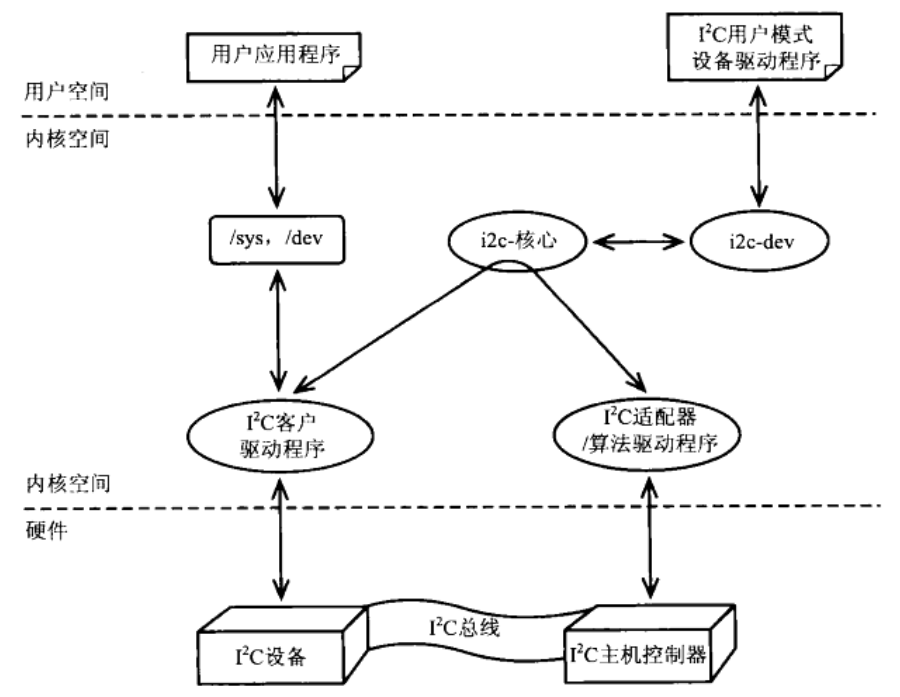

I2C设备驱动，可以直接使用内核中i2c-dev.c文件提供的read/write或ioctl操作接口，在应用层通过read/write和ioctl系统调用实现对I2C设备的读写；也就是常说的I2C用户态驱动；用户态I2C驱动，需要在用户态封装i2c_msg结构体消息，通过内核态i2c_transfer()函数和I2C从设备通信；


<!--more-->


### 目录

[TOC]

### 0. 简介


I2C设备驱动，可以直接使用内核中i2c-dev.c文件提供的read/write或ioctl操作接口，在应用层通过read/write和ioctl系统调用实现对I2C设备的读写；也就是常说的I2C用户态驱动；

用户态驱动，和一般的I2C设备驱动实现原理差不多，都是封装i2c_msg结构体消息，通过i2c_transfer()函数和I2C从设备通信；区别在于，一般的I2C设备驱动，在内核态封装了该功能；而用户态驱动，需要在用户态封装；可以根据实际需要选择合适的I2C驱动实现方法；





在i2c-dev.c文件中，实现了I2C适配器设备文件的功能，每个I2C适配器被分配一个设备节点；通过适配器访问设备文件节点，主设备号为89，次设备号为0～255；应用程序通过生成的设备节点/dev/i2c-X，使用open、close、read、write、ioctl系统调用进行访问；

i2c-dev.c并不是针对特定的设备而设计，只是提供通用的open、close、read、write、ioctl等系统调用接口，应用程序可以通过这些系统调用接口访问挂接在适配器上的I2C设备；


内核代码实现在drivers/i2c/i2c-dev.c；

设备文件：/dev/i2c-X，X为序号；


### 1. 内核态实现

i2c-dev驱动的内核态代码实现在drivers/i2c/i2c-dev.c文件中，如果要编译该文件，需要在make menuconfig配置内核时打开CONFIG_I2C_CHARDEV选项；


```
// driver/i2c/Makefile
obj-$(CONFIG_I2C_CHARDEV)   += i2c-dev.o
```


```c
CONFIG_I2C_CHARDEV=y
```


在drivers/i2c/i2c-dev.c文件中建立i2c-dev驱动模块；

```c
// drivers/i2c/i2c-dev.c
module_init(i2c_dev_init);
module_exit(i2c_dev_exit);
```


#### 1.1 init/exit

```c
// drivers/i2c/i2c-dev.c
static struct class *i2c_dev_class;
static int __init i2c_dev_init(void)
{
    int res;

    // 注册字符设备驱动
    res = register_chrdev_region(MKDEV(I2C_MAJOR, 0), I2C_MINORS, "i2c");
    
    i2c_dev_class = class_create(THIS_MODULE, "i2c-dev");
    i2c_dev_class->dev_groups = i2c_groups;
    
    /* Keep track of adapters which will be added or removed later */
    res = bus_register_notifier(&i2c_bus_type, &i2cdev_notifier);
    
    /* Bind to already existing adapters right away */
    i2c_for_each_dev(NULL, i2cdev_attach_adapter);
    
    return 0;
	......
}

static void __exit i2c_dev_exit(void)
{
    bus_unregister_notifier(&i2c_bus_type, &i2cdev_notifier);
    i2c_for_each_dev(NULL, i2cdev_detach_adapter);
    class_destroy(i2c_dev_class);
    unregister_chrdev_region(MKDEV(I2C_MAJOR, 0), I2C_MINORS);
}
```

I2C设备的主设备号固定为89；


```c
// include/linux/i2c-dev.h
#define I2C_MAJOR   89      /* Device major number      */
```


```c
static int i2cdev_notifier_call(struct notifier_block *nb, unsigned long action,
             void *data)
{
    struct device *dev = data;

    switch (action) {
    case BUS_NOTIFY_ADD_DEVICE:
        return i2cdev_attach_adapter(dev, NULL);
    case BUS_NOTIFY_DEL_DEVICE:
        return i2cdev_detach_adapter(dev, NULL);
    }

    return 0;
}

static struct notifier_block i2cdev_notifier = {
    .notifier_call = i2cdev_notifier_call,
};
```


#### 1.2 attach/detach

```c
static int i2cdev_attach_adapter(struct device *dev, void *dummy)
{
    struct i2c_adapter *adap;
    struct i2c_dev *i2c_dev;
    int res;

    if (dev->type != &i2c_adapter_type)
        return 0;
    adap = to_i2c_adapter(dev);

    i2c_dev = get_free_i2c_dev(adap);

    cdev_init(&i2c_dev->cdev, &i2cdev_fops);
    i2c_dev->cdev.owner = THIS_MODULE;
    res = cdev_add(&i2c_dev->cdev, MKDEV(I2C_MAJOR, adap->nr), 1);

    /* register this i2c device with the driver core */
    i2c_dev->dev = device_create(i2c_dev_class, &adap->dev,
                     MKDEV(I2C_MAJOR, adap->nr), NULL,
                     "i2c-%d", adap->nr);

    return 0;
	......
}

static int i2cdev_detach_adapter(struct device *dev, void *dummy)
{
    struct i2c_adapter *adap;
    struct i2c_dev *i2c_dev;

    if (dev->type != &i2c_adapter_type)
        return 0;
    adap = to_i2c_adapter(dev);

    i2c_dev = i2c_dev_get_by_minor(adap->nr);

    cdev_del(&i2c_dev->cdev);
    put_i2c_dev(i2c_dev);
    device_destroy(i2c_dev_class, MKDEV(I2C_MAJOR, adap->nr));

    return 0;
}
```


i2c-dev的字符设备操作集

```c
static const struct file_operations i2cdev_fops = {
    .owner      = THIS_MODULE,
    .llseek     = no_llseek,
    .read       = i2cdev_read,
    .write      = i2cdev_write,
    .unlocked_ioctl = i2cdev_ioctl,
    .open       = i2cdev_open,
    .release    = i2cdev_release,
};
```


#### 1.3 open/release

i2c-dev设备节点的open、release操作；

```c
static int i2cdev_open(struct inode *inode, struct file *file)
{
    unsigned int minor = iminor(inode);
    struct i2c_client *client;
    struct i2c_adapter *adap;

    adap = i2c_get_adapter(minor);

    client = kzalloc(sizeof(*client), GFP_KERNEL);
    if (!client) {
        i2c_put_adapter(adap);
        return -ENOMEM;
    }
    snprintf(client->name, I2C_NAME_SIZE, "i2c-dev %d", adap->nr);

    client->adapter = adap;
    file->private_data = client;

    return 0;
}

static int i2cdev_release(struct inode *inode, struct file *file)
{
    struct i2c_client *client = file->private_data;

    i2c_put_adapter(client->adapter);
    kfree(client);
    file->private_data = NULL;

    return 0;
}
```

i2c-dev在open时，为设备节点建立一个i2c_client；在之后的操作中，该i2c_client会被I2C_SLAVE或I2C_SLAVE_FORCE命令设置一个从设备地址；

但是这个i2c_client并不加添加到i2c_adapter的client链表中，而是在用户关闭设备节点时，自动释放i2c_client；


#### 1.4 read/write

i2c-dev设备节点的read、write操作；

##### read/write

```c
// drivers/i2c/i2c-dev.c
static ssize_t i2cdev_read(struct file *file, char __user *buf, size_t count,
        loff_t *offset)
{
    char *tmp;
    int ret;

    struct i2c_client *client = file->private_data;

    if (count > 8192)
        count = 8192;

    tmp = kmalloc(count, GFP_KERNEL);
    if (tmp == NULL)
        return -ENOMEM;

    pr_debug("i2c-dev: i2c-%d reading %zu bytes.\n",
        iminor(file_inode(file)), count);

    ret = i2c_master_recv(client, tmp, count);
    if (ret >= 0)
        ret = copy_to_user(buf, tmp, count) ? -EFAULT : ret;
    kfree(tmp);
    return ret;
}

static ssize_t i2cdev_write(struct file *file, const char __user *buf,
        size_t count, loff_t *offset)
{
    int ret;
    char *tmp;
    struct i2c_client *client = file->private_data;

    if (count > 8192)
        count = 8192;

    tmp = memdup_user(buf, count);
    if (IS_ERR(tmp))
        return PTR_ERR(tmp);

    pr_debug("i2c-dev: i2c-%d writing %zu bytes.\n",
        iminor(file_inode(file)), count);

    ret = i2c_master_send(client, tmp, count);
    kfree(tmp);
    return ret;
}
```

##### 写入数据实例

```c
unsigned char *data_wr;
write(fd, data_wr, len+2);
```

i2c-dev的写入操作，通过write()系统调用，将带有从设备寄存器地址的数组写入到i2c-dev内核驱动，数据长度为要写入的寄存器个数加上两个字节寄存器地址；


##### 读取数据实例

```c
unsigned char *data_slave;
unsigned char *data;
write(fd, addr_slave, 2);
read(fd, data, len);
```

i2c-dev的读取操作，分两步：

第一步，通过write()系统调用，将要读取的两个字节从设备寄存器地址，写入到i2c-dev内核驱动；

第二步，通过read()系统调用，从i2c-dev内核驱动中读取长度为len的数据，并保存在data内存中；


#### 1.5 ioctl

##### i2cdev_ioctl

```c
static long i2cdev_ioctl(struct file *file, unsigned int cmd, unsigned long arg)
{
    struct i2c_client *client = file->private_data;
    unsigned long funcs;

    switch (cmd) {
    case I2C_SLAVE:
    case I2C_SLAVE_FORCE:
        if ((arg > 0x3ff) ||
            (((client->flags & I2C_M_TEN) == 0) && arg > 0x7f))
            return -EINVAL;
        if (cmd == I2C_SLAVE && i2cdev_check_addr(client->adapter, arg))
            return -EBUSY;
        client->addr = arg;
        return 0;
    case I2C_TENBIT:
        if (arg)
            client->flags |= I2C_M_TEN;
        else
            client->flags &= ~I2C_M_TEN;
        return 0;
    case I2C_PEC:
        if (arg)
            client->flags |= I2C_CLIENT_PEC;
        else
            client->flags &= ~I2C_CLIENT_PEC;
        return 0;
    case I2C_FUNCS:
        funcs = i2c_get_functionality(client->adapter);
        return put_user(funcs, (unsigned long __user *)arg);

    case I2C_RDWR:
        return i2cdev_ioctl_rdwr(client, arg);

    case I2C_SMBUS:
        return i2cdev_ioctl_smbus(client, arg);

    case I2C_RETRIES:
        client->adapter->retries = arg;
        break;
    case I2C_TIMEOUT:
        client->adapter->timeout = msecs_to_jiffies(arg * 10);
        break;
    default:
        return -ENOTTY;
    }
    return 0;
}
```


##### ioctl支持的功能

| 命令            | 操作               | 备注                         |
| --------------- | ------------------ | ---------------------------- |
| I2C_SLAVE       | 设置从设备地址     | 尝试设置                     |
| I2C_SLAVE_FORCE | 强制设置从设备地址 | 强制设置，不检查是否已经存在 |
| I2C_TENBIT      |                    |                              |
| I2C_PEC         |                    |                              |
| I2C_FUNCS       |                    |                              |
| I2C_RDWR        | 读写操作           | 参数：i2cdev_ioctl_rdwr      |
| I2C_SMBUS       |                    |                              |
| I2C_RETRIES     | 设置重试次数       |                              |
| I2C_TIMEOUT     | 设置超时时间       | 单位：10ms                   |


##### ioctl实例

设置从设备地址

```c
ioctl(fd, I2C_SLAVE, SLAVE_ADDR);
ioctl(fd, I2C_SLAVE_FORCE, SLAVE_ADDR);
```

I2C_SLAVE和I2C_SLAVE_FORCE命令都是设置从设备地址，区别是：I2C_SLAVE命令尝试设置从设备地址，如果该设备地址已经被设置，就返回失败；I2C_SLAVE_FORCE命令，不管该地址是否存在，都强制设置从设备地址；


设置超时时间

```c
ioctl(fd, I2C_TIMEOUT, 1);
```

超时时间单位：10ms


设置重试次数

```c
ioctl(fd, I2C_RETRIES, 1);
```


I2C读写操作

```c
struct i2c_rdwr_ioctl_data data;
ioctl(fd, I2C_RDWR, (unsigned long)&data);
```


i2c-dev的读写操作是通过ioctl系统调用的I2C_RDWR命令完成，将struct i2c_rdwr_ioctl_data结构体的参数传递给内核态；

```c
// include/uapi/linux/i2c-dev.h
struct i2c_rdwr_ioctl_data {
    struct i2c_msg __user *msgs;    /* pointers to i2c_msgs */
    __u32 nmsgs;            /* number of i2c_msgs */
};
```

i2c_rdwr_ioctl_data结构体包含了指向i2c_msg结构体的消息指针msgs，和i2c_msg消息个数的nmsgs；


struct i2c_msg

```c
// include/uapi/linux/i2c.h
struct i2c_msg {
    __u16 addr; /* slave address            */
    __u16 flags;
#define I2C_M_RD        0x0001  /* read data, from slave to master */
                    /* I2C_M_RD is guaranteed to be 0x0001! */
#define I2C_M_TEN       0x0010  /* this is a ten bit chip address */
#define I2C_M_RECV_LEN      0x0400  /* length will be first received byte */
#define I2C_M_NO_RD_ACK     0x0800  /* if I2C_FUNC_PROTOCOL_MANGLING */
#define I2C_M_IGNORE_NAK    0x1000  /* if I2C_FUNC_PROTOCOL_MANGLING */
#define I2C_M_REV_DIR_ADDR  0x2000  /* if I2C_FUNC_PROTOCOL_MANGLING */
#define I2C_M_NOSTART       0x4000  /* if I2C_FUNC_NOSTART */
#define I2C_M_STOP      0x8000  /* if I2C_FUNC_PROTOCOL_MANGLING */
    __u16 len;      /* msg length               */
    __u8 *buf;      /* pointer to msg data          */
};
```

I2C传输数据是以字节为单位的，具体到i2c_msg结构体，buf表示要传输的数据，len表示传输的数据字节数；

I2C读取，需要两个i2c_msg组成的数组；第一个i2c_msg的buf，保存master向slave发出目标寄存器地址，len表示寄存器地址字节长度；第二个i2c_msg的buf，用来接收slave向master返回的数据，len表示期望读到的数据字节长度；

I2C写入，仅由一个i2c_msg组成；i2c_msg的buf，保存从slave的目标寄存器地址和要写入的数据，len表示期望写入的数据字节长度；

i2c_msg消息以数组格式定义，是为了访问连续，因为数组是连续内存存储的；


##### i2cdev_ioctl_rdwr

i2cdev_ioctl_rdwr()函数，处理通过ioctl()系统调用I2C_RDWR命令的操作，即对从设备读写的操作；

```c
static noinline int i2cdev_ioctl_rdwr(struct i2c_client *client,
        unsigned long arg)
{
    struct i2c_rdwr_ioctl_data rdwr_arg;
    struct i2c_msg *rdwr_pa;
    u8 __user **data_ptrs;
    int i, res;

    if (copy_from_user(&rdwr_arg,
               (struct i2c_rdwr_ioctl_data __user *)arg,
               sizeof(rdwr_arg)))
        return -EFAULT;
	......
    rdwr_pa = memdup_user(rdwr_arg.msgs,
                  rdwr_arg.nmsgs * sizeof(struct i2c_msg));

	data_ptrs = kmalloc(rdwr_arg.nmsgs * sizeof(u8 __user *), GFP_KERNEL);

    res = 0;
    for (i = 0; i < rdwr_arg.nmsgs; i++) {
        ......
        data_ptrs[i] = (u8 __user *)rdwr_pa[i].buf;
        rdwr_pa[i].buf = memdup_user(data_ptrs[i], rdwr_pa[i].len);
		...... 
    }

    // 重点，I2C消息的收发，都是通过i2c_transfer()函数实现的
    res = i2c_transfer(client->adapter, rdwr_pa, rdwr_arg.nmsgs);
    while (i-- > 0) {
        if (res >= 0 && (rdwr_pa[i].flags & I2C_M_RD)) {
            if (copy_to_user(data_ptrs[i], rdwr_pa[i].buf,
                     rdwr_pa[i].len))
                res = -EFAULT;
        }
        kfree(rdwr_pa[i].buf);
    }   
	......
}
```

i2cdev_ioctl_rdwr()函数，完成了消息的收发操作；具体操作：

> 将i2c_rdwr_ioctl_data数据从用户空间拷贝到内核空间
>
> 将i2c_rdwr_ioctl_data.msgs消息数组从用户空间拷贝到内核空间
>
> 将i2c_rdwr_ioctl_data.msgs.buf数组从用户空间拷贝到内核空间
>
> 通过i2c_transfer()函数，以i2c_msg消息格式数组和从设备通信


### 2. 用户态实现

#### 2.1 设备节点


在Linux内核中，已经注册了的I2C适配器，可以在用户空间进行访问；i2c-dev驱动对每个I2C适配器生成一个设备节点/dev/i2c-X，主设备号固定为89，X为数字，是I2C适配器的编号，从0开始，编号和设备节点的此设备号一致；


```shell
# ls /dev/i2c-* -l
crw-rw----    1 root     root       89,   0 Nov  3 22:02 /dev/i2c-0
crw-rw----    1 root     root       89,   1 Nov  3 22:02 /dev/i2c-1
crw-rw----    1 root     root       89,   2 Nov  3 22:02 /dev/i2c-2
crw-rw----    1 root     root       89,   3 Nov  3 22:02 /dev/i2c-3
```


设备节点/dev/i2c-X的编号X和注册次序有关，使用前还是需要通过/sys/class/i2c-dev/来确定编号；


```shell
# ls /sys/class/i2c-dev/ -l
total 0
lrwxrwxrwx    1 root     root             0 Nov  4 04:01 i2c-0 -> ../../devices/platform/soc/2000000.i2c/i2c-0/i2c-dev/i2c-0
lrwxrwxrwx    1 root     root             0 Nov  4 04:01 i2c-1 -> ../../devices/platform/soc/2010000.i2c/i2c-1/i2c-dev/i2c-1
lrwxrwxrwx    1 root     root             0 Nov  4 04:01 i2c-2 -> ../../devices/platform/soc/2030000.i2c/i2c-2/i2c-dev/i2c-2
lrwxrwxrwx    1 root     root             0 Nov  4 04:01 i2c-3 -> ../../devices/platform/soc/2050000.i2c/i2c-3/i2c-dev/i2c-3
```


或者


```shell
# cat /sys/class/i2c-dev/i2c-0/name
2000000.i2c
# cat /sys/class/i2c-dev/i2c-2/name
2030000.i2c
```


这些设备节点实现了文件操作接口，用户空间通过这些I2C设备节点访问I2C适配器；对I2C设备进行读写时，可以通过调用read/write或ioctl来实现；在内核态read、write、ioctl系统调用都是通过i2c_transfer()函数实现和I2C设备的通信；


#### 2.2 open


用户态使用open函数打开对应的I2C设备节点/dev/i2c-X，如：/dev/i2c-2；


```c
int fd = -1;
fd = open("/dev/i2c-2", O_RDWR);
```


i2c-dev在open时，为设备节点建立一个i2c_client；但是这个i2c_client并不加添加到i2c_adapter的client链表中，而是在用户关闭设备节点时，自动释放i2c_client；


#### 2.3 read/write实现

##### 1）发送


```c
int i2c_write_bytes(int fd, unsigned short addr, unsigned char *data, int len)
{
    unsigned char *data_wr = NULL;
    int ret = -1;

    data_wr = malloc(len + 2);
    if (!data_wr) {
        printf("%s, malloc failed!\n", __func__);
        return -1;
    }

    data_wr[0] = addr / 0xff;
    data_wr[1] = addr % 0xff;
    memcpy(&data_wr[2], data, len);

    ioctl(fd, I2C_SLAVE, SLAVE_ADDR);
    ioctl(fd, I2C_TIMEOUT, 1);
    ioctl(fd, I2C_RETRIES, 1);

    ret = write(fd, data_wr, len+2);
    if (ret < 0) {
        printf("%s, write failed, ret: 0x%x\n", __func__, ret);
        return ret;
    }

    printf("%s, write ok, num: %d\n", __func__, ret);

    if (data_wr != NULL) {
        free(data_wr);
        data_wr = NULL;
    }

    return ret;
}
```


##### 2）接收


```c
int i2c_read_bytes(int fd, unsigned short addr, unsigned char *data, int len)
{
    unsigned char addr_slave[2] = { 0 };
    int ret = -1;

    ioctl(fd, I2C_SLAVE, SLAVE_ADDR);
    ioctl(fd, I2C_TIMEOUT, 1);
    ioctl(fd, I2C_RETRIES, 1);

    addr_slave[0] = addr / 0xff;
    addr_slave[1] = addr % 0xff;

    ret = write(fd, addr_slave, 2);
    if (ret < 0) {
        printf("%s, write failed, ret: 0x%x\n", __func__, ret);
        return ret;
    }

    ret = read(fd, data, len);
    if (ret < 0) {
        printf("%s, read failed, ret: 0x%x\n", __func__, ret);
        return ret;
    }

    printf("%s, read ok, num: %d\n", __func__, ret);

    return ret;
}
```


#### 2.4 ioctl实现


##### 1）发送


```c
int i2c_write_bytes(int fd, unsigned short addr, unsigned char *data, int len)
{
    struct i2c_rdwr_ioctl_data data_wr;
    int ret = -1;

    data_wr.nmsgs = 1;
    data_wr.msgs = malloc(sizeof(struct i2c_msg) * data_wr.nmsgs);
    if (!data_wr.msgs) {
        printf("%s, msgs malloc failed!\n", __func__);
        return -1;
    }

    data_wr.msgs[0].addr = SLAVE_ADDR;
    data_wr.msgs[0].flags = 0;
    data_wr.msgs[0].len = len + 2;
    data_wr.msgs[0].buf = malloc(data_wr.msgs[0].len + 2);
    if (!data_wr.msgs[0].buf) {
        printf("%s, msgs buf malloc failed!\n", __func__);
        return -1;
    }
    data_wr.msgs[0].buf[0] = addr / 0xff;
    data_wr.msgs[0].buf[1] = addr % 0xff;
    memcpy(&data_wr.msgs[0].buf[2], data, len);

    ret = ioctl(fd, I2C_RDWR, (unsigned long)&data_wr);
    if (ret < 0) {
        printf("%s, ioctl failed, ret: 0x%x\n", __func__, ret);
        return ret;
    }

    if (data_wr.msgs[0].buf != NULL) {
        free(data_wr.msgs[0].buf);
        data_wr.msgs[0].buf = NULL;
    }

    if (data_wr.msgs != NULL) {
        free(data_wr.msgs);
        data_wr.msgs = NULL;
    }

    return ret;
}
```


##### 2）接收


```c
int i2c_read_bytes(int fd, unsigned short addr, unsigned char *data, int len)
{
    struct i2c_rdwr_ioctl_data data_rd;
    int ret = -1;
    int i = 0;

    data_rd.nmsgs = 2;
    data_rd.msgs = malloc(sizeof(struct i2c_msg) * data_rd.nmsgs);
    if (!data_rd.msgs) {
        printf("%s, msgs malloc failed!\n", __func__);
        return -1;
    }

    data_rd.msgs[0].addr = SLAVE_ADDR;
    data_rd.msgs[0].flags = 0;
    data_rd.msgs[0].len = 2;
    data_rd.msgs[0].buf = malloc(data_rd.msgs[0].len);
    if (!data_rd.msgs[0].buf) {
        printf("%s, msgs buf malloc failed!\n", __func__);
        return -1;
    }
    data_rd.msgs[0].buf[0] = addr / 0xff;
    data_rd.msgs[0].buf[1] = addr % 0xff;

    data_rd.msgs[1].addr = SLAVE_ADDR;
    data_rd.msgs[1].flags = I2C_M_RD;
    data_rd.msgs[1].len = len;
    data_rd.msgs[1].buf = malloc(data_rd.msgs[1].len);
    if (!data_rd.msgs[0].buf) {
        printf("%s, msgs buf malloc failed!\n", __func__);
        return -1;
    }
    memset(data_rd.msgs[1].buf, 0, data_rd.msgs[1].len);

    ret = ioctl(fd, I2C_RDWR, (unsigned long)&data_rd);
    if (ret < 0) {
        printf("%s, ioctl failed, ret: 0x%x\n", __func__, ret);
        return ret;
    }
    memcpy(data, data_rd.msgs[1].buf, len);

    printf("%s, read ok, num: %d\n", __func__, ret);

    if (data_rd.msgs[0].buf != NULL) {
        free(data_rd.msgs[0].buf);
        data_rd.msgs[0].buf = NULL;
    }
    
    if (data_rd.msgs[1].buf != NULL) {
        free(data_rd.msgs[1].buf);
        data_rd.msgs[1].buf = NULL;
    }

    if (data_rd.msgs != NULL) {
        free(data_rd.msgs);
        data_rd.msgs = NULL;
    }

    return ret;
}
```


#### 2.5 main函数


```c
#include <stdio.h>
#include <string.h>
#include <stdlib.h>
#include <sys/types.h>
#include <sys/stat.h>
#include <fcntl.h>
#include <unistd.h>
#include <sys/ioctl.h>
#include <linux/i2c.h>
#include <linux/i2c-dev.h>

#define SLAVE_ADDR  0x51

int arr_show(unsigned char *data, int len)
{
    int i = 0;

    for (i = 0; i < len; i++) {
        printf("data[%d]: 0x%x\n", i, data[i]);
    }

    return 0;
}

void usage(void)
{
    printf("xxx -r addr len\n");
    printf("xxx -w addr data1 data2 ...\n");
}

int main(int argc, char *argv[])
{
    int opt;
    int fd = -1;

    unsigned short addr;
    unsigned char buf[256] = { 0 };
    int len = 0;
    int i = 0;

    if (argc < 4) {
        usage();
        return -1;
    }

    fd = open("/dev/i2c-2", O_RDWR);
    if (fd < 0) {
        printf("%s, open failed!\n", __func__);
        return -1;
    }

    while ((opt = getopt(argc, argv, "w:r:")) != -1) {
        printf("optarg: %s\n", optarg);
        printf("optind: %d\n", optind);
        printf("argc: %d\n", argc);
        printf("argv[optind]: %s\n", argv[optind]);

        addr = (unsigned short)strtol(optarg, NULL, 0);
        printf("addr: %d\n", addr);
        switch(opt) {
            case 'w':
                for (len = 0; optind < argc; optind++, len++) {
                    buf[len] = (unsigned char)strtol(argv[optind], NULL, 0);
                }
                printf("len: %d\n", len);

                i2c_write_bytes(fd, addr, buf, len);
                break;
            case 'r':
                len = (unsigned int)strtol(argv[optind], NULL, 0);
                printf("len: %d\n", len);

                i2c_read_bytes(fd, addr, buf, len);

                arr_show(buf, len);
                break;
            default:
                printf("Invalid parameter!\n");
                usage;
                break;
        }
    }
    close(fd);

    return 0;
}
```


### 3. 总结


[回到目录](!目录)

