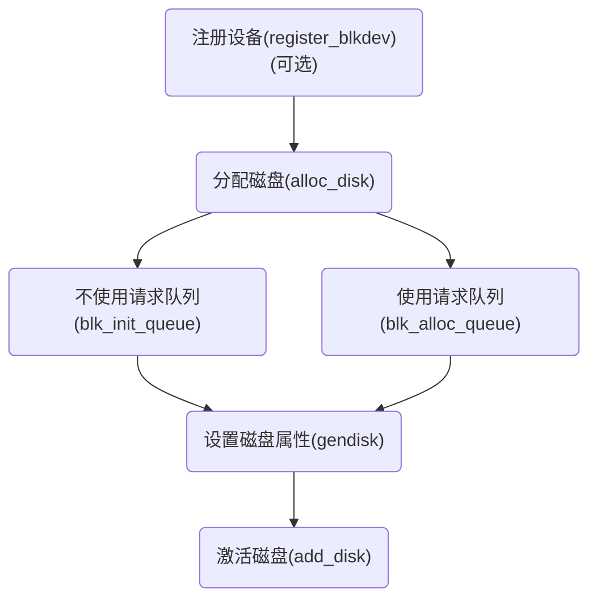
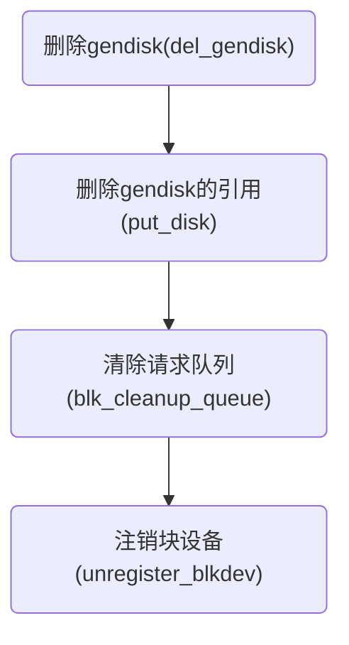

## Linux块设备驱动


Linux块设备驱动

<!--more-->


### 目录


[TOC]


### 0. 简介


字符设备


字符设备是一种顺序的数据流设备，对字符设备的读写是以字节为单位进行的，这些字符连续地形成一个数据流，字符设备没有缓存区，对于字符设备的读写是实时的；


块设备


块设备是一种具有一定结构的随机存取设备，对块设备的读写是以块为单位进行的，块设备使用缓存区来存放数据，待条件满足后，将数据从缓存区一次性写入到设备，或者从设备一次性读取到缓存区；


为了创建一个块设备驱动程序，实现一个基于内存的块设备驱动程序；


#### 1. 块设备结构


**段（Segments）**：由若干个块组成；是Linux内存管理机制中一个内存页或内存页的一部分；


**块（Blocks）**：由Linux制定对内核或文件系统等数据处理的基本单位；通常通常为4096个字节，由1个或多个扇区组成；


**扇区（Sectors）**：块设备的基本单位，是一个固定的硬件单位，制定了设备最少能够传输的数据量；通常在512字节到32768字节之间，默认：512字节；


块是连续扇区的序列，块长度总是扇区长度的整数倍；块的最大长度，受特定体系结构的内存页长度限制；


块设备使用请求队列，缓存并重排读写数据块的请求，用高效的方式读取数据；块设备的每个设备都关联了请求队列；对块设备的读写请求不会立即执行，这些请求会汇总起来，经过协同之后传输到设备；


#### 2. 块设备驱动框架


### 1. 重要操作


#### 1. 注册块设备驱动程序


向内核注册块设备驱动程序


```c
#include <linux/fs.h>
int register_blkdev(unsigned int major, const char *name);
```


> name：设备名字，是在/proc/devices中显示的名字
>
> major：设备的主设备号，如果major=0，则分配一个主设备号

该函数的调用是可选的，完成的工作：

> 1. 如果需要的话分配一个动态的主设备号
> 2. 2. 在/proc/devices中创建一个入口项


注销块设备驱动程序


```c
#include <linux/fs.h>
void unregister_blkdev(unsigned int major, const char *name);
```


如下用例：


```c
#include <linux/fs.h>
int sbull_major = 0;
sbull_major = register_blkdev(sbull_major, "sbull");
if (sbull_major < 0) {
	printk(KERN_WARNNING "sbull: unable to get major number\n");
	return -EBUSY;
}
```


```c
// include/linux/fs.h
struct block_device {
    dev_t           bd_dev;  /* not a kdev_t - it's a search key */
    int         bd_openers;
    struct inode *      bd_inode;   /* will die */
    struct super_block *    bd_super;
    struct mutex        bd_mutex;   /* open/close mutex */
    void *          bd_claiming;
    void *          bd_holder;
    int         bd_holders;
    bool            bd_write_holder;
#ifdef CONFIG_SYSFS
    struct list_head    bd_holder_disks;
#endif
    struct block_device *   bd_contains;
    unsigned        bd_block_size;
    struct hd_struct *  bd_part;
    /* number of times partitions within this device have been opened. */
    unsigned        bd_part_count;
    int         bd_invalidated;
    struct gendisk *    bd_disk;
    struct request_queue *  bd_queue;
    struct list_head    bd_list;
    /*
     * Private data.  You must have bd_claim'ed the block_device
     * to use this.  NOTE:  bd_claim allows an owner to claim
     * the same device multiple times, the owner must take special
     * care to not mess up bd_private for that case.
     */
    unsigned long       bd_private;

    /* The counter of freeze processes */
    int         bd_fsfreeze_count;
    /* Mutex for freeze */
    struct mutex        bd_fsfreeze_mutex;
};
```


#### 2. 块设备操作


字符设备使用file_operations结构，来告诉系统字符设备驱动的操作接口；


块设备使用block_device_operations结构，来告诉系统块设备驱动的操作接口；


```c
// include/linux/blkdev.h
struct block_device_operations {
    int (*open) (struct block_device *, fmode_t);
    void (*release) (struct gendisk *, fmode_t);
    int (*rw_page)(struct block_device *, sector_t, struct page *, bool);
    int (*ioctl) (struct block_device *, fmode_t, unsigned, unsigned long);
    int (*compat_ioctl) (struct block_device *, fmode_t, unsigned, unsigned long);
    long (*direct_access)(struct block_device *, sector_t, void **, pfn_t *,
            long);
    unsigned int (*check_events) (struct gendisk *disk,
                      unsigned int clearing);
    /* ->media_changed() is DEPRECATED, use ->check_events() instead */
    int (*media_changed) (struct gendisk *);
    void (*unlock_native_capacity) (struct gendisk *);
    int (*revalidate_disk) (struct gendisk *);
    int (*getgeo)(struct block_device *, struct hd_geometry *);
    /* this callback is with swap_lock and sometimes page table lock held */
    void (*swap_slot_free_notify) (struct block_device *, unsigned long);
    struct module *owner;
    const struct pr_ops *pr_ops;
};
```


和字符设备驱动不同，块设备驱动的block_device_operations操作集中没有负责读和写数据的函数；在块设备驱动中，这些操作是由request函数处理的；


#### 3. 注册磁盘


为了管理独立的磁盘，需要使用struct gendisk结构体，内核使用gendisk结构表示一个独立的磁盘设备，还可以表示分区；


```c
// include/linux/genhd.h
struct gendisk {
    int major;          /* major number of driver */
    int first_minor;
    int minors;                     /* maximum number of minors, =1 for
                                         * disks that can't be partitioned. */
    char disk_name[DISK_NAME_LEN];  /* name of major driver */
    char *(*devnode)(struct gendisk *gd, umode_t *mode);

    struct hd_struct part0;

    const struct block_device_operations *fops;
    struct request_queue *queue;
	......
};
```


major：指定驱动程序的主设备号


first_minor和minors：从设备号的可能范围


disk_name：磁盘名称，在/proc/partitions 和 sysfs 中表示该磁盘


```c
char disk_name[DISK_NAME_LEN];
```


显示在/proc/partitions 和 sysfs 中


对于每一个分区来说，都有一个hd_struct结构体，用于描述该分区


```c
// include/linux/genhd.h
struct hd_struct {
    sector_t start_sect;
    /*
     * nr_sects is protected by sequence counter. One might extend a
     * partition while IO is happening to it and update of nr_sects
     * can be non-atomic on 32bit machines with 64bit sector_t.
     */
    sector_t nr_sects;
    seqcount_t nr_sects_seq;
    sector_t alignment_offset;
    unsigned int discard_alignment;
    struct device __dev;
    struct kobject *holder_dir;
    int policy, partno;
    struct partition_meta_info *info;
#ifdef CONFIG_FAIL_MAKE_REQUEST
    int make_it_fail;
#endif
    unsigned long stamp;
    atomic_t in_flight[2];
#ifdef  CONFIG_SMP
    struct disk_stats __percpu *dkstats;
#else
    struct disk_stats dkstats;
#endif
    struct percpu_ref ref;
    struct rcu_head rcu_head;
};
```


start_sect和nr_sects：定义了该分区在块设备上的起始扇区和长度，唯一地描述了该分区


拥有了设备内存和请求队列，就可以分配、初始化及安装gendisk结构


```c
# include <linux/genhd.h>
```


struct gendisk是动态分配的结构，需要内核进行初始化，驱动必须通过alloc_disk分配：


```c
struct gendisk *alloc_disk(int minors);
```

> minors：是该磁盘使用的从设备号的数目；


卸载磁盘


```c
void del_gendisk(struct gendisk *disk)
```


gendisk是一个引用计数结构，get_disk和put_disk函数负责处理引用计数；调用del_gendisk后，该结构可能继续存在；


为了使gendisk结构的磁盘设备生效，需要初始化结构，并将磁盘或分区信息添加到内核链表；


```c
void add_disk(struct gendisk *gd);
```


调用add_disk后，磁盘设备将被激活，并随时会调用它提供的操作方法，因此在驱动程序完全被初始化并且能够响应对磁盘的请求前，不要调用add_disk；


#### 4. 请求队列


块设备的读写请求放置在请求队列中，在struct gendisk中，通过struct request_queue *queue指针指向请求队列；请求队列用数据结构struct request_queue表示；


```c
// include/linux/blkdev.h
struct request_queue {
    struct list_head    queue_head;
    struct request      *last_merge;
    struct elevator_queue   *elevator;
    int         nr_rqs[2];  /* # allocated [a]sync rqs */
    int         nr_rqs_elvpriv; /* # allocated rqs w/ elvpriv */

    struct request_list root_rl;

    request_fn_proc     *request_fn;
    make_request_fn     *make_request_fn;
    prep_rq_fn      *prep_rq_fn;
    unprep_rq_fn        *unprep_rq_fn;
    softirq_done_fn     *softirq_done_fn;
    rq_timed_out_fn     *rq_timed_out_fn;
    dma_drain_needed_fn *dma_drain_needed;
    lld_busy_fn     *lld_busy_fn;

    struct blk_mq_ops   *mq_ops;
    unsigned int        *mq_map;

    /* sw queues */
    struct blk_mq_ctx __percpu  *queue_ctx;
    unsigned int        nr_queues;

    /* hw dispatch queues */
    struct blk_mq_hw_ctx    **queue_hw_ctx;
    unsigned int        nr_hw_queues;

    sector_t        end_sector;
    struct request      *boundary_rq;
    struct delayed_work delay_work;
    struct backing_dev_info backing_dev_info;
    void            *queuedata;
    unsigned long       queue_flags;
    int         id;
    gfp_t           bounce_gfp;

    spinlock_t      __queue_lock;
    spinlock_t      *queue_lock;

    struct kobject kobj;
    struct kobject mq_kobj;

#ifdef  CONFIG_BLK_DEV_INTEGRITY
    struct blk_integrity integrity;
#endif  /* CONFIG_BLK_DEV_INTEGRITY */

#ifdef CONFIG_PM
    struct device       *dev;
    int         rpm_status;
    unsigned int        nr_pending;
#endif

    unsigned long       nr_requests;    /* Max # of requests */
    unsigned int        nr_congestion_on;
    unsigned int        nr_congestion_off;
    unsigned int        nr_batching;

    unsigned int        dma_drain_size;
    void            *dma_drain_buffer;
    unsigned int        dma_pad_mask;
    unsigned int        dma_alignment;

    struct blk_queue_tag    *queue_tags;
    struct list_head    tag_busy_list;

    unsigned int        nr_sorted;
    unsigned int        in_flight[2];
    unsigned int        request_fn_active;
    unsigned int        rq_timeout;
    struct timer_list   timeout;
    struct work_struct  timeout_work;
    struct list_head    timeout_list;

    struct list_head    icq_list;
#ifdef CONFIG_BLK_CGROUP
    DECLARE_BITMAP      (blkcg_pols, BLKCG_MAX_POLS);
    struct blkcg_gq     *root_blkg;
    struct list_head    blkg_list;
#endif

    struct queue_limits limits;

    unsigned int        sg_timeout;
    unsigned int        sg_reserved_size;
    int         node;
#ifdef CONFIG_BLK_DEV_IO_TRACE
    struct blk_trace    *blk_trace;
#endif
    struct blk_flush_queue  *fq;

    struct list_head    requeue_list;
    spinlock_t      requeue_lock;
    struct delayed_work requeue_work;

    struct mutex        sysfs_lock;

    int         bypass_depth;
    atomic_t        mq_freeze_depth;

#if defined(CONFIG_BLK_DEV_BSG)
    bsg_job_fn      *bsg_job_fn;
    int         bsg_job_size;
    struct bsg_class_device bsg_dev;
#endif

#ifdef CONFIG_BLK_DEV_THROTTLING
    /* Throttle data */
    struct throtl_data *td;
#endif
    struct rcu_head     rcu_head;
    struct swait_queue_head mq_freeze_wq;
    struct percpu_ref   q_usage_counter;
    struct list_head    all_q_node;

    struct blk_mq_tag_set   *tag_set;
    struct list_head    tag_set_list;
    struct bio_set      *bio_split;

    bool            mq_sysfs_init_done;
};
```


queue_head：表头，用于构建一个IO请求的双链表；链表每个元素代表向块设备读取数据的一个请求；内核会重排该链表，以得到更好的IO性能；


与每个块设备驱动程序相关的I/O请求队列用request_queue结构体描述，而每个request_queue队列中的请求用request结构体描述；


```c
// include/linux/blkdev.h
struct request {
    struct list_head queuelist;

    struct request_queue *q;
    struct blk_mq_ctx *mq_ctx;

    /* the following two fields are internal, NEVER access directly */
    unsigned int __data_len;    /* total data len */
    sector_t __sector;      /* sector cursor */

    struct bio *bio;
    struct bio *biotail;

	struct request *next_rq;
    ......
}
```


request结构体关联了struct bio，struct bio结构体是块I/O操作在页级粒度的底层描述；


```c
// include/linux/blk_types.h
struct bio {
    struct bio      *bi_next;   /* request queue link */
    struct block_device *bi_bdev;
    int         bi_error;
    unsigned int        bi_opf;     /* bottom bits req flags,
                         * top bits REQ_OP. Use
                         * accessors.
                         */
    unsigned short      bi_flags;   /* status, command, etc */
    unsigned short      bi_ioprio;

    struct bvec_iter    bi_iter;

    unsigned int        bi_phys_segments;

    unsigned int        bi_seg_front_size;
    unsigned int        bi_seg_back_size;

    atomic_t        __bi_remaining;
    bio_end_io_t        *bi_end_io;
    
    unsigned short      bi_vcnt;    /* how many bio_vec's */
    unsigned short      bi_max_vecs;    /* max bvl_vecs we can hold */
    struct bio_vec      *bi_io_vec; /* the actual vec list */
	......
}
```


块数据通过bio_vec结构体数组在内部被表示成I/O向量；每个bio_vec数组元素由三元组组成（即，页、页偏移、长度），表示该块I/O的一个段；


块设备驱动程序的核心是请求函数，包含请求处理过程；


### 2. 块设备驱动的初始化


```c
module_init(block_init);
module_exit(block_exit);
```


块设备驱动程序的初始化方法在block_init()函数中；


#### 1. 注册块设备


```c
static int major = 0;
major = register_blkdev(major, "my_blk");
```


为块设备驱动分配一个未使用的主设备号，并在/proc/devies中添加一个入口；


#### 2. 注册请求队列


注册请求队列的操作，将一个请求的操作方法与该设备相关联，通过blk_init_queue()函数实现；


```c
static struct request_queue *blkdev_queue = NULL;
static DEFINE_SPINLOCK(blk_lock);
blkdev_queue = blk_init_queue(blkdev_request, &blk_lock);
```


blk_init_queue()函数返回请求队列request_queue；将blkdev_request()函数指针方式关联到设备；而第二个参数是自旋锁，用来保护request_queue队列不被同时访问；


#### 3. 设置读写块大小


硬件执行磁盘是以扇区为单位的，而文件系统是以块为单位处理数据；通常，扇区大小为512字节，块大小为4096字节；需要将硬件支持的扇区大小和驱动程序在一次请求中能接收的最大扇区数通知块层；


```c
// include/linux/blkdev.h
int my_blkdev_sect_size = 512;
// blk_queue_hardsect_size(blkdev_queue, my_blkdev_sect_size);
blk_queue_logical_block_size(blkdev_queue, my_blkdev_sect_size);
```


#### 4. 创建磁盘


使用alloc_disk()函数分配一个与设备对应的磁盘gendisk结构体，并初始化其成员；需要初始化的成员有：block_device_operations、存储容量（单位是扇区）、请求队列、主设备号、磁盘名称等；设置存储容量通过set_capacity()函数来完成；


调用add_disk()函数将磁盘添加到块I/O层；


```c
blkdev_disk = alloc_disk(1);

sprintf(blkdev_disk->disk_name, "my_blkdev");
blkdev_disk->fops = &blkdev_fops;
blkdev_disk->queue = blkdev_queue;
blkdev_disk->major = major;
blkdev_disk->first_minor = 0;
set_capacity(blkdev_disk, blkdev_size * 2);

add_disk(mcy_blkdev_disk);
```


到这里，设备/dev/my_blkdev就可以使用了，如果设备支持多个磁盘分区，会显示为/dev/my_blkdevX，X是分区号；


### 3. 队列请求


每个块设备，都有一个请求队列，当请求队列生成时，请求函数request()就与该队列绑定，这个操作在blk_init_queue()函数完成；


```c
struct request_queue *blk_init_queue(request_fn_proc *rfn, spinlock_t *lock)
```


### 4. 块设备的注册


注册一个块设备驱动，需要以下步骤：


> 创建一个块设备 
>
> 分配一个申请队列
>
> 分配一个gendisk结构体
>
> 设置gendisk结构体成员
>
> 注册gendisk结构体


#### 块设备的注册过程





1. 通过register_blkdev()函数注册设备，是个可选操作；

2. 使用alloc_disk()函数分配通用磁盘gendisk结构体；

3. 根据是否需要I/O调度，分两种情况，一种是使用请求队列进行数据传输，一种是不使用请求队列进行数据传输；

4. 初始化gendisk结构体的数据成员，包括：major、fops、queue等；

5. 使用add_disk()函数激活磁盘设备，调用该函数之前要做好所有的准备工作；


分配一个gendisk结构体


设置一个队列，将访问请求放到队列里


设置gendisk结构体的属性，如：名称、容量、操作集等


添加gendisk结构体


另外分配一块内存空间，当做块设备，在request函数中使用memcpy访问，模仿块设备读写


```c
static int major = 0;
static struct request_queue *mcy_blkdev_queue = NULL;
static struct gendisk *mcy_blkdev_disk = NULL;
static DEFINE_SPINLOCK(mcy_blk_lock);

int mcy_blkdev_size = 256 * 1024;
int mcy_blkdev_sect_size = 512;

static int mcy_block_init(void)
{
    printk("%s: %d\n", __func__, __LINE__);

    major = register_blkdev(major, "mcy_blk");
    if (major < 0) {
        printk("%s, register_blkdev failed, major: %d\n", __func__, major);
        goto register_blkdev_err;
    }

    printk("%s, major: %d\n", __func__, major);

    // blk_queue_make_request
    mcy_blkdev_queue = blk_init_queue(mcy_blkdev_request, &mcy_blk_lock);
    if (!mcy_blkdev_queue) {
        printk("%s, blk_init_queue failed!\n", __func__);
        goto init_queue_err;
    }

    mcy_blkdev_disk = alloc_disk(1);
    if (!mcy_blkdev_disk) {
        printk("%s, alloc_disk failed!\n", __func__);
        goto alloc_disk_err;
    }

    sprintf(mcy_blkdev_disk->disk_name, "mcy_blkdev_disk");
    mcy_blkdev_disk->fops = &mcy_blkdev_fops;
    mcy_blkdev_disk->queue = mcy_blkdev_queue;
    mcy_blkdev_disk->major = major;
    mcy_blkdev_disk->first_minor = 0;
    set_capacity(mcy_blkdev_disk, mcy_blkdev_size * 2);

    add_disk(mcy_blkdev_disk);

    printk("%s, mcy_blkdev_disk add success!\n", __func__);

    return 0;

alloc_disk_err:
    blk_cleanup_queue(mcy_blkdev_queue);
init_queue_err:
    unregister_blkdev(major, "mcy_blk");
register_blkdev_err:
    return -EBUSY;
}
```


```c
struct block_device_operations mcy_blkdev_fops = {
    .owner = THIS_MODULE,
    .open = mcy_blkdev_open,
    .release = mcy_blkdev_release,
    .ioctl = mcy_blkdev_ioctl,
};
```


#### 块设备的卸载过程





1. 使用del_gendisk()函数删除gendisk设备（磁盘）；

2. 使用put_disk()函数删除gendisk设备的引用；

3. 使用blk_cleanup_queue()函数清除请求队列，释放请求队列占用的资源；

4. 使用unregister_blkdev()函数注销设备，并释放对设备的引用，可选操作，与register_blkdev()函数配合使用；


```c
    static void mcy_block_exit(void)
    {
        printk("%s: %d\n", __func__, __LINE__);

        del_gendisk(mcy_blkdev_disk);
        put_disk(mcy_blkdev_disk);
        blk_cleanup_queue(mcy_blkdev_queue);
        unregister_blkdev(major, "mcy_blk");
    }
```


```c
# ls /dev/my_blkdev -l
brw-rw----    1 root     root      253,   0 Oct 21 08:18 /dev/my_blkdev
```


### 5. 测试验证


测试步骤：

> 加载驱动：insmod ramblock.ko
>
> 格式化：mkdosfs /dev/ramblock
>
> 挂载：mount /dev/ramblock /mnt
>
> 读写文件：cd /mnt，创建文件
>
> 卸载：umount /mnt
>
> cat /dev/ramblock > /mnt/ramblock.bin
>
> 在PC上查看/mnt/ramblock.bin，sudo mount -o loop ramblock.bin /mnt


### 总结


### 参考资料


https://www.cnblogs.com/big-devil/p/8590007.html


[回到目录](#目录)

