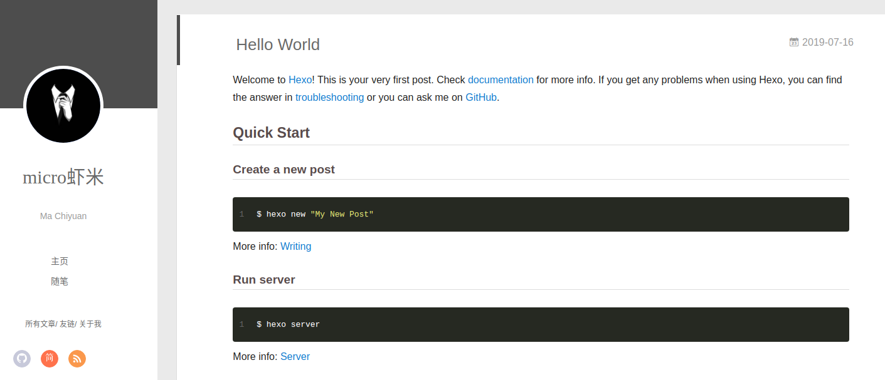

## Ubuntu-Hexo+Github搭建个人博客


### 目录

[TOC]

### 1. 简介

#### 环境

```shell
# uname -a
Linux xiami 5.3.0-40-generic #32~18.04.1-Ubuntu SMP Mon Feb 3 14:05:59 UTC 2020 x86_64 x86_64 x86_64 GNU/Linux
```


### 2. Git安装及配置

#### 2.1 安装Git

使用命令安装Git工具：

```
# sudo apt install git
```

查看是否安张成功：

```
# git --version
git version 2.17.1
```


#### 2.2 创建Git仓库

打开GitHub，点击“New repository”，创建一个新仓库，用来专门存放博客日志信息；仓库名要按照格式：账户名.github.io，比如：Mshrimp.github.io；否则，后边的操作会出现问题；创建仓库时勾选上“
Initialize this repository with a README”；

进入创建好的仓库Mshrimp.github.io，点击右侧的“Settings”，向下拉找到Github Pages，会看到网站是：https://mshrimp.github.io/，点击就可以访问，也可以通过外网访问，这时这个博客项目已经部署到网站上了，但是是个空的网站，没有内容；这个网址是博客的默认地址，如果有兴趣可以自己购买域名换成想要的地址。


#### 2.3 配置git仓库

如果是第一次使用git，就需要先配置git环境，否则可以跳过；

```
$ git config --global user.name "Mshrimp"
$ git config --global user.email "******@outlook.com"
```

在没有配置git环境之前，~/.ssh是不存在的

```
$ cd ~/.ssh
bash: cd: /c/Users/Kevin-TP/.ssh: No such file or directory
```

使用ssh-keygen生成私钥和公钥

```
$ ssh-keygen -t rsa -C "chiyuan.ma@outlook.com"
Generating public/private rsa key pair.
Enter file in which to save the key (/c/Users/Kevin-TP/.ssh/id_rsa):
Created directory '/c/Users/Kevin-TP/.ssh'.
Enter passphrase (empty for no passphrase):
Enter same passphrase again:
Your identification has been saved in /c/Users/Kevin-TP/.ssh/id_rsa.
Your public key has been saved in /c/Users/Kevin-TP/.ssh/id_rsa.pub.
The key fingerprint is:
SHA256:pHNkvs9RsOToxmFH6gnkOb7j/dlRSc4c6TkOvGQ6fcc chiyuan.ma@outlook.com
The key's randomart image is:
+---[RSA 3072]----+
|                 |
|               . |
|      . + +   +  |
|     o B * + * + |
|      B S + * X  |
|     . X = * = o |
|      . B + + o E|
|      .+ o = o . |
|     .o...= .    |
+----[SHA256]-----+
```

从以上的操作打印可以知道，生成的密钥和公钥的保存路径

```
Your identification has been saved in /c/Users/Kevin-TP/.ssh/id_rsa.
Your public key has been saved in /c/Users/Kevin-TP/.ssh/id_rsa.pub.
```

查看生成的密钥和公钥

```
$ cd ~/.ssh
$ ls
id_rsa  id_rsa.pub
$ cat id_rsa.pub
ssh-rsa 
......
```


#### 2.4 添加公钥

把本地公钥添加到github中；在GitHub中，点击右侧图像下拉选项，选择“Settings”，在“SSH and GPG keys”中，点击“New SSH key”，并将~/.ssh/id_rsa.pub文件里的内容复制上去，保存退出；


使用“ssh -T git@github.com”命令，测试添加ssh是否成功；

```
$ ssh -T git@github.com
......
Hi Mshrimp! You've successfully authenticated, but GitHub does not provide shell access.
```


### 3. Node安装

命令行安装：

```
# sudo apt-get install nodejs
# sudo apt install npm
```

查看nodejs工具是否安装成功：

```
# nodejs -v
v8.10.0
```


### 4. Hexo安装及配置

先创建一个hexo操作的文件目录


如果使用的是Linux系统，可以直接在命令行中输入命令操作，如果是windows系统，用管理员权限打开“命令提示符”，使用命令在电脑上安装hexo；或者，在hexo目录上右键，选择“Git Bash Here”，用git bash工具打开hexo目录，在git bash中使用命令操作；

#### 4.1 安装hexo

```
# npm install hexo-cli -g
# npm install hexo -g
```


检查hexo是否安装成功

```
$ hexo -v
hexo: 4.2.0
hexo-cli: 3.1.0
os: Linux 5.3.0-45-generic linux x64
http_parser: 2.7.1
node: 8.10.0
v8: 6.2.414.50
uv: 1.18.0
zlib: 1.2.11
ares: 1.14.0
modules: 57
nghttp2: 1.30.0
openssl: 1.0.2n
icu: 60.2
unicode: 10.0
cldr: 32.0.1
tz: 2017c
```

#### 4.2 初始化hexo文件夹

```
# hexo init
```

看到“Start blogging with Hexo！”打印，说明初始化完成；

输入npm install，安装所需要的组件

```
# npm install
```

hexo已经安装并初始化完成；

```
# ls
_config.yml  node_modules/  package.json  package-lock.json  scaffolds/  source/  themes/
```

到此，hexo环境安装完成。

#### 4.3 Hexo操作

```
$ hexo g #generate 生成静态文件
$ hexo s #server 启动服务器。
// 默认情况下，访问网址为： [http://localhost:4000/]
```

在浏览器地址栏输入“http://localhost:4000/”打开页面，是一个空的博客网页；


#### 4.4 将git库和hexo链接起来


配置Deployment

在hexo文件夹中，找到_config.yml文件，修改repository值（在末尾），repository值是github项目里的ssh；

```
deploy:
  type: git
  repository: git@github.com:Mshrimp/Mshrimp.github.io.git
  branch: master
```


HexoBlog部署到git，需要安装hexo-deployer-git插件，在blog目录下运行以下命令进行安装；

```
$ npm install hexo-deployer-git --save

npm WARN babel-eslint@10.1.0 requires a peer of eslint@>= 4.12.1 but none is 
installed. You must install peer dependencies yourself.

+ hexo-deployer-git@1.0.0
added 1 package from 1 contributor, removed 4 packages and updated 14 packages in 
5.684s
```

修改根目录下_config.yml文件后，需要使用$ hexo deploy部署一下，否则修改内容不会生效；

```
$ hexo deploy
```


至此，一个空的博客已经搭建完成，下一步，添加博客文章；


### 5. 更换主题

不喜欢原来自带的主题，找了一个比较好看的yilia主题，需要先Github中将yilia主题的源码下载到博客目录的themes目录下；

```
# git clone https://github.com/litten/hexo-theme-yilia.git themes/yilia
```

在博客根目录下，修改_config.yml文件的themes：

```
themes: yilia
```

这个主题中的一些配置，可以根据需要自行修改，配置文件为themes/yilia/_config.yml；

效果如下：




### 6. 博客迁移

#### 6.1 常规迁移

以前部署的Hexo博客是在Windows上搭建的，现在安装了Ubuntu-18.04.1，需要重新搭建博客；为了兼容以前的windows博客，需要使用以前的Hexo下的几个文件夹：

```
_config.yml  package.json  source/  themes/
```

这时，在Ubuntu系统上创建文件夹hexo，以hexo为主目录搭建博客环境：

```
# mkdir hexo
# cd hexo
# hexo init
```

将上边四个文件或文件夹复制到hexo目录替换：

```
# cp _config.yml  package.json  source  themes . -rf
```

之后就可以按照hexo命令进行操作了；


#### 6.2 特殊情况

由于我的实际情况是，不但将hexo中的博客文件保存在了Github上，还将hexo生成的环境工程，以并保存在Github同一个工程的其他分支了，如：ubuntu分支；这样我就可以一并保存所有文件了；

在这种特殊情况下，博客迁移操作原理上和常规迁移一样，只是操作稍微不同；

将以前用的工程在Ubuntu环境中克隆下来，Mshrimp.github.io；

新建hexo目录，并初始化hexo目录：

```
# mkdir hexo
# cd hexo
# hexo init
# ls
_config.yml  node_modules/  package.json  package-lock.json  scaffolds/  source/  themes/
```

将hexo中生成的文件或文件夹复制到Mshrimp.github.io目录替换：

```
node_modules/  package-lock.json  scaffolds/
```

这个操作，和常规迁移的区别是，复制的方向相反，其余都一样；

