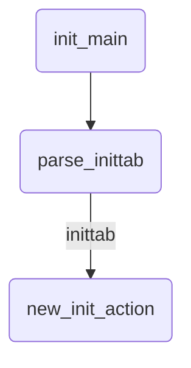

### 


### busybox加载inittab过程分析


##### 环境

linux-4.9.115

busybox-1.31.1


#### 简介


busybox工具通过init_main()函数对inittab文件进行分析执行；


init_main()函数通过parse_inittab()函数分析inittab文件，将文件中的每一行配置用new_init_action()函数；





在parse_inittab()函数中


如果不支持ENABLE_FEATURE_USE_INITTAB，或者支持ENABLE_FEATURE_USE_INITTAB时，未找到inittab文件；busybox使用默认的脚本操作：

```c
// init/init.c
    if (parser == NULL)
    {    
        /* No inittab file - set up some default behavior */
        /* Sysinit */
        new_init_action(SYSINIT, INIT_SCRIPT, ""); 
        /* Askfirst shell on tty1-4 */
        new_init_action(ASKFIRST, bb_default_login_shell, ""); 
//TODO: VC_1 instead of ""? "" is console -> ctty problems -> angry users
        new_init_action(ASKFIRST, bb_default_login_shell, VC_2);
        new_init_action(ASKFIRST, bb_default_login_shell, VC_3);
        new_init_action(ASKFIRST, bb_default_login_shell, VC_4);
        /* Reboot on Ctrl-Alt-Del */
        new_init_action(CTRLALTDEL, "reboot", ""); 
        /* Umount all filesystems on halt/reboot */
        new_init_action(SHUTDOWN, "umount -a -r", ""); 
        /* Swapoff on halt/reboot */
        new_init_action(SHUTDOWN, "swapoff -a", ""); 
        /* Restart init when a QUIT is received */
        new_init_action(RESTART, "init", ""); 
        return;
    }
```


```c
// init/init.c
#define SYSINIT     0x01
#define WAIT        0x02
#define ONCE        0x04
#define RESPAWN     0x08
#define ASKFIRST    0x10
#define CTRLALTDEL  0x20
#define SHUTDOWN    0x40
#define RESTART     0x80
```


在没有inittab配置文件时，busybox会默认加载初始化脚本/etc/init.d/rcS；

```c
// init/init.c
/* Default sysinit script. */
#ifndef INIT_SCRIPT
# define INIT_SCRIPT  "/etc/init.d/rcS"
#endif
```


如果支持ENABLE_FEATURE_USE_INITTAB；busybox会解析inittab配置文件，根据inittab中的配置进行初始化；

先在config_open2()函数中，申请一个struct parser_t结构体的内存空间，并初始化结构体成员fp，指向已经打开的inittab文件；


```c
// init/init.c
#if ENABLE_FEATURE_USE_INITTAB
    char *token[4];
    parser_t *parser = config_open2("/etc/inittab", fopen_for_read);
#endif
```


```c
// include/libbb.h
typedef struct parser_t {
    FILE *fp; 
    char *data;
    char *line, *nline;
    size_t line_alloc, nline_alloc;
    int lineno;
} parser_t;
```


busybox解析inittab文件的操作如下：

```c
// init/init.c
#if ENABLE_FEATURE_USE_INITTAB
    /* optional_tty:ignored_runlevel:action:command
     * Delims are not to be collapsed and need exactly 4 tokens
     */
    while (config_read(parser, token, 4, 0, "#:",
                PARSE_NORMAL & ~(PARSE_TRIM | PARSE_COLLAPSE))) {
        /* order must correspond to SYSINIT..RESTART constants */
        static const char actions[] ALIGN1 =
            "sysinit\0""wait\0""once\0""respawn\0""askfirst\0"
            "ctrlaltdel\0""shutdown\0""restart\0";
        int action;
        char *tty = token[0];

        if (!token[3]) /* less than 4 tokens */
            goto bad_entry;
        action = index_in_strings(actions, token[2]);
        if (action < 0 || !token[3][0]) /* token[3]: command */
            goto bad_entry;
        /* turn .*TTY -> /dev/TTY */
        if (tty[0]) {
            tty = concat_path_file("/dev/", skip_dev_pfx(tty));
        }
        new_init_action(1 << action, token[3], tty);
        if (tty[0])
            free(tty);
        continue;
 bad_entry:
        message(L_LOG | L_CONSOLE, "Bad inittab entry at line %d",
                parser->lineno);
    }
    config_close(parser);
#endif
```


