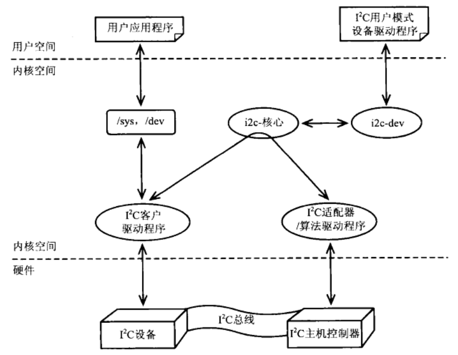

## linux kernel中的I2C子系统

[1.2 I2C总线驱动](#1.2 I2C总线驱动)

### 目录

[TOC]

Linux系统定义了I2C驱动体系结构，在Linux内核中的I2C子系统中，I2C驱动共有3部分组成：I2C核心、I2C总线驱动、I2C设备驱动，这三部分组成了I2C的框架；I2C子系统中有4个重要内容：I2C总线、I2C设备、I2C驱动、I2C适配器；

<!--more-->

Linux内核中的I2C驱动代码位于：drivers/i2c目录；


### 0. 简述


Linux内核中的I2C驱动代码位于：drivers/i2c目录；

Linux设备模型由bus、device、driver组成；


I2C驱动中有4个重要内容：I2C总线、I2C设备、I2C驱动、I2C适配器；

> I2C总线：维护I2C驱动和I2C设备两个链表，管理I2C驱动和I2C设备的匹配、删除等；
>
> I2C设备：具体硬件设备的一个抽象；
>
> I2C驱动：对应I2C设备的驱动程序；
>
> I2C适配器：用于I2C驱动和I2C设备间通信，是SOC上I2C控制器的一个抽象；


I2C总线上有两个链表，分别是i2c_driver和i2c_client链表；当任何一个driver或client注册时，I2C总线都会调用match函数，对client.name和driver.id_table.name进行遍历匹配；如果driver.id_table中所有的id都匹配不成功，说明client没有找到对应的driver；如果匹配成功，说明client和driver是配套的，那么I2C总线就会调用自己的probe函数，然后probe函数调用driver中提供的probe函数，driver中的probe函数会对设备进行硬件初始化和后续工作；

| 函数            | 说明        |
| --------------- | ----------- |
| i2c_add_adapter | 注册adapter |
| i2c_add_driver  | 注册driver  |
| i2c_new_device  | 注册client  |


### 1. I2C驱动框架


Linux的I2C体系结构分为3个部分：

> I2C核心
>
> I2C总线驱动
>
> I2C设备驱动





#### 1.1 I2C核心


I2C核心（i2c_core）维护了i2c_bus结构体，提供了：

> I2C总线驱动和设备驱动的注册、注销方法
>
> I2C的通信方法（i2c_algorithm）
>
> 上层的与具体适配器无关的代码
>
> 探测设备、检测设备地址的上层代码

此部分代码由Linux内核提供；


#### 1.2 I2C总线驱动


I2C总线驱动是对I2C硬件体系结构中适配器端的实现，适配器由CPU控制，或者直接集成在CPU内部；


I2C总线驱动主要包含：

> I2C适配器数据结构i2c_adapter
>
> I2C适配器的控制算法数据结构i2c_algorithm
>
> 控制I2C适配器产生通信信号的函数

通过I2C总线驱动代码，可以控制I2C适配器，以主设备方式产生开始位、停止位、读写周期，以及以从设备方式读写、产生ACK等；

此部分代码由具体的芯片厂商提供，如：高通、Samsung等；


#### 1.3 I2C设备驱动


I2C设备驱动是对I2C硬件体系结构中设备端的实现，设备一般挂接在I2C控制器（适配器）上，通过I2C适配器与CPU交换数据；

I2C设备驱动主要包含i2c_client和i2c_driver结构体，实现和用户交互的文件操作集fops、cdev等；

这两个数据结构中的成员函数，需要由驱动开发者根据具体设备去实现；


### 2. 核心数据结构


I2C驱动中最核心的4个数据结构：

> struct i2c_client
>
> struct i2c_driver
>
> struct i2c_adapter
>
> struct i2c_algorithm


#### 2.1 设备层


##### 2.1.1 I2C设备（i2c_client）

硬件上连接到I2C的SDA、SCL总线上的设备都是I2C设备，每一个I2C设备由一个i2c_client结构体进行描述；i2c_client对应真实的I2C物理设备，是具体硬件设备的抽象；一个i2c_client对象，表示连接到i2c总线的一个设备；


```
// include/linux/i2c.h
struct i2c_client {
    unsigned short flags;       /* div., see below      */
    unsigned short addr;        /* chip address - NOTE: 7bit    */
    char name[I2C_NAME_SIZE];
    struct i2c_adapter *adapter;    /* the adapter we sit on    */
    struct device dev;      /* the device structure     */
    int irq;            /* irq issued by device     */
    struct list_head detected;
#if IS_ENABLED(CONFIG_I2C_SLAVE)
    i2c_slave_cb_t slave_cb;    /* callback for slave mode  */
#endif
};
```

> unsigned short addr：表示7bit的设备芯片地址，地址被保存在低7bits
>
> struct i2c_adapter *adapter：表示这个i2c_client从属的i2c_adapter对象，驱动中使用这个指针操作发送
>
> struct device dev：表示device信息
>
> struct list_head detected：设备链表，将所有的i2c_client组成链表


i2c_client结构不是驱动开发者创建的，而是通过以下方式自动创建：

> 分配、设置、注册i2c_board_info
>
> 获取i2c_adapter，调用i2c_new_device
>
> 通过设备树（DeviceTree）创建


##### 2.1.2 I2C驱动（i2c_driver）


i2c_driver结构用于管理I2C的驱动和I2C设备的匹配探测，实现与用户层交互的文件操作集fops、cdev等；每一个I2C设备都对应一个I2C驱动，因此，每一个i2c_client结构，都对应一个i2c_driver结构，通过指针相连；编写一个i2c驱动的本质，就是要构造一个i2c_driver对象，并将其注册到内核；


```
// include/linux/i2c.h
struct i2c_driver {
    unsigned int class;

    int (*attach_adapter)(struct i2c_adapter *) __deprecated;

    /* Standard driver model interfaces */
    int (*probe)(struct i2c_client *, const struct i2c_device_id *); 
    int (*remove)(struct i2c_client *); 

    void (*shutdown)(struct i2c_client *); 
    void (*alert)(struct i2c_client *, enum i2c_alert_protocol protocol,
              unsigned int data);

    int (*command)(struct i2c_client *client, unsigned int cmd, void *arg);

    struct device_driver driver;
    const struct i2c_device_id *id_table;

    /* Device detection callback for automatic device creation */
    int (*detect)(struct i2c_client *, struct i2c_board_info *); 
    const unsigned short *address_list;
    struct list_head clients;
};
```

> probe：探测函数，匹配成功后执行，会将匹配到的i2c_client对象传入，完成申请资源、初始化、提供接口等操作
>
> remove：移除函数，设备消失时或驱动模块被卸载时会被调用，和probe操作相反
>
> struct device_driver driver：表明是一个设备的驱动类，用于匹配设备树的of_match_table域
>
> const struct i2c_device_id *id_table：用于使用平台文件或模块编写设备信息时进行匹配
>
> struct list_head clients：用于将所有i2c_driver联系到一起的链表


```
#define to_i2c_driver(d) container_of(d, struct i2c_driver, driver)
```


##### 2.1.3 总线和设备关系


#### 2.2 总线层


##### 2.2.1 I2C适配器（i2c_adapter）


I2C适配器，即SOC中的I2C控制器，对应struct i2c_adapter结构体；Linux中用i2c_adapter来表示一个I2C控制器，一个i2c_adapter结构体对应的就是SOC上的I2C控制器；所有的设备驱动都需要经过i2c_adapter对象的处理才能和物理设备通信；通过i2c_core层将I2C设备与i2c adapter关联起来，用来完成i2c总线控制器相关的数据通信，此结构体在芯片厂商提供的代码中维护；


```
// include/linux/i2c.h
struct i2c_adapter {
    struct module *owner;
    unsigned int class;       /* classes to allow probing for */
    const struct i2c_algorithm *algo; /* the algorithm to access the bus */
    void *algo_data;

    /* data fields that are valid for all devices   */
    const struct i2c_lock_operations *lock_ops;
    struct rt_mutex bus_lock;
    struct rt_mutex mux_lock;

    int timeout;            /* in jiffies */
    int retries;
    struct device dev;      /* the adapter device */

    int nr;
    char name[48];
    struct completion dev_released;

    struct mutex userspace_clients_lock;
    struct list_head userspace_clients;

    struct i2c_bus_recovery_info *bus_recovery_info;
    const struct i2c_adapter_quirks *quirks;
};
```


```
#define to_i2c_adapter(d) container_of(d, struct i2c_adapter, dev)
```


##### 2.2.2 I2C总线算法（i2c_algorithm）

I2C总线数据通信算法，通过管理I2C总线控制器，实现对I2C总线上数据的发送和接收等操作；

struct i2c_algorithm数据结构，是i2c控制器数据通信需要的控制算法，对应的是I2C的时序；通过管理I2C总线控制器，实现对I2C总线上数据的发送和接收等操作；用来描述适配器和设备之间的通信方法，由芯片厂商实现；

最重要的成员是master_xfer()函数，这个接口是硬件相关的，操作内容都是I2C控制器的寄存器，最终完成将数据发送到物理I2C控制器；


```
// include/linux/i2c.h
struct i2c_algorithm {
    int (*master_xfer)(struct i2c_adapter *adap, struct i2c_msg *msgs,
               int num);
    int (*smbus_xfer) (struct i2c_adapter *adap, u16 addr,
               unsigned short flags, char read_write,
               u8 command, int size, union i2c_smbus_data *data);

    /* To determine what the adapter supports */
    u32 (*functionality) (struct i2c_adapter *);

#if IS_ENABLED(CONFIG_I2C_SLAVE)
    int (*reg_slave)(struct i2c_client *client);
    int (*unreg_slave)(struct i2c_client *client);
#endif
};
```

> master_xfer：最重要的接口，这个接口是硬件相关的，操作内容都是I2C控制器的寄存器，最终完成将数据发送到物理I2C控制器；该函数返回成功发送的消息数，错误返回负数；


device_driver

```
// include/linux/device.h
struct device_driver {
    const char      *name;
    struct bus_type     *bus;

    struct module       *owner;
    const char      *mod_name;  /* used for built-in modules */

    bool suppress_bind_attrs;   /* disables bind/unbind via sysfs */
    enum probe_type probe_type;

    const struct of_device_id   *of_match_table;
    const struct acpi_device_id *acpi_match_table;

    int (*probe) (struct device *dev);
    int (*remove) (struct device *dev);
    void (*shutdown) (struct device *dev);
    int (*suspend) (struct device *dev, pm_message_t state);
    int (*resume) (struct device *dev);
    const struct attribute_group **groups;

    const struct dev_pm_ops *pm; 

    struct driver_private *p;
};
```


##### 2.2.3 I2C总线类型


I2C总线对应着/bus/目录下的一个总线；维护I2C设备和I2C驱动两个链表，管理I2C设备和I2C的匹配和删除；是SOC上I2C控制器的抽象；


```
// include/linux/device.h
struct bus_type {
    const char      *name;
    const char      *dev_name;
    struct device       *dev_root;
    struct device_attribute *dev_attrs; /* use dev_groups instead */
    const struct attribute_group **bus_groups;
    const struct attribute_group **dev_groups;
    const struct attribute_group **drv_groups;

    int (*match)(struct device *dev, struct device_driver *drv);
    int (*uevent)(struct device *dev, struct kobj_uevent_env *env);
    int (*probe)(struct device *dev);
    int (*remove)(struct device *dev);
    void (*shutdown)(struct device *dev);

    int (*online)(struct device *dev);
    int (*offline)(struct device *dev);

    int (*suspend)(struct device *dev, pm_message_t state);
    int (*resume)(struct device *dev);

    const struct dev_pm_ops *pm; 

    const struct iommu_ops *iommu_ops;

    struct subsys_private *p;
    struct lock_class_key lock_key;
};
```


```
// drivers/i2c/i2c-core.c
struct bus_type i2c_bus_type = {
    .name       = "i2c",
    .match      = i2c_device_match,
    .probe      = i2c_device_probe,
    .remove     = i2c_device_remove,
    .shutdown   = i2c_device_shutdown,
};
EXPORT_SYMBOL_GPL(i2c_bus_type);
```


I2C总线bus_type结构体管理着i2c设备和i2c驱动的匹配、删除操作，i2c会调用i2c_device_match函数对比i2c设备和i2c驱动是否匹配，如果匹配就调用i2c_device_probe函数，进而调用i2c驱动的probe函数；


#### 2.3 总线层和设备层关系


在设备层，i2c_client通过adapter指针，指向总线层的i2c_adapter，和总线层存在关系；

在总线层，i2c_adapter通过algo指针，指向i2c_algorithm，进一步调用i2c_algorithm中的算法，如：master_xfer()，进行实际的数据发送和接收；


总线层

struct i2c_adapter       I2C适配器（主机CPU的I2C控制器）

struct i2c_algorithm       I2C算法（I2C的收、发时序控制）


设备层

struct i2c_client       I2C（从机）设备信息

struct i2c_driver       I2C（从机）设备驱动信息


#### 2.4 数据结构间的关系


### 3. 重要的操作函数


#### 3.1 I2C子系统初始化


##### 3.1.1 I2C总线初始化


```
// drivers/i2c/i2c-core.c
postcore_initcall(i2c_init);
module_exit(i2c_exit);
```


```
// include/linux/init.h
#define postcore_initcall(fn)       __define_initcall(fn, 2)
```


```
// include/linux/init.h
#define __define_initcall(fn, id) \
    static initcall_t __initcall_##fn##id __used \
    __attribute__((__section__(".initcall" #id ".init"))) = fn;
```

postcore_initcall(i2c_init)操作，会在编译内核时，将函数指针变量__initcall_i2c_init放到名称为initcall2.init的section中；即将i2c_init()函数的首地址放到名称为initcall2.init的section中；

Linux设备启动时，会在do_basic_setup()函数中，通过driver_init()和do_initcalls()函数，调用到i2c_init()函数，对I2C总线初始化；


```
// drivers/i2c/i2c-core.c
static int __init i2c_init(void)
{
    ......
    retval = bus_register(&i2c_bus_type);
    ......
    i2c_adapter_compat_class = class_compat_register("i2c-adapter");
    ......
    retval = i2c_add_driver(&dummy_driver);
    ......
}
```


通过bus_register()函数，在系统中注册一个新的总线i2c_bus_type，name: i2c；适配器设备、I2C设备、I2C设备驱动程序都会连接到这条总线上；

```
// drivers/i2c/i2c-core.c
struct bus_type i2c_bus_type = {
    .name       = "i2c",
    .match      = i2c_device_match,
    .probe      = i2c_device_probe,
    .remove     = i2c_device_remove,
    .shutdown   = i2c_device_shutdown,
};
EXPORT_SYMBOL_GPL(i2c_bus_type);
```


通过i2c_add_driver()函数，向I2C总线注册一个空的I2C设备驱动程序；可以不用关心；


注册过程中发生异常错误时，需要使用对应的函数进行反向操作：


##### 3.1.2 I2C总线退出


```
// drivers/i2c/i2c-core.c
static void __exit i2c_exit(void)
{
    if (IS_ENABLED(CONFIG_ACPI))
        WARN_ON(acpi_reconfig_notifier_unregister(&i2c_acpi_notifier));
    if (IS_ENABLED(CONFIG_OF_DYNAMIC))
        WARN_ON(of_reconfig_notifier_unregister(&i2c_of_notifier));
    i2c_del_driver(&dummy_driver);
#ifdef CONFIG_I2C_COMPAT
    class_compat_unregister(i2c_adapter_compat_class);
#endif
    bus_unregister(&i2c_bus_type);
    tracepoint_synchronize_unregister();
}
```


i2c_del_driver()函数，用来从I2C总线注销设备驱动程序；和i2c_add_driver()函数功能相反；


#### 	3.2 适配器驱动

适配器驱动程序是I2C设备驱动程序需要实现的主要驱动程序，需要根据具体的适配器硬件编写；

使用内核提供的框架函数向I2C子系统中添加一个新的适配器；i2c_adapter结构体为描述各种I2C适配器提供了通用的封装，但是i2c_adapter结构体只是所有适配器的共有属性，并不能代表所有类型的适配器；

添加新的适配器的过程：

>分配一个I2C适配器，并初始化一个i2c_adapter结构体，及相应的变量
>
>使用i2c_add_adapter()函数向I2C子系统添加适配器结构体i2c_adapter


##### 3.2.1 添加适配器驱动

```c
// drivers/i2c/i2c-core.c
int i2c_add_adapter(struct i2c_adapter *adapter)
{
    struct device *dev = &adapter->dev;
    int id;

    if (dev->of_node) {
        id = of_alias_get_id(dev->of_node, "i2c");
        if (id >= 0) { 
            adapter->nr = id;
            return __i2c_add_numbered_adapter(adapter);
        }
    }    

    mutex_lock(&core_lock);
    id = idr_alloc(&i2c_adapter_idr, adapter,
               __i2c_first_dynamic_bus_num, 0, GFP_KERNEL);
    mutex_unlock(&core_lock);
    if (WARN(id < 0, "couldn't get idr"))
        return id;

    adapter->nr = id;

    return i2c_register_adapter(adapter);
}
EXPORT_SYMBOL(i2c_add_adapter);
```

通过i2c_register_adapter()函数，向内核注册一个适配器设备adapter；


```c
// drivers/i2c/i2c-core.c
static int i2c_register_adapter(struct i2c_adapter *adap)
{
    int res = -EINVAL;
	......
    /* Sanity checks */
    if (WARN(!adap->name[0], "i2c adapter has no name"))
        goto out_list;

    if (!adap->algo) {
        pr_err("adapter '%s': no algo supplied!\n", adap->name);
        goto out_list;
    }

    if (!adap->lock_ops)
        adap->lock_ops = &i2c_adapter_lock_ops;
	......
    /* Set default timeout to 1 second if not already set */
    if (adap->timeout == 0)
        adap->timeout = HZ;

    dev_set_name(&adap->dev, "i2c-%d", adap->nr);
    adap->dev.bus = &i2c_bus_type;
    adap->dev.type = &i2c_adapter_type;
    res = device_register(&adap->dev);

    pm_runtime_no_callbacks(&adap->dev);
    pm_suspend_ignore_children(&adap->dev, true);
    pm_runtime_enable(&adap->dev);

#ifdef CONFIG_I2C_COMPAT
    res = class_compat_create_link(i2c_adapter_compat_class, &adap->dev,
                       adap->dev.parent);
#endif

    i2c_init_recovery(adap);

    /* create pre-declared device nodes */
    of_i2c_register_devices(adap);
    i2c_acpi_register_devices(adap);
    i2c_acpi_install_space_handler(adap);

    if (adap->nr < __i2c_first_dynamic_bus_num)
        i2c_scan_static_board_info(adap);

    /* Notify drivers */
    mutex_lock(&core_lock);
    bus_for_each_drv(&i2c_bus_type, NULL, adap, __process_new_adapter);
    mutex_unlock(&core_lock);

    return 0;

out_list:
    mutex_lock(&core_lock);
    idr_remove(&i2c_adapter_idr, adap->nr);
    mutex_unlock(&core_lock);
    return res;
}
```


##### 3.2.2 注销适配器驱动

```c
// // drivers/i2c/i2c-core.c
void i2c_del_adapter(struct i2c_adapter *adap)
{
    struct i2c_adapter *found;
    struct i2c_client *client, *next;

    /* First make sure that this adapter was ever added */
    mutex_lock(&core_lock);
    found = idr_find(&i2c_adapter_idr, adap->nr);
    mutex_unlock(&core_lock);
    if (found != adap) {
        pr_debug("attempting to delete unregistered adapter [%s]\n", adap->name);
        return;
    }

    i2c_acpi_remove_space_handler(adap);
    /* Tell drivers about this removal */
    mutex_lock(&core_lock);
    bus_for_each_drv(&i2c_bus_type, NULL, adap,
                   __process_removed_adapter);
    mutex_unlock(&core_lock);

    /* Remove devices instantiated from sysfs */
    mutex_lock_nested(&adap->userspace_clients_lock,
              i2c_adapter_depth(adap));
    list_for_each_entry_safe(client, next, &adap->userspace_clients,
                 detected) {
        list_del(&client->detected);
        i2c_unregister_device(client);
    }
    mutex_unlock(&adap->userspace_clients_lock);
    device_for_each_child(&adap->dev, NULL, __unregister_client);
    device_for_each_child(&adap->dev, NULL, __unregister_dummy);

#ifdef CONFIG_I2C_COMPAT
    class_compat_remove_link(i2c_adapter_compat_class, &adap->dev,
                 adap->dev.parent);
#endif

    pm_runtime_disable(&adap->dev);

    init_completion(&adap->dev_released);
    device_unregister(&adap->dev);
    wait_for_completion(&adap->dev_released);

    /* free bus id */
    mutex_lock(&core_lock);
    idr_remove(&i2c_adapter_idr, adap->nr);
    mutex_unlock(&core_lock);

    /* Clear the device structure in case this adapter is ever going to be
       added again */
    memset(&adap->dev, 0, sizeof(adap->dev));
}
EXPORT_SYMBOL(i2c_del_adapter);
```


#### 3.3 注册I2C驱动

注册I2C驱动需要完成的操作：

> 将I2C驱动添加到I2C总线的驱动链表中
>
> 遍历I2C总线上的I2C设备链表，根据i2c_device_match函数进行匹配，如果匹配就调用i2c_device_probe函数
>
> i2c_device_probe函数会调用I2C驱动的probe函数


##### 3.3.1 注册I2C驱动

在I2C驱动程序中，通过i2c_add_driver()函数，来注册驱动：

```
// include/linux/i2c.h
#define i2c_add_driver(driver) \
    i2c_register_driver(THIS_MODULE, driver)
```


```
// drivers/i2c/i2c-core.c
int i2c_register_driver(struct module *owner, struct i2c_driver *driver)
{
	......
    /* add the driver to the list of i2c drivers in the driver core */
    driver->driver.owner = owner;
    driver->driver.bus = &i2c_bus_type;		// 绑定I2C总线 
    INIT_LIST_HEAD(&driver->clients);

    res = driver_register(&driver->driver);		// 向I2C总线注册驱动
	......
    i2c_for_each_dev(driver, __process_new_driver);

    return 0;
}
EXPORT_SYMBOL(i2c_register_driver);
```


在i2c_add_driver()函数中，做了三件事：

> 绑定总线
>
> 向总线注册驱动 ---- 重点
>
> 遍历总线的设备，调用__process_new_driver


driver_register

```
// drivers/i2c/i2c-core.c
int driver_register(struct device_driver *drv)
{
    int ret;
    struct device_driver *other;
	......
    other = driver_find(drv->name, drv->bus);
	......
    ret = bus_add_driver(drv);

    ret = driver_add_groups(drv, drv->groups);
    if (ret) {
        bus_remove_driver(drv);
        return ret;
    }
    kobject_uevent(&drv->p->kobj, KOBJ_ADD);

    return ret;
}
EXPORT_SYMBOL_GPL(driver_register);
```


driver_find()函数，在I2C总线中，找到name对应的I2C device_driver；

bus_add_driver()函数，将驱动添加到总线上；


##### 3.3.2 注销I2C驱动

```
// drivers/i2c/i2c-core.c
void i2c_del_driver(struct i2c_driver *driver)
{
    i2c_for_each_dev(driver, __process_removed_driver);

    driver_unregister(&driver->driver);
    pr_debug("driver [%s] unregistered\n", driver->driver.name);
}
EXPORT_SYMBOL(i2c_del_driver);
```


#### 3.4 注册I2C设备

##### 3.4.1 注册I2C设备

I2C通过i2c_new_device()函数，来添加一个I2C设备；

```
// drivers/i2c/i2c-core.c
struct i2c_client *
i2c_new_device(struct i2c_adapter *adap, struct i2c_board_info const *info)
{
    struct i2c_client   *client;
    int         status;

    client = kzalloc(sizeof *client, GFP_KERNEL);

    client->adapter = adap;		// 指定设备的适配器

    client->dev.platform_data = info->platform_data;

    if (info->archdata)
        client->dev.archdata = *info->archdata;

    client->flags = info->flags;
    client->addr = info->addr;
    client->irq = info->irq;

    strlcpy(client->name, info->type, sizeof(client->name));

    status = i2c_check_addr_validity(client->addr, client->flags);

	/* Check for address business */
    status = i2c_check_addr_busy(adap, i2c_encode_flags_to_addr(client));

    client->dev.parent = &client->adapter->dev;
    client->dev.bus = &i2c_bus_type;	// 绑定I2C总线
    client->dev.type = &i2c_client_type;
    client->dev.of_node = info->of_node;
    client->dev.fwnode = info->fwnode;

    i2c_dev_set_name(adap, client);
    status = device_register(&client->dev);		// 向总线注册设备
	......
    return client;
}
EXPORT_SYMBOL_GPL(i2c_new_device);
```


```
// include/linux/i2c.h
struct i2c_board_info {
    char        type[I2C_NAME_SIZE];	// 设备名称，用于与驱动匹配
    unsigned short  flags;
    unsigned short  addr;	// 设备地址
    void        *platform_data;
    struct dev_archdata *archdata;
    struct device_node *of_node;
    struct fwnode_handle *fwnode;
    int     irq;
};
```

struct i2c_board_info结构体描述了设备的硬件信息；


```
// drivers/base/core.c
int device_register(struct device *dev)
{   
    device_initialize(dev);
    return device_add(dev);
}
EXPORT_SYMBOL_GPL(device_register);
```


device_initialize()函数用来初始化I2C设备的device结构体；

```
// drivers/base/core.c
void device_initialize(struct device *dev)
{
    dev->kobj.kset = devices_kset;
    kobject_init(&dev->kobj, &device_ktype);
    INIT_LIST_HEAD(&dev->dma_pools);
    mutex_init(&dev->mutex);
    lockdep_set_novalidate_class(&dev->mutex);
    spin_lock_init(&dev->devres_lock);
    INIT_LIST_HEAD(&dev->devres_head);
    device_pm_init(dev);
    set_dev_node(dev, -1);
#ifdef CONFIG_GENERIC_MSI_IRQ
    INIT_LIST_HEAD(&dev->msi_list);
#endif
}
EXPORT_SYMBOL_GPL(device_initialize);
```


```
int device_add(struct device *dev)
{
    struct device *parent = NULL;
    struct kobject *kobj;
    struct class_interface *class_intf;
    int error = -EINVAL;
    struct kobject *glue_dir = NULL;

    dev = get_device(dev);

    if (!dev->p) {
        error = device_private_init(dev);
        if (error)
            goto done;
    }

    if (dev->init_name) {
        dev_set_name(dev, "%s", dev->init_name);
        dev->init_name = NULL;
    }

    if (!dev_name(dev) && dev->bus && dev->bus->dev_name)
        dev_set_name(dev, "%s%u", dev->bus->dev_name, dev->id);

    parent = get_device(dev->parent);
    kobj = get_device_parent(dev, parent);

    if (kobj)
        dev->kobj.parent = kobj;
    if (parent && (dev_to_node(dev) == NUMA_NO_NODE))
        set_dev_node(dev, dev_to_node(parent));

    error = kobject_add(&dev->kobj, dev->kobj.parent, NULL);

    if (platform_notify)
        platform_notify(dev);

    error = device_create_file(dev, &dev_attr_uevent);

    error = device_add_class_symlinks(dev);

    error = device_add_attrs(dev);

    error = bus_add_device(dev);

    error = dpm_sysfs_add(dev);

    device_pm_add(dev);

    if (MAJOR(dev->devt)) {
        error = device_create_file(dev, &dev_attr_dev);

        error = device_create_sys_dev_entry(dev);

        devtmpfs_create_node(dev);
    }

    if (dev->bus)
        blocking_notifier_call_chain(&dev->bus->p->bus_notifier,
                         BUS_NOTIFY_ADD_DEVICE, dev);

    kobject_uevent(&dev->kobj, KOBJ_ADD);
    bus_probe_device(dev);
    if (parent)
        klist_add_tail(&dev->p->knode_parent,
                   &parent->p->klist_children);

    if (dev->class) {
        mutex_lock(&dev->class->p->mutex);
        klist_add_tail(&dev->knode_class,
                   &dev->class->p->klist_devices);

        list_for_each_entry(class_intf,
                    &dev->class->p->interfaces, node)
            if (class_intf->add_dev)
                class_intf->add_dev(dev, class_intf);
        mutex_unlock(&dev->class->p->mutex);
    }
}
EXPORT_SYMBOL_GPL(device_add);
```


device_addbus_add_devicebus_probe_device


##### 3.4.2 注销I2C设备


```
// drivers/i2c/i2c-core.c
void i2c_unregister_device(struct i2c_client *client)
{
    if (client->dev.of_node)
        of_node_clear_flag(client->dev.of_node, OF_POPULATED);
    if (ACPI_COMPANION(&client->dev))
        acpi_device_clear_enumerated(ACPI_COMPANION(&client->dev));
    device_unregister(&client->dev);
}
EXPORT_SYMBOL_GPL(i2c_unregister_device);
```


#### 3.5 适配器和设备通信


I2C总线通信方式是对特定的I2C适配器使用i2c_transfer()函数，调用i2c_algothrim的master_xfer()方法实现i2c_msg消息的传输；不同的适配器，对应的master_xfer()方法由控制器的硬件决定，由芯片厂商提供；


##### 3.5.1 i2c_transfer


在I2C设备和I2C驱动匹配之后，驱动程序和设备的通讯，通过i2c_transfer()函数来给设备发送信息；

```
// drivers/i2c/i2c-core.c
int i2c_transfer(struct i2c_adapter *adap, struct i2c_msg *msgs, int num)
{
    int ret;
    if (adap->algo->master_xfer) {
		......
        ret = __i2c_transfer(adap, msgs, num);
		......
}
EXPORT_SYMBOL(i2c_transfer);
```

i2c_transfer()函数是i2c核心提供给设备驱动的发送方法，该函数发送的数据需要被打包成i2c_msg结构，该函数最终会回调i2c_adapter->i2c_algorithm->master_xfer()函数，将i2c_msg对象发送到i2c的物理控制器；

```
// drivers/i2c/i2c-core.c
int __i2c_transfer(struct i2c_adapter *adap, struct i2c_msg *msgs, int num)
{
    unsigned long orig_jiffies;
    int ret, try;

    if (adap->quirks && i2c_check_for_quirks(adap, msgs, num))
        return -EOPNOTSUPP;

    if (static_key_false(&i2c_trace_msg)) {
        int i;
        for (i = 0; i < num; i++)
            if (msgs[i].flags & I2C_M_RD)
                trace_i2c_read(adap, &msgs[i], i);
            else
                trace_i2c_write(adap, &msgs[i], i);
    }

    orig_jiffies = jiffies;
    for (ret = 0, try = 0; try <= adap->retries; try++) {
        ret = adap->algo->master_xfer(adap, msgs, num);		// 发送、接收信息操作
        if (ret != -EAGAIN)
            break;
        if (time_after(jiffies, orig_jiffies + adap->timeout))
            break;
    }
	......
}
EXPORT_SYMBOL(__i2c_transfer);
```

最终，通过adap->algo->master_xfer()函数，将struct i2c_msg结构体类型的消息，通过适配器的struct i2c_adapter发送给设备，或者从设备中读取信息；


##### 3.5.2 消息格式


经过mster_xfer()函数发送、接收的消息类型应该按照struct i2c_msg结构体格式：

```c
// include/uapi/linux/i2c.h
struct i2c_msg {
    __u16 addr; /* slave address            */
    __u16 flags;
#define I2C_M_RD        0x0001  /* read data, from slave to master */
                    /* I2C_M_RD is guaranteed to be 0x0001! */
#define I2C_M_TEN       0x0010  /* this is a ten bit chip address */
#define I2C_M_RECV_LEN      0x0400  /* length will be first received byte */
#define I2C_M_NO_RD_ACK     0x0800  /* if I2C_FUNC_PROTOCOL_MANGLING */
#define I2C_M_IGNORE_NAK    0x1000  /* if I2C_FUNC_PROTOCOL_MANGLING */
#define I2C_M_REV_DIR_ADDR  0x2000  /* if I2C_FUNC_PROTOCOL_MANGLING */
#define I2C_M_NOSTART       0x4000  /* if I2C_FUNC_NOSTART */
#define I2C_M_STOP      0x8000  /* if I2C_FUNC_PROTOCOL_MANGLING */
    __u16 len;      /* msg length               */
    __u8 *buf;      /* pointer to msg data          */
};
```

> I2C传输数据是以字节为单位的，具体到i2c_msg结构体，buf表示要传输的数据，len表示传输的数据字节数；
>
> I2C读取，即封装的xxx_i2c_read()函数，需要两个i2c_msg组成的数组；第一个i2c_msg的buf，保存master向slave发出目标寄存器地址，len表示寄存器地址字节长度；第二个i2c_msg的buf，用来接收slave向master返回的数据，len表示期望读到的数据字节长度；
>
> I2C写入，即封装的xxx_i2c_write()函数，仅由一个i2c_msg组成；i2c_msg的buf，保存从slave的目标寄存器地址和要写入的数据，len表示期望写入的数据字节长度；

注意：以数组格式定义i2c_msg是为了访问连续，因为数组是连续内存存储的；


##### 3.5.3 消息发送、接收函数


###### 1）发送函数

```
// drivers/i2c/i2c-core.c
int i2c_master_send(const struct i2c_client *client, const char *buf, int count)
{
    int ret;
    struct i2c_adapter *adap = client->adapter;
    struct i2c_msg msg;

    msg.addr = client->addr;
    msg.flags = client->flags & I2C_M_TEN;
    msg.len = count;
    msg.buf = (char *)buf;

    ret = i2c_transfer(adap, &msg, 1);

    return (ret == 1) ? count : ret;
}
EXPORT_SYMBOL(i2c_master_send);
```

I2C发送消息操作时，仅需要一个i2c_msg；i2c_msg的buf，保存slave的目标寄存器地址和要写入的数据，len表示期望写入的数据字节长度；如下：

```c
i2c_master_send(client, data, len);
```


###### 2）接收函数

```
// drivers/i2c/i2c-core.c
int i2c_master_recv(const struct i2c_client *client, char *buf, int count)
{
    struct i2c_adapter *adap = client->adapter;
    struct i2c_msg msg;
    int ret;

    msg.addr = client->addr;
    msg.flags = client->flags & I2C_M_TEN;
    msg.flags |= I2C_M_RD;
    msg.len = count;
    msg.buf = buf;

    ret = i2c_transfer(adap, &msg, 1);

    return (ret == 1) ? count : ret;
}
EXPORT_SYMBOL(i2c_master_recv);
```

I2C接收消息操作时，需要给从设备发送两个i2c_msg组成的数组；第一个i2c_msg的buf，保存master向slave发出目标寄存器地址，并使用buf指针指向这个地址，len表示寄存器地址字节长度；第二个i2c_msg的buf，用来接收slave向master返回的数据，len表示期望读到的数据字节长度；

也可以分两次，先使用i2c_master_send()函数，向slave发出目标寄存器地址，在使用i2c_master_recv()函数，用来接收读取到的数据消息；如下：

```c
	i2c_master_send(client, reg, 2); 
	i2c_master_recv(client, data, len);
```


### 4. 添加设备


在内核中的Documentation/i2c/instantiating-devices文件中，讲述了添加设备的方法；


i2c_client结构是通过以下方式自动创建：

> 分配、设置、注册i2c_board_info
>
> 获取i2c_adapter，调用i2c_new_device
>
> 通过设备树（DeviceTree）创建


#### 4.1 添加设备树


```
// Image-fsl-lx2160a-rdb-new.dts
        i2c@2030000 {
            compatible = "fsl,vf610-i2c";
            #address-cells = <0x1>;
            #size-cells = <0x0>;
            reg = <0x0 0x2030000 0x0 0x10000>;
            interrupts = <0x0 0x23 0x4>;
            scl-gpios=<&gpio4 8 0x0>;
            clock-names = "i2c";
            clocks = <0x2 0x4 0x7>;
            status = "okay";
            rtc@32 {
                compatible = "Micro Crystal,rv8803";
                reg = <0x32>;
            };

            eeprom_mcy@51 {
                compatible = "mcy,eeprom_mcy";
                reg = <0x51>;
            };
        };
```


```
# ls /sys/bus/i2c/devices/
2-0032  2-0051  i2c-0   i2c-1   i2c-2   i2c-3 
# ls /sys/bus/i2c/devices/ -l
total 0
lrwxrwxrwx    1 root     root             0 Oct 15 03:26 2-0032 -> ../../../devices/platform/soc/2030000.i2c/i2c-2/2-0032
lrwxrwxrwx    1 root     root             0 Oct 15 03:26 2-0051 -> ../../../devices/platform/soc/2030000.i2c/i2c-2/2-0051
lrwxrwxrwx    1 root     root             0 Oct 15 03:26 i2c-0 -> ../../../devices/platform/soc/2000000.i2c/i2c-0
lrwxrwxrwx    1 root     root             0 Oct 15 03:26 i2c-1 -> ../../../devices/platform/soc/2010000.i2c/i2c-1
lrwxrwxrwx    1 root     root             0 Oct 15 03:26 i2c-2 -> ../../../devices/platform/soc/2030000.i2c/i2c-2
lrwxrwxrwx    1 root     root             0 Oct 15 03:26 i2c-3 -> ../../../devices/platform/soc/2050000.i2c/i2c-3


# ls /sys/bus/i2c/devices/2-0051/
consumers  modalias   name       of_node    subsystem  suppliers  uevent
# ls /sys/bus/i2c/devices/2-0051/ -l
total 0
-r--r--r--    1 root     root          4096 Oct 15 03:27 consumers
-r--r--r--    1 root     root          4096 Oct 15 03:27 modalias
-r--r--r--    1 root     root          4096 Oct 15 03:27 name
lrwxrwxrwx    1 root     root             0 Oct 15 03:27 of_node -> ../../../../../../firmware/devicetree/base/soc/i2c@2030000/eeprom_mcy@51
lrwxrwxrwx    1 root     root             0 Oct 15 03:27 subsystem -> ../../../../../../bus/i2c
-r--r--r--    1 root     root          4096 Oct 15 03:27 suppliers
-rw-r--r--    1 root     root          4096 Oct 15 03:27 uevent
# cat /sys/bus/i2c/devices/2-0051/name
eeprom_mcy
```


#### 4.2 i2c_new_device添加


```c
#include <linux/module.h>
#include <linux/i2c.h>

static struct i2c_client *client;

static struct i2c_board_info eeprom_info = { 
    I2C_BOARD_INFO("eeprom_device", 0x51),
};

static int eeprom_device_init(void)
{
    struct i2c_adapter *adap = NULL;

    printk("%s: %d\n", __func__, __LINE__);

    adap = i2c_get_adapter(2);
    if (!adap) {
        printk("%s, i2c_get_adapter failed!\n", __func__);
        return -1; 
    }   

    client = i2c_new_device(adap, &eeprom_info);
    if (!client) {
        printk("%s, i2c_new_device failed!\n", __func__);
        return -2; 
    }   

    i2c_put_adapter(adap);

    return 0;
}

static void eeprom_device_exit(void)
{
    printk("%s: %d\n", __func__, __LINE__);

    i2c_unregister_device(client);
}

module_init(eeprom_device_init);
module_exit(eeprom_device_exit);
```


#### 4.3 静态注册I2C设备

内核提供了一种静态注册I2C设备的方法，通过i2c_register_board_info()函数实现：

```
// drivers/i2c/i2c-boardinfo.c
int i2c_register_board_info(int busnum, struct i2c_board_info const *info, unsigned len)
{
    int status;

    if (busnum >= __i2c_first_dynamic_bus_num)
        __i2c_first_dynamic_bus_num = busnum + 1;

    for (status = 0; len; len--, info++) {
        struct i2c_devinfo  *devinfo;

        devinfo = kzalloc(sizeof(*devinfo), GFP_KERNEL);

        devinfo->busnum = busnum;
        devinfo->board_info = *info;
        list_add_tail(&devinfo->list, &__i2c_board_list);
    }   
	......
}
```

在系统初始化过程中，可以通过i2c_register_board_info()函数，将需要的I2C设备添加到\_\_i2c_board_list链表；系统在成功加载I2C适配器adapter后，会对这个\_\_i2c_board_list链表中所有的设备逐一完成i2c_client的注册；

```
// drivers/i2c/i2c-core.h
struct i2c_devinfo {
    struct list_head    list;
    int         busnum;
    struct i2c_board_info   board_info;
};
```

系统初始化时，根据I2C设备配置信息，创建I2C设备（i2c_client），并添加到I2C子系统；

最终是在i2c_scan_static_board_info()函数中，通过调用i2c_new_device()函数来实现添加设备；i2c_scan_static_board_info()函数一般在初始化时工作；

```
// drivers/i2c/i2c-core.c
static void i2c_scan_static_board_info(struct i2c_adapter *adapter)
{
    struct i2c_devinfo  *devinfo;

    list_for_each_entry(devinfo, &__i2c_board_list, list) {
        if (devinfo->busnum == adapter->nr
                && !i2c_new_device(adapter,
                        &devinfo->board_info))
		......
    }
}
```


### 5. 添加驱动

以eeprom为例；


#### 5.1 I2C设备驱动框架

```c
static int mcy_eeprom_init(void)
{
    printk("%s\n", __func__);

    i2c_add_driver(&mcy_eeprom_driver);

    return 0;
}

static void mcy_eeprom_exit(void)
{
    printk("%s\n", __func__);

    i2c_del_driver(&mcy_eeprom_driver);
}

module_init(mcy_eeprom_init);
module_exit(mcy_eeprom_exit);
```


```c
struct i2c_driver mcy_eeprom_driver = {
    .driver = {
        .owner = THIS_MODULE,
        .name = "mcy_eeprom",
        //.of_match_table = mcy_eeprom_table,
    },
    .probe = mcy_eeprom_probe,
    .remove = mcy_eeprom_remove,
    .id_table = mcy_eeprom_id,
};
```


#### 5.2 probe函数

##### 1）注册字符设备

```c
int mcy_eeprom_probe(struct i2c_client *client, const struct i2c_device_id *id)
{
    int ret = -1; 

    printk("%s\n", __func__);
    
    eeprom_driver.client = client;

    ret = alloc_chrdev_region(&devnum, 0, 1, "mcy_eeprom_chrdev");
    if (ret) {
        printk("%s, alloc_chrdev_region failed!\n", __func__);
        goto chrdev_err;
    }   
    printk("%s, alloc_chrdev_region, devnum: %d\n", __func__, devnum);

    cdev = cdev_alloc();
    cdev_init(cdev, &mcy_eeprom_fops);
    ret = cdev_add(cdev, devnum, 1); 
    if (ret) {
        printk("%s, cdev_add failed!\n", __func__);
        goto cdev_err;
    }
        
    // /sys/class
    dev_class = class_create(THIS_MODULE, "mcy_eeprom_class");
    if (IS_ERR(dev_class)) {
        printk("%s, dev_class class_create failed\n", __func__);
        goto class_err;
    }   
    // /dev
    device_create(dev_class, NULL, devnum, NULL, "mcy_eeprom0");

    printk("%s, OK!\n", __func__);

    return 0;

class_err:
    cdev_del(cdev);
cdev_err:
    unregister_chrdev_region(devnum, 1); 
chrdev_err:
    return -1; 
}
```


##### 2）卸载函数

```c
int mcy_eeprom_remove(struct i2c_client *client)
{
    printk("%s\n", __func__);

    device_destroy(dev_class, devnum);
    class_destroy(dev_class);
    cdev_del(cdev);
    unregister_chrdev_region(devnum, 1);
    kfree(cdev);

    return 0;
}
```


##### 3）字符设备操作集

```c
struct file_operations mcy_eeprom_fops= {
    .open = eeprom_driver_open,
    .release = eeprom_driver_release,
    .read = eeprom_driver_read,
    .write = eeprom_driver_write,
};
```


#### 5.3 读写函数


I2C数据的发送和接收，是通过I2C驱动中file_operations的write和read系统调用来实现的；驱动中read和write的封装，是需要封装调用i2c_transfer()函数来完成i2d_msg消息的通信；read和write函数的封装，有两种方法；


##### 5.3.1 内核函数调用

使用i2c-core.c提供的i2c_master_send()和i2c_master_recv()函数实现I2C信息的发送和接收；


###### 1）发送

```c
i2c_master_send(client, data, len);
```

I2C发送，直接调用i2c_master_send()函数，一次完成I2C数据的发送；

data：要发送的数据信息数组；其中data最前边的地址存放的是I2C从设备寄存器的地址，如果地址是8bits，就占用data[0]，如果地址是16bits，占用data[0]和data[1]；在地址之后，紧接着存放要发送的数据内容；

len：要发送的数据长度；包含I2C从设备寄存器地址和数据内容的总数据长度；

```c
static ssize_t eeprom_driver_write(struct file *filp, const char __user *buf, size_t count, loff_t *loff)
{   
    eeprom_data_t eeprom_data;
    unsigned char data[18] = {0};
    int len = 0;
    int i = 0;
    int ret = -1;

    printk("%s\n", __func__);

    memset(&eeprom_data, 0, sizeof(eeprom_data_t));
    ret = copy_from_user(&eeprom_data, buf, count);
    if (ret < 0) {
        printk("%s, copy_from_user failed, ret: %d\n", __func__, ret);
        return -1;
    }

    memcpy(&data[2], eeprom_data.data, eeprom_data.len);
    data[0] = (char)((eeprom_data.reg & 0x0000ff00) >> 8);
    data[1] = (char)(eeprom_data.reg & 0x000000ff);
    len = eeprom_data.len + 2;

    for (i = 0; i < len; i++) {
        printk("%s, data[%d]: 0x%2x\n", __func__, i, data[i]);
    }
#if 1
    ret = i2c_master_send(eeprom_driver.client, data, len);
#else
    
#endif
    return 0;
}
```


###### 2）接收

```c
i2c_master_send(client, reg, reg_len); 
i2c_master_recv(client, data, data_len);
```

I2C接收不同于发送，需要两步来完成，先使用i2c_master_send()函数向I2C从设备发送要读取的寄存器地址；再使用i2c_master_recv()函数，从I2C从设备指定寄存器地址读取数据；

reg：要读取的从设备寄存器地址数组；如果地址是8bits，reg_len为1；如果地址是16bits，reg_len为2；

data：要读取的数据信息存放的指针地址；data_len为要读取的寄存器个数；

###### 

```c
static ssize_t eeprom_driver_read(struct file *filp, char __user *buf, size_t count, loff_t *loff)
{
    eeprom_data_t eeprom_data;
    unsigned char reg[2] = {0};
    int i = 0;
    int ret = -1; 

    printk("%s\n", __func__);

    memset(&eeprom_data, 0, sizeof(eeprom_data_t));
    ret = copy_from_user(&eeprom_data, buf, count);
    if (ret < 0) {
        printk("%s, copy_from_user failed, ret: %d\n", __func__, ret);
        return -1; 
    }

    reg[0] = (char)((eeprom_data.reg & 0x0000ff00) >> 8); 
    reg[1] = (char)(eeprom_data.reg & 0x000000ff);

#if 1
    ret = i2c_master_send(eeprom_driver.client, reg, 2); 
    ret = i2c_master_recv(eeprom_driver.client, eeprom_data.data, eeprom_data.len);
#else
    
#endif

    for (i = 0; i < eeprom_data.len; i++) {
        printk("%s, i2c_master_recv, reg[%d]: 0x%x, data: 0x%2x\n", __func__, i, eeprom_data.reg + i, eeprom_data.data[i]);
    }   

    ret = copy_to_user(buf, &eeprom_data, count);
    if (ret < 0) {
        printk("%s, copy_to_user failed, ret: %d\n", __func__, ret);
        return -1; 
    }   

    return 0;
}
```


##### 5.3.2 直接封装

直接通过封装i2c_msg消息，通过i2c_transfer()函数实现I2C信息的发送和接收；

###### 1）发送

```c
int i2c_send_bytes(const struct i2c_client *client, unsigned short reg, const char *buf, int count)
{
    unsigned char *data = NULL;
    struct i2c_msg msg;
    int len = 0;
    int ret = -1;

    data = kmalloc(count + 2, GFP_KERNEL);
    if (!data) {
        printk("%s, kmalloc failed!\n", __func__);
        return -1;
    }
    data[0] = (char)((reg & 0x0000ff00) >> 8);
    data[1] = (char)(reg & 0x000000ff);
    memcpy(&data[2], buf, count);
    len = count + 2;

    memset(&msg, 0, sizeof(msg));
    msg.addr = client->addr;
    msg.flags = 0;
    msg.len = count;
    msg.buf = data;

    ret = i2c_transfer(client->adapter, &msg, 1);

    if (data) {
        kfree(data);
        data = NULL;
    }

    return ret;
}
```


```c
static ssize_t eeprom_driver_write(struct file *filp, const char __user *buf, size_t count, loff_t *loff)
{
    eeprom_data_t eeprom_data;
    int i = 0;
    int ret = -1;

    memset(&eeprom_data, 0, sizeof(eeprom_data_t));
    ret = copy_from_user(&eeprom_data, buf, count);
    if (ret < 0) {
        printk("%s, copy_from_user failed, ret: %d\n", __func__, ret);
        return -1;
    }

    ret = i2c_send_bytes(eeprom_driver.client, eeprom_data.reg, eeprom_data.data, eeprom_data.len);

    return 0;
}
```


###### 2）接收

```c
int i2c_recv_bytes(const struct i2c_client *client, unsigned short reg, unsigned char *buf, int count)
{
    struct i2c_msg msg[2] = { 0 };
    unsigned char txbuf[2] = { 0 };
    int ret = -1;

    txbuf[0] = (char)((reg & 0x0000ff00) >> 8);
    txbuf[1] = (char)(reg & 0x000000ff);

    memset(&msg, 0, sizeof(msg));
    msg[0].addr = client->addr;
    msg[0].flags = 0;
    msg[0].len = 2;
    msg[0].buf = txbuf;

    msg[1].addr = client->addr;
    msg[1].flags = I2C_M_RD;
    msg[1].len = count;
    msg[1].buf = buf;

    ret = i2c_transfer(client->adapter, msg, 2);

    return ret;
}
```


```c
static ssize_t eeprom_driver_read(struct file *filp, char __user *buf, size_t count, loff_t *loff)
{
    eeprom_data_t eeprom_data;
    int i = 0;
    int ret = -1;

    memset(&eeprom_data, 0, sizeof(eeprom_data_t));
    ret = copy_from_user(&eeprom_data, buf, count);
    if (ret < 0) {
        printk("%s, copy_from_user failed, ret: %d\n", __func__, ret);
        return -1;
    }

    ret = i2c_recv_bytes(eeprom_driver.client, eeprom_data.reg, eeprom_data.data, eeprom_data.len);

    ret = copy_to_user(buf, &eeprom_data, count);
    if (ret < 0) {
        printk("%s, copy_to_user failed, ret: %d\n", __func__, ret);
        return -1;
    }

    return 0;
}
```


### 6. 驱动和设备匹配

设备和驱动的关系

对于一个驱动程序，有两个必不可少的元素，即：设备和驱动，驱动是通过设备名和驱动名建立联系；在i2c_adapter注册时会遍历i2c_board_info结构，会完成驱动和设备的匹配；


一个驱动程序，可以有多个名字，即一个驱动程序可以支持多个设备，该机制通过由i2c_device_id结构体组成的数组实现；该数组是在驱动中建立；I2C架构会扫描该结构体数组，逐一与设备进行匹配，匹配成功就会调用相应的probe函数；

进入驱动中的probe函数，要先进入总线的probe函数，而前提是设备与驱动的match匹配成功；


bus_add_driver

```
// drivers/base/bus.c
int bus_add_driver(struct device_driver *drv)
{
    struct bus_type *bus;
    struct driver_private *priv;
    int error = 0; 

    bus = bus_get(drv->bus);

    priv = kzalloc(sizeof(*priv), GFP_KERNEL);

    klist_init(&priv->klist_devices, NULL, NULL);
    priv->driver = drv; 
    drv->p = priv;
    priv->kobj.kset = bus->p->drivers_kset;
    error = kobject_init_and_add(&priv->kobj, &driver_ktype, NULL,
                     "%s", drv->name);

    klist_add_tail(&priv->knode_bus, &bus->p->klist_drivers);
    if (drv->bus->p->drivers_autoprobe) {
        if (driver_allows_async_probing(drv)) {
            async_schedule(driver_attach_async, drv);
        } else {
            error = driver_attach(drv);
        }
    }
    module_add_driver(drv->owner, drv);

    error = driver_create_file(drv, &driver_attr_uevent);

    error = driver_add_groups(drv, bus->drv_groups);

    if (!drv->suppress_bind_attrs) {
        error = add_bind_files(drv);
    }
	......
}
```


```
// drivers/base/dd.c
int driver_attach(struct device_driver *drv)
{               
    return bus_for_each_dev(drv->bus, NULL, drv, __driver_attach);
}       
EXPORT_SYMBOL_GPL(driver_attach);
```


```
// drivers/base/bus.c
int bus_for_each_dev(struct bus_type *bus, struct device *start,
             void *data, int (*fn)(struct device *, void *))
{
    struct klist_iter i;
    struct device *dev;
    int error = 0;

    if (!bus || !bus->p)
        return -EINVAL;

    klist_iter_init_node(&bus->p->klist_devices, &i,
                 (start ? &start->p->knode_bus : NULL));
    while ((dev = next_device(&i)) && !error)
        error = fn(dev, data);
    klist_iter_exit(&i);
    return error;
}
EXPORT_SYMBOL_GPL(bus_for_each_dev);
```


```
// drivers/base/dd.c
static int __driver_attach(struct device *dev, void *data)
{
    struct device_driver *drv = data;
    int ret;

    ret = driver_match_device(drv, dev);
	......
    if (!dev->driver)
        driver_probe_device(drv, dev);
	......
}
```


```
// drivers/base/base.h
static inline int driver_match_device(struct device_driver *drv,
                      struct device *dev)
{
    return drv->bus->match ? drv->bus->match(dev, drv) : 1;
}
```


```
// drivers/base/dd.c
int driver_probe_device(struct device_driver *drv, struct device *dev)
{
    int ret = 0;

    if (!device_is_registered(dev))
        return -ENODEV;

    pr_debug("bus: '%s': %s: matched device %s with driver %s\n",
         drv->bus->name, __func__, dev_name(dev), drv->name);

    if (dev->parent)
        pm_runtime_get_sync(dev->parent);

    pm_runtime_barrier(dev);
    ret = really_probe(dev, drv);
    pm_request_idle(dev);

    if (dev->parent)
        pm_runtime_put(dev->parent);

    return ret;
}
```


```
// drivers/base/dd.c
static int really_probe(struct device *dev, struct device_driver *drv)
{
	......
	if (dev->bus->probe) {
        ret = dev->bus->probe(dev);
    } else if (drv->probe) {
        ret = drv->probe(dev);
    }
    ......
}
```


```
// drivers/i2c/i2c-core.c 
struct bus_type i2c_bus_type = {
    .name       = "i2c",
    .match      = i2c_device_match,
    .probe      = i2c_device_probe,
    .remove     = i2c_device_remove,
    .shutdown   = i2c_device_shutdown,
};
EXPORT_SYMBOL_GPL(i2c_bus_type);
```


#### 6.1 match


```
// drivers/i2c/i2c-core.c 
static int i2c_device_match(struct device *dev, struct device_driver *drv)
{
    struct i2c_client   *client = i2c_verify_client(dev);
    struct i2c_driver   *driver;

    if (!client)
        return 0;

    /* Attempt an OF style match */
    if (of_driver_match_device(dev, drv))
        return 1;

    /* Then ACPI style match */
    if (acpi_driver_match_device(dev, drv))
        return 1;

    driver = to_i2c_driver(drv);
    /* match on an id table if there is one */
    if (driver->id_table)
        return i2c_match_id(driver->id_table, client) != NULL;

    return 0;
}
```


从i2c_device_match()函数的定义可以得出，i2c的match函数，优先选择设备树匹配（of_driver_match_device），如果设备树匹配成功，函数就返回；否则，会进行下一个。。。。。。，最后，如果定义了id_table，就会通过i2c_match_id()函数进行id_table匹配；如果三者全都匹配不成功，才算是匹配失败；

从i2c_device_match函数来看，配置了设备树，就不需要id_table的定义了；但是实际上还是需要id_table的定义的，因为在后边的probe函数中需要判断id_table是否定义，如果定义了才能执行driver->probe函数；


设备树的匹配过程如下：


__of_match_node()函数，把device_driver的of_match_table（struct of_device_id）和device里的of_node（struct device_node）进行匹配；

匹配方式是，在__of_device_is_compatible()函数里，分别调用of_compat_cmp()函数对两者的compatible、type、name字符串进行对比，compatible、type、name字符串要同时相同；一般情况下，name、type为空，只比较compatible字符串；比较compatible字符串时是比较整个字符串；这里的比较不是单纯的比较，是采用的加分制；


#### 6.2 probe


```
// drivers/i2c/i2c-core.c
static int i2c_device_probe(struct device *dev)
{
    struct i2c_client   *client = i2c_verify_client(dev);
    struct i2c_driver   *driver;
    int status;
    ......
    driver = to_i2c_driver(dev->driver);
    if (!driver->probe || !driver->id_table)
        return -ENODEV;
	......
    status = driver->probe(client, i2c_match_id(driver->id_table, client));
	......
}
```


i2c_device_probe()函数中，如果配置了设备树，i2c总线在match函数中，就不需要id_table的定义了；但是在probe函数中，还是需要id_table的定义的，因为在probe函数中需要判断id_table是否定义，如果定义了才能执行driver->probe函数；


#### 6.3 I2C注册匹配过程


### 7. 实例

以添加eeprom驱动为例讲解I2C驱动在eeprom芯片中的使用；


#### 7.1 添加设备

##### 1）添加设备树

```
// arch/arm/boot/dts/vexpress-v2m.dtsi
			v2m_i2c_dvi: i2c@16000 {
                compatible = "arm,versatile-i2c";
                reg = <0x16000 0x1000>;

                #address-cells = <1>;
                #size-cells = <0>;

                dvi-transmitter@39 {
                    compatible = "sil,sii9022-tpi", "sil,sii9022";
                    reg = <0x39>;
                };

                dvi-transmitter@60 {
                    compatible = "sil,sii9022-cpi", "sil,sii9022";
                    reg = <0x60>;
                };

                eeprom@51 {
                    compatible = "mcy,mcy_eeprom";
                    reg = <0x51>;
                };
            };
```


##### 2）i2c_new_device

```c
// mcy_eeprom_device.c
#include <linux/module.h>
#include <linux/i2c.h>

static struct i2c_client *client;

static struct i2c_board_info eeprom_info = { 
    I2C_BOARD_INFO("eeprom_device", 0x51),
};

static int eeprom_device_init(void)
{
    struct i2c_adapter *adap = NULL;

    adap = i2c_get_adapter(2);
    if (!adap) {
        printk("%s, i2c_get_adapter failed!\n", __func__);
        return -1; 
    }

    client = i2c_new_device(adap, &eeprom_info);
    if (!client) {
        printk("%s, i2c_new_device failed!\n", __func__);
        return -2; 
    }   

    i2c_put_adapter(adap);

    return 0;
}

static void eeprom_device_exit(void)
{
    i2c_unregister_device(client);
}

module_init(eeprom_device_init);
module_exit(eeprom_device_exit);
```


#### 7.2 添加驱动

##### 实例代码

```c
// mcy_eeprom_driver.c
#include <linux/module.h>
#include <linux/cdev.h>
#include <linux/fs.h>
#include <linux/slab.h>
#include <linux/i2c.h>
#include <asm-generic/uaccess.h>

typedef struct eeprom_data_s {
    int reg;
    int len;
    unsigned char data[16];
} eeprom_data_t;

typedef struct eeprom_driver_s {
    dev_t devnum;
    struct cdev *cdev;
    struct class *class;
    struct device *dev;
    struct i2c_client *client;
} eeprom_driver_t;

eeprom_data_t eeprom_data;
eeprom_driver_t eeprom_driver;

static int eeprom_driver_open(struct inode *inode, struct file *filp)
{
    return 0;
}

static int eeprom_driver_release(struct inode *inode, struct file *filp)
{
    return 0;
}

static ssize_t eeprom_driver_read(struct file *filp, char __user *buf, size_t count, loff_t *loff)
{
    eeprom_data_t eeprom_data;
    unsigned char reg[2] = {0};
    int i = 0;
    int ret = -1;

    memset(&eeprom_data, 0, sizeof(eeprom_data_t));
    ret = copy_from_user(&eeprom_data, buf, count);
    if (ret < 0) {
        printk("%s, copy_from_user failed, ret: %d\n", __func__, ret);
        return -1;
    }

    reg[0] = (char)((eeprom_data.reg & 0x0000ff00) >> 8);
    reg[1] = (char)(eeprom_data.reg & 0x000000ff);

    ret = i2c_master_send(eeprom_driver.client, reg, 2);
    ret = i2c_master_recv(eeprom_driver.client, eeprom_data.data, eeprom_data.len);

    for (i = 0; i < eeprom_data.len; i++) {
        printk("%s, i2c_master_recv, reg[%d]: 0x%x, data: 0x%2x\n", __func__, i, eeprom_data.reg + i, eeprom_data.data[i]);
    }

    ret = copy_to_user(buf, &eeprom_data, count);
    if (ret < 0) {
        printk("%s, copy_to_user failed, ret: %d\n", __func__, ret);
        return -1;
    }

    return 0;
}

static ssize_t eeprom_driver_write(struct file *filp, const char __user *buf, size_t count, loff_t *loff)
{
    eeprom_data_t eeprom_data;
    unsigned char data[18] = {0};
    int len = 0;
    int i = 0;
    int ret = -1;

    memset(&eeprom_data, 0, sizeof(eeprom_data_t));
    ret = copy_from_user(&eeprom_data, buf, count);
    if (ret < 0) {
        printk("%s, copy_from_user failed, ret: %d\n", __func__, ret);
        return -1;
    }

    memcpy(&data[2], eeprom_data.data, eeprom_data.len);
    data[0] = (char)((eeprom_data.reg & 0x0000ff00) >> 8);
    data[1] = (char)(eeprom_data.reg & 0x000000ff);
    len = eeprom_data.len + 2;

    for (i = 0; i < len; i++) {
        printk("%s, data[%d]: 0x%2x\n", __func__, i, data[i]);
    }

    ret = i2c_master_send(eeprom_driver.client, data, len);

    return 0;
}

struct file_operations eeprom_driver_fops = {
    .open = eeprom_driver_open,
    .release = eeprom_driver_release,
    .read = eeprom_driver_read,
    .write = eeprom_driver_write,
};

int eeprom_driver_probe(struct i2c_client *client, const struct i2c_device_id *id)
{
    int major = 0;
    int ret = -1;

    eeprom_driver.client = client;

    ret = alloc_chrdev_region(&eeprom_driver.devnum, 0, 1, "eeprom_driver_chrdev");
    if (ret < 0) {
        printk("%s, alloc_chrdev_region failed!\n", __func__);
        goto chrdev_err;
    }
    major = MAJOR(eeprom_driver.devnum);
    printk("%s, alloc_chrdev_region, devnum: 0x%x, major: %d\n", __func__, eeprom_driver.devnum, major);

    eeprom_driver.cdev = cdev_alloc();
    if (!eeprom_driver.cdev) {
        printk("%s, cdev_alloc failed!\n", __func__);
        goto cdev_alloc_err;
    }
    cdev_init(eeprom_driver.cdev, &eeprom_driver_fops);
    ret = cdev_add(eeprom_driver.cdev, eeprom_driver.devnum, 1);
    if (ret < 0) {
        printk("%s, cdev_add failed!\n", __func__);
        goto cdev_add_err;
    }

    // /sys/class
    eeprom_driver.class = class_create(THIS_MODULE, "eeprom_driver_class");
    if (IS_ERR(eeprom_driver.class)) {
        printk("%s, class_create failed!\n", __func__);
        ret = PTR_ERR(eeprom_driver.class);
        goto class_create_err;
    }
    // /dev
    eeprom_driver.dev = device_create(eeprom_driver.class, NULL, eeprom_driver.devnum, NULL, "eeprom_driver");
    if (IS_ERR(eeprom_driver.dev)) {
        printk("%s, device_create failed!\n", __func__);
        ret = PTR_ERR(eeprom_driver.dev);
        goto device_create_err;
    }

    return 0;

device_create_err:
    class_destroy(eeprom_driver.class);
class_create_err:
    cdev_del(eeprom_driver.cdev);
cdev_add_err:
    kfree(eeprom_driver.cdev);
cdev_alloc_err:
    unregister_chrdev_region(eeprom_driver.devnum, 1);
chrdev_err:
    return -EINVAL;
}

int eeprom_driver_remove(struct i2c_client *client)
{
    device_destroy(eeprom_driver.class, eeprom_driver.devnum);
    class_destroy(eeprom_driver.class);

    cdev_del(eeprom_driver.cdev);

    kfree(eeprom_driver.cdev);
    unregister_chrdev_region(eeprom_driver.devnum, 1);

    return 0;
}

struct i2c_device_id eeprom_driver_id[] = {
    {"mcy_eeprom", 0},
    {},
};

struct of_device_id eeprom_driver_table[] = {
    {
        //.name = "mcy_eeprom",
        .compatible = "mcy,mcy_eeprom",
    },
    {},
};

struct i2c_driver eeprom_i2c_driver= {
    .driver = {
        .owner = THIS_MODULE,
        .name = "mcy_eeprom",
        //.of_match_table = eeprom_driver_table,
    },
    .probe = eeprom_driver_probe,
    .remove = eeprom_driver_remove,
    .id_table = eeprom_driver_id,
};

static int eeprom_driver_init(void)
{
    i2c_add_driver(&eeprom_i2c_driver);

    return 0;
}

static void eeprom_driver_exit(void)
{
    i2c_del_driver(&eeprom_i2c_driver);
}

module_init(eeprom_driver_init);
module_exit(eeprom_driver_exit);
```


#### 7.3 应用程序


```c
// main.c
#include <stdio.h>
#include <stdlib.h>
#include <string.h>
#include <sys/types.h>
#include <sys/stat.h>
#include <fcntl.h>
#include <unistd.h>

typedef struct eeprom_s {
    int reg;
    int len;
    unsigned char data[16];
} eeprom_data_t;

int eeprom_read(int reg, int len)
{
    eeprom_data_t eeprom_data;
    int fd = -1; 
    int i = 0;
    int ret = -1; 

    if (len > 16) {
        printf("%s, len: %d over range!\n", __func__, len);
        return -1; 
    }   

    memset(&eeprom_data, 0, sizeof(eeprom_data_t));
    eeprom_data.reg = reg;
    eeprom_data.len = len;
    
    ret = read(fd, &eeprom_data, sizeof(eeprom_data_t));
    if (ret < 0) {
        printf("%s, read failed, ret: %d\n", __func__, ret);
        return -2; 
    }   

    for (i = 0; i < len; i++) {
        printf("%s, reg[%d]: %d, data: 0x%2x\n", __func__, i, reg + i, eeprom_data.data[i]);
    }   

    return 0;
}

int eeprom_write(int reg, int len, unsigned char *data)
{
    eeprom_data_t eeprom_data;
    int fd = -1;
    int i = 0;
    int ret = -1;

    if (len > 16) {
        printf("%s, len: %d over range!\n", __func__, len);
        return -1;
    }

    memset(&eeprom_data, 0, sizeof(eeprom_data_t));
    eeprom_data.reg = reg;
    eeprom_data.len = len;

    ret = write(fd, &eeprom_data, sizeof(eeprom_data_t));
    if (ret < 0) {
        printf("%s, read failed, ret: %d\n", __func__, ret);
        return -2;
    }

    for (i = 0; i < len; i++) {
        printf("%s, reg[%d]: %d, data: 0x%2x\n", __func__, i, reg + i, eeprom_data.data[i]);
    }

    return 0;
}

int main(int argc, char *argv[])
{
    char buf[8] = {0};
    int count = 0;
    int reg = 0;
    int len = 0;
    int fd = -1;
    int ret = -1;

    fd = open("/dev/eeprom_driver", O_RDWR | O_NONBLOCK);
    if (fd < 0) {
        printf("open failed, fd: %d\n", fd);
        return -1;
    }

    ret = eeprom_write(reg, len, buf);
    if (ret < 0) {
        printf("eeprom_write failed, ret: %d\n", ret);
        close(fd);
        return -1;
    }

    ret = eeprom_read(reg, len);
    if (ret < 0) {
        printf("eeprom_read failed, ret: %d\n", ret);
        close(fd);
        return -1;
    }

    close(fd);

    return 0;
}
```


#### 7.4 Makefile


```shell
ifneq ($(KERNELRELEASE),)
    obj-m := mcy_eeprom_driver.o mcy_eeprom_device.o
else

#generate the path
CURRENT_PATH:=$(shell pwd)

#the absolute path
LINUX_KERNEL_PATH := /home/xiami/tool/linux-4.9.115

CROSS_COMPILE := arm-linux-gnueabi-
CC := $(CROSS_COMPILE)gcc

#complie object
all:
    make -C $(LINUX_KERNEL_PATH) M=$(CURRENT_PATH) modules
clean:
    make -C $(LINUX_KERNEL_PATH) M=$(CURRENT_PATH) clean
    -rm main -rf
app:
    $(CC) main.c -o main
install:
    -chmod a+x *.ko
    -cp *.ko /home/xiami/qemu/nfs_root/mcy -rfp
    -cp main /home/xiami/qemu/nfs_root/mcy -rfp
    -chmod a+x /home/xiami/qemu/nfs_root/mcy/* main
endif
```


### 8. 总结


I2C总线维护两个链表，一个是I2C驱动链表，一个是I2C设备链表，每当注册一个驱动（或设备），就会将其添加到I2C总线上相对应的I2C驱动链表（或I2C设备链表），然后遍历I2C总线的I2C设备（或I2C驱动）链表的所有设备（或驱动），通过I2C总线的匹配函数判断是否匹配，如果匹配，就调用驱动的probe函数，然后就可以在probe函数中注册字符设备，创建设备节点，实现设备操作集fops等，为应用调用提供接口；


参考资料

https://blog.csdn.net/shichaog/article/details/41169981

《Linux设备驱动开发详解》

《精通linux设备驱动程序开发》


[回到目录](#目录)


