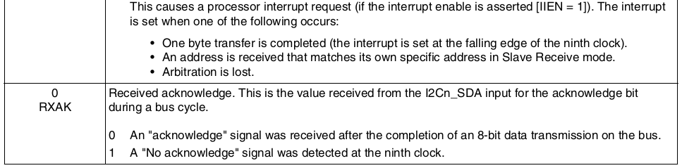

## linux-kernel中i2c的master_xfer驱动实现----基于imx6

### 目录

[TOC]

在I2C驱动中，每个适配器i2c_adapter都有自己的I2C通信方法，在struct i2c_algorithm结构中的master_xfer()函数中实现；i2c_algorithm结构中的关键函数master_xfer()用于产生I2C访问周期需要的信号，以struct i2c_msg结构的格式进行数据传送；

未完成

<!--more-->

**注：**本文含有一些从《IMX6SDLRM.pdf》手册中获取的一些数据信息截图，如有侵权，纯属无意，还请告知，立即删除！

### 简介

http://read.pudn.com/downloads664/sourcecode/embedded/2692975/IMX6SDLRM.pdf

#### 寄存器描述

)

##### I2C Address Register

##### I2C Frequency Divider Register

##### I2C Control Register

##### I2C Status Register

##### I2C Data I/O Register

