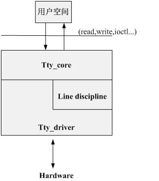
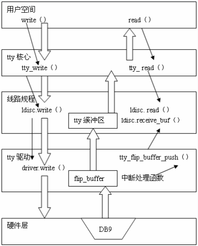

## linux-kernel中的tty驱动

### 目录

[0. 简介](#1-简介)

[1. tty核心](#1-tty核心)

[2. tty线路规程](#2-tty线路规程)

[3. tty驱动](#3-tty驱动)

[4. 总结](#4-总结)

[5. 参考资料](#5-参考资料)


[TOC]


### 0. 简介


TTY 是 Teletypewriter的缩写（Teleprinter、TeletypewriterTele-Type，缩写为 TTY），中文电传打字机简称电传，是远距离打印交换的编写形式；


在linux中tty表示各种终端，通常是和硬件相对应，tty用来指任何的串口设备，如：输入设备键盘鼠标、输出设备显示器、虚拟的pty等；


tty驱动、uart驱动存在密切联系，tty设备包括uart，uart设备的工作依赖于tty设备，uart是tty的上层，内核中有完整的tty驱动，uart设备可以使用tty驱动进行封装；而内核中也有完整的uart驱动，两者相互独立又密切相关；本文主要讲解tty驱动相关的内容，以控制台驱动为例讲述tty驱动的应用，关于uart驱动方面内容，请参考下一文uart驱动；


tty驱动程序的核心在标准字符设备驱动层之下；


linux内核中的tty层次结构，包含：tty核心、tty线路规程、tty驱动；


1. tty核心(tty_core)：整个tty设备的抽象，对用户提供统一的接口，用户空间通过设备文件与tty_core交互；tty_core根据用户空间操作类型，选择将数据交给line discipline和tty_driver；


2. tty线路规程(line discipline)：对传输数据的格式化，把从用户或硬件接收的数据格式化，这种格式化使用协议完成转换，如：蓝牙；处理之后，将数据交给tty_driver；


3. tty驱动(tty_driver)：tty设备对应的驱动，将字符转换成硬件可以理解的字符，将其传给硬件设备；并从硬件接收数据；




2


tty核心和线路规程由内核提供，驱动工程师只需要完成tty驱动部分代码就可以使用tty了；


多数时候tty核心和tty驱动之间的数据传输会经历tty线路规程的转换，但是tty驱动和tty核心之间也可以直接传输数据；tty核心根据操作类型选择和线路规程和tty驱动交互；如：设置硬件的ioctl直接交给tty_driver处理；而read/write操作交给线路规程处理；


1) 发送数据流程：tty核心从用户空间获取到将要发送给tty设备的数据，tty核心将数据传递给tty线路规程驱动，然后数据被传递到tty驱动，tty驱动将数据转换为可以发送给硬件的格式；


2) 接收数据流程：tty硬件将接收到的数据上交给tty驱动，进入tty线路规程驱动，再进入tty核心，被传递给用户空间；


tty驱动程序有三种类型：控制台、串口和pty；控制台和pty驱动程序已经在内核中稳定使用，使用tty核心与用户和系统交互的新驱动都可以看做是串口驱动程序；


tty驱动代码位于drivers/tty目录；


### 1. tty核心


tty核心是所有tty类型驱动的顶层架构，向应用层提供了统一的接口；用户态的open、close、read、write系统调用首先到达tty核心；


tty核心在tty_io.c文件中由内核实现，定义了tty设备需要的核心数据结构，和一些需要操作；


#### 1.1 tty重要数据结构


**1) tty_driver**


tty驱动程序的主要数据结构是struct tty_driver，规定了tty驱动程序和高层之间的编程接口，用来向tty核心注册和注销驱动程序；操作包含在头文件<linux/tty_driver.h>中；


```c
// linux/tty_driver.h
struct tty_driver {
    int magic;      /* magic number for this structure */
    struct kref kref;   /* Reference management */
    struct cdev **cdevs;
    struct module   *owner;
    const char  *driver_name;
    const char  *name;
    int name_base;  /* offset of printed name */
    int major;      /* major device number */
    int minor_start;    /* start of minor device number */
    unsigned int    num;    /* number of devices allocated */
    short   type;       /* type of tty driver */
    short   subtype;    /* subtype of tty driver */
    struct ktermios init_termios; /* Initial termios */
    unsigned long   flags;      /* tty driver flags */
    struct proc_dir_entry *proc_entry; /* /proc fs entry */
    struct tty_driver *other; /* only used for the PTY driver */

    /*
     * Pointer to the tty data structures
     */
    struct tty_struct **ttys;
    struct tty_port **ports;
    struct ktermios **termios;
    void *driver_state;

    /*
     * Driver methods
     */
    const struct tty_operations *ops;
    struct list_head tty_drivers;
};
```


tty设备的所有操作都包含在tty_driver结构体中，内核提供alloc_tty_driver()函数来分配tty_driver结构体，参数是该驱动支持的tty设备的数量；


```c
	// 分配tty驱动程序
	struct tty_driver *normal;
	normal = alloc_tty_driver(nr);
```


alloc_tty_driver()函数的实现如下：


```c
static inline struct tty_driver *alloc_tty_driver(unsigned int lines)
{
    struct tty_driver *ret = tty_alloc_driver(lines, 0);
    if (IS_ERR(ret))
        return NULL;
    return ret;
}

#define tty_alloc_driver(lines, flags) \
        __tty_alloc_driver(lines, THIS_MODULE, flags)

// tty_io.c
struct tty_driver *__tty_alloc_driver(unsigned int lines, struct module *owner,
         unsigned long flags)
{
	struct tty_driver *driver;

	driver = kzalloc(sizeof(struct tty_driver), GFP_KERNEL);
    if (!driver)
        return ERR_PTR(-ENOMEM);
    ......
}
```


申请成功后，alloc_tty_driver()函数将申请到的tty_driver结构体作为返回值返回，之后，需要对tty_driver进行初始化，再通过调用tty_register_driver()来注册进内核；


**2) tty_operations**


tty_operations结构中包含所有的回调函数，被tty驱动程序设置，并被tty核心调用；


```c
// linux/tty_driver.h
struct tty_operations {
    struct tty_struct * (*lookup)(struct tty_driver *driver,
            struct inode *inode, int idx);
    int  (*install)(struct tty_driver *driver, struct tty_struct *tty);
    void (*remove)(struct tty_driver *driver, struct tty_struct *tty);
    int  (*open)(struct tty_struct * tty, struct file * filp);
    void (*close)(struct tty_struct * tty, struct file * filp);
    void (*shutdown)(struct tty_struct *tty);
    void (*cleanup)(struct tty_struct *tty);
    int  (*write)(struct tty_struct * tty,
              const unsigned char *buf, int count);
    int  (*put_char)(struct tty_struct *tty, unsigned char ch);
    void (*flush_chars)(struct tty_struct *tty);
    int  (*write_room)(struct tty_struct *tty);
    int  (*chars_in_buffer)(struct tty_struct *tty);
    int  (*ioctl)(struct tty_struct *tty,
            unsigned int cmd, unsigned long arg);
    long (*compat_ioctl)(struct tty_struct *tty,
                 unsigned int cmd, unsigned long arg);
    void (*set_termios)(struct tty_struct *tty, struct ktermios * old);
    void (*throttle)(struct tty_struct * tty);
    void (*unthrottle)(struct tty_struct * tty);
    void (*stop)(struct tty_struct *tty);
    void (*start)(struct tty_struct *tty);
    void (*hangup)(struct tty_struct *tty);
    int (*break_ctl)(struct tty_struct *tty, int state);
    void (*flush_buffer)(struct tty_struct *tty);
    void (*set_ldisc)(struct tty_struct *tty);
    void (*wait_until_sent)(struct tty_struct *tty, int timeout);
    void (*send_xchar)(struct tty_struct *tty, char ch);
    int (*tiocmget)(struct tty_struct *tty);
    int (*tiocmset)(struct tty_struct *tty,
            unsigned int set, unsigned int clear);
    int (*resize)(struct tty_struct *tty, struct winsize *ws);
    int (*set_termiox)(struct tty_struct *tty, struct termiox *tnew);
	......
};
```


**3) tty_struct**


tty核心使用tty_struct结构保存当前特定tty端口的状态；除了个别成员外基本上所有成员都只能被tty核心使用；


```c
// linux/tty_driver.h
struct tty_struct {
    int magic;
    struct kref kref;
    struct device *dev;
    struct tty_driver *driver;
    const struct tty_operations *ops;
    int index;

    /* Protects ldisc changes: Lock tty not pty */
    struct ld_semaphore ldisc_sem;
    struct tty_ldisc *ldisc;

    /* Termios values are protected by the termios rwsem */
    struct ktermios termios, termios_locked;
    struct termiox *termiox;    /* May be NULL for unsupported */
    char name[64];

    struct tty_struct *link;
    struct fasync_struct *fasync;
    int alt_speed;      /* For magic substitution of 38400 bps */
    wait_queue_head_t write_wait;
    wait_queue_head_t read_wait;

#define N_TTY_BUF_SIZE 4096
    unsigned char *write_buf;
    int write_cnt;
    /* If the tty has a pending do_SAK, queue it here - akpm */
    struct work_struct SAK_work;
    struct tty_port *port;
};
```


tty端口的状态都包含在tty_struct结构体中，内核提供alloc_tty_struct()函数来分配tty_struct结构体，并对成员进行初始化操作，参数是该驱动的tty_driver和设备的索引号；该函数在tty核心中实现并调用，不需要在tty驱动中明确调用；


```c
	// 分配tty驱动程序
	struct tty_struct *tty;
	tty = alloc_tty_struct(driver, idx);
```


#### 1.2 tty的注册和卸载


**1) 注册**


tty驱动的注册，由tty_register_driver()函数完成，用于将串口驱动tty_driver注册到内核；注册时会分配主设备号和次设备号，主设备号对应驱动程序，告知内核需要使用哪个驱动程序驱动该设备，次设备号对应具体的设备；


tty_register_driver()函数用来向内核注册tty设备，根据tty_driver的所有次设备号，创建不同的sysfs文件；会使用fs/char_dev.c中提供的字符设备接口注册字符设备；使用fs/proc/proc_tty.c中的函数创建/proc/tty文件；在使用tty_register_driver()函数注册tty驱动之前，需要先对申请到的tty_driver结构体成员进行初始化；tty_register_driver()函数的参数是已经初始化过的tty_driver结构体指针；


```c
// drivers/tty/tty_io.c
int tty_register_driver(struct tty_driver *driver)
{
	alloc_chrdev_region();
    register_chrdev_region();
    tty_cdev_add();
    list_add(&driver->tty_drivers, &tty_drivers);
    // 注册所控制的设备
    if (!(driver->flags & TTY_DRIVER_DYNAMIC_DEV)) {
        for (i = 0; i < driver->num; i++) {
            d = tty_register_device(driver, i, NULL);
            if (IS_ERR(d)) {
                error = PTR_ERR(d);
                goto err_unreg_devs;
            }
        }
    }
}
```


在tty_cdev_add()函数中，将字符设备操作集指定为tty_fops，之后将tty_driver添加到tty_driver结构体中的tty_drivers链表中，可以通过设备号找到对应的driver；最后通过tty_register_device()函数注册tty驱动所控制的硬件设备；


**2) 卸载**


tty驱动的卸载，由tty_unregister_driver()函数完成，用于注销已注册的tty_driver；


```c
// drivers/tty/tty_io.c
int tty_unregister_driver(struct tty_driver *driver)
{
    unregister_chrdev_region(MKDEV(driver->major, driver->minor_start),
                driver->num);
	list_del(&driver->tty_drivers);
}
```


从注册过程中可以得知，tty设备所有的操作都包含在tty_fops结构体中；


```c
// drivers/tty/tty_io.c
static const struct file_operations tty_fops = {
    .llseek     = no_llseek,
    .read       = tty_read,
    .write      = tty_write,
    .poll       = tty_poll,
    .unlocked_ioctl = tty_ioctl,
    .compat_ioctl   = tty_compat_ioctl,
    .open       = tty_open,
    .release    = tty_release,
    .fasync     = tty_fasync,
};
```


特定的tty设备驱动的主要工作是填充tty_driver结构体中的成员；


#### 1.3 tty的打开和关闭


tty设备的打开和关闭操作，在tty_io.c中实现通过tty_open和tty_release函数实现；tty_open和tty_release函数保持对tty打开的设备计数；


**1) open**


用户态使用open函数打开设备节点时，对应tty_fops结构体中的tty_open函数被调用；tty驱动程序一定要设置open成员操作，否则用户态调用open时，将返回-ENODEV；


```c
static int tty_open(struct inode *inode, struct file *filp)
{
    struct tty_struct *tty;
    struct tty_driver *driver = NULL;
    int index;
    dev_t device = inode->i_rdev;

    nonseekable_open(inode, filp);

retry_open:
    retval = tty_alloc_file(filp);
    if (retval)
        return -ENOMEM;

    tty = tty_open_current_tty(device, filp);
    if (!tty) {
        mutex_lock(&tty_mutex);
        driver = tty_lookup_driver(device, filp, &noctty, &index);

        /* check whether we're reopening an existing tty */
        tty = tty_driver_lookup_tty(driver, inode, index);

        if (tty) {
            mutex_unlock(&tty_mutex);
            retval = tty_lock_interruptible(tty);

            /* safe to drop the kref from tty_driver_lookup_tty() */
            tty_kref_put(tty);
            retval = tty_reopen(tty);

        } else { /* Returns with the tty_lock held for now */
            tty = tty_init_dev(driver, index);
            mutex_unlock(&tty_mutex);
        }

        tty_driver_kref_put(driver);
    }

    tty_add_file(tty, filp);
	......
    if (tty->ops->open)
        retval = tty->ops->open(tty, filp);
    else
        retval = -ENODEV;
    filp->f_flags = saved_flags;
	......
}
```


tty_alloc_file()函数


每一个打开的tty都有一个私有数据tty_file_private结构，在tty_alloc_file()函数中用private_data指针指向该结构；


```c
int tty_alloc_file(struct file *file)
{
    struct tty_file_private *priv;

    priv = kmalloc(sizeof(*priv), GFP_KERNEL);
    if (!priv)
        return -ENOMEM;

    file->private_data = priv;

    return 0;
}
```


```c
// linux/tty.h
/* Each of a tty's open files has private_data pointing to tty_file_private */
struct tty_file_private {
    struct tty_struct *tty;
    struct file *file;
    struct list_head list;
};
```


tty_lookup_driver()函数查找tty_driver链表，找到注册时添加的tty_driver，然后调用tty_driver的ops->open函数打开具体的tty设备；


```c
	struct tty_driver *driver = NULL;
	driver = tty_lookup_driver(device, filp, &noctty, &index);
```


```c
static struct tty_driver *tty_lookup_driver(dev_t device, struct file *filp,
        int *noctty, int *index)
{
	......
    default:
        driver = get_tty_driver(device, index);
        if (!driver)
            return ERR_PTR(-ENODEV);
        break;
    }
    return driver;
}    
```


```c
static struct tty_driver *get_tty_driver(dev_t device, int *index)
{
    struct tty_driver *p;

    list_for_each_entry(p, &tty_drivers, tty_drivers) {
        dev_t base = MKDEV(p->major, p->minor_start);
        if (device < base || device >= base + p->num)
            continue;
        *index = device - base;
        return tty_driver_kref_get(p);
    }
    return NULL;
}
```


tty_reopen()


tty_init_dev()


**2) release**


tty_release()函数通过tty->ops->close操作来关闭tty设备；


```c
int tty_release(struct inode *inode, struct file *filp)
{
    struct tty_struct *tty = file_tty(filp);
    struct tty_struct *o_tty = NULL;
    long    timeout = 0;
	......
    if (tty->ops->close)
        tty->ops->close(tty, filp);

    tty_del_file(filp);

    /*
     * Ask the line discipline code to release its structures
     */
    tty_ldisc_release(tty);

    /* Wait for pending work before tty destruction commmences */
    tty_flush_works(tty);
	......
}
```


#### 1.4 tty的读写


**1) write**


在用户态调用write系统调用函数将数据发送给硬件时，内核将数据和大小发送给tty驱动程序的write操作；


由于tty硬件速度和缓冲区大小等原因，当write时写操作程序处理的数据不能同时发送出去，write函数将返回发送给硬件的字符数；用户态可以通过write系统条用函数的返回值，判断是否写入了所有的数据；


tty设备文件的写操作通过tty_fops结构体中的tty_write函数实现；


```c
static ssize_t tty_write(struct file *file, const char __user *buf,
                        size_t count, loff_t *ppos)
{
    struct tty_struct *tty = file_tty(file);
    struct tty_ldisc *ld;
    ssize_t ret;

    if (tty_paranoia_check(tty, file_inode(file), "tty_write"))
        return -EIO;
    if (!tty || !tty->ops->write ||
        (test_bit(TTY_IO_ERROR, &tty->flags)))
            return -EIO;
    /* Short term debug to catch buggy drivers */
    if (tty->ops->write_room == NULL)
        printk(KERN_ERR "tty driver %s lacks a write_room method.\n",
            tty->driver->name);
    ld = tty_ldisc_ref_wait(tty);
    if (!ld->ops->write)
        ret = -EIO;
    else
        ret = do_tty_write(ld->ops->write, tty, file, buf, count);
    tty_ldisc_deref(ld);
    return ret;
}
```


tty_write()函数通过file_tty(file)从file的私有数据中获取tty_struct结构；并通过tty_ldisc_ref_wait(tty)获取线路规程tty_ldisc结构指针，在do_tty_write(ld->ops->write, tty, file, buf, count)函数中，使用tty_ldisc_ops结构中的ld->ops->write函数，进行具体的写入操作；


```c
static inline ssize_t do_tty_write(
    ssize_t (*write)(struct tty_struct *, struct file *, const unsigned char *, size_t),
    struct tty_struct *tty,
    struct file *file,
    const char __user *buf,
    size_t count)
{
    chunk = 2048;
    if (test_bit(TTY_NO_WRITE_SPLIT, &tty->flags))
        chunk = 65536;

    for (;;) {
        if (copy_from_user(tty->write_buf, buf, size))
            break;
        ret = write(tty, file, tty->write_buf, size);
    }
}
```


在调用do_tty_write()函数前后，会分别使用tty_ldisc_ref_wait()和tty_ldisc_deref()函数增加和减少ldsic的引用计数；因为内部分别调用了ldsem_down_read和ldsem_up_read函数操作&ld->tty->ldisc_sem锁；


```c
ldsem_down_read(&tty->ldisc_sem, MAX_SCHEDULE_TIMEOUT);
ldsem_up_read(&ld->tty->ldisc_sem);
```


在do_tty_write()函数中，默认一次写入数据大小为2048字节，如果设置了TTY_NO_WRITE_SPLIT，可以一次写入65536字节数据；


tty->write_buf，是写操作的临时缓冲区，存放通过copy_from_user从用户空间获取的数据；


tty->write_cnt，是临时缓冲区的大小；


tty_write通过ld->ops->write操作来完成数据的写入操作；


**2) read**


tty设备文件的写操作通过tty_fops结构体中的tty_read函数实现；


```c
static ssize_t tty_read(struct file *file, char __user *buf, size_t count,
            loff_t *ppos)
{
    int i;
    struct inode *inode = file_inode(file);
    struct tty_struct *tty = file_tty(file);
    struct tty_ldisc *ld;

    if (tty_paranoia_check(tty, inode, "tty_read"))
        return -EIO;
    if (!tty || (test_bit(TTY_IO_ERROR, &tty->flags)))
        return -EIO;

    /* We want to wait for the line discipline to sort out in this
       situation */
    ld = tty_ldisc_ref_wait(tty);
    if (ld->ops->read)
        i = ld->ops->read(tty, file, buf, count);
    else
        i = -EIO;
    tty_ldisc_deref(ld);

    if (i > 0)
        tty_update_time(&inode->i_atime);

    return i;
}
```


tty_read()函数通过file_tty(file)从file的私有数据中获取tty_struct结构；并通过tty_ldisc_ref_wait(tty)获取线路规程tty_ldisc结构指针，使用tty_ldisc_ops结构中的ld->ops->read函数，进行具体的读取操作；


ld->ops->read(tty, file, buf, count)


在读取操作前后，会分别使用tty_ldisc_ref_wait()和tty_ldisc_deref()函数增加和减少ldsic的引用计数；因为内部分别调用了ldsem_down_read和ldsem_up_read函数操作&ld->tty->ldisc_sem锁；


ldsem_down_read(&tty->ldisc_sem, MAX_SCHEDULE_TIMEOUT);


ldsem_up_read(&ld->tty->ldisc_sem);


tty_read通过ld->ops->read操作来完成数据的读取操作；


#### 1.5 tty线路设置


用户态要改变线路设置，或者获取当前的线路设置时，只需要调用多个termios用户空间库函数，或者对tty设备节点调用ioctl操作；在tty核心会把这两种操作转换为tty驱动程序的回调函数或ioctl操作；大部分temios用户空间函数会被库函数转换成对tty设备节点的ioctl调用；tty的ioctl调用会被tty核心转换成一系列的set_termios调用；所有的线路设置都封装在termios结构中；


```c
// uapi/asm-generic/termbits.h
struct ktermios {
    tcflag_t c_iflag;       /* input mode flags */
    tcflag_t c_oflag;       /* output mode flags */
    tcflag_t c_cflag;       /* control mode flags */
    tcflag_t c_lflag;       /* local mode flags */
    cc_t c_line;            /* line discipline */
    cc_t c_cc[NCCS];        /* control characters */
    speed_t c_ispeed;       /* input speed */
    speed_t c_ospeed;       /* output speed */
};
```


ktermios结构体用来提供一个线路设置集合，给tty设备提供一个特定的端口，用来设置波特率、数据大小、数据流控设置等；如果驱动中未初始化使用，驱动中会使用tty_std_termios结构体变量；


```c
// tty_io.c
struct ktermios tty_std_termios = { /* for the benefit of tty drivers  */
    .c_iflag = ICRNL | IXON,
    .c_oflag = OPOST | ONLCR,
    .c_cflag = B38400 | CS8 | CREAD | HUPCL,
    .c_lflag = ISIG | ICANON | ECHO | ECHOE | ECHOK |
           ECHOCTL | ECHOKE | IEXTEN,
    .c_cc = INIT_C_CC,
    .c_ispeed = 38400,
    .c_ospeed = 38400
};
```


最终在内核空间tty驱动中会转换为对tty设备节点的ioctl调用；


```c
long tty_ioctl(struct file *file, unsigned int cmd, unsigned long arg)
{
    ......
    if (tty->ops->ioctl) {
        retval = tty->ops->ioctl(tty, cmd, arg);
        if (retval != -ENOIOCTLCMD)
            return retval;
    }
    ld = tty_ldisc_ref_wait(tty);
    retval = -EINVAL;
    if (ld->ops->ioctl) {
        retval = ld->ops->ioctl(tty, file, cmd, arg);
        if (retval == -ENOIOCTLCMD)
            retval = -ENOTTY;
    }
    tty_ldisc_deref(ld);
    return retval;
}
```


### 2. tty线路规程


tty线路规程在tty_ldisc.c文件中由内核实现；不同的tty类型设备，具有不同的线路规程；tty线路规程由内核实现，不需要驱动工程师开发；


在上文tty_read和tty_write函数中可以看出，最后调用了线路规程的read和write操作；


内核用tty_ldisc_ops表示设备的线路规程信息；


```c
// linux/tty_ldisc.h
struct tty_ldisc_ops {
    int magic;
    char    *name;
    int num;
    int flags;

    /*
     * The following routines are called from above.
     */
    int (*open)(struct tty_struct *);
    void    (*close)(struct tty_struct *);
    void    (*flush_buffer)(struct tty_struct *tty);
    ssize_t (*chars_in_buffer)(struct tty_struct *tty);
    ssize_t (*read)(struct tty_struct *tty, struct file *file,
            unsigned char __user *buf, size_t nr);
    ssize_t (*write)(struct tty_struct *tty, struct file *file,
             const unsigned char *buf, size_t nr);
    int (*ioctl)(struct tty_struct *tty, struct file *file,
             unsigned int cmd, unsigned long arg);
    long    (*compat_ioctl)(struct tty_struct *tty, struct file *file,
                unsigned int cmd, unsigned long arg);
    void    (*set_termios)(struct tty_struct *tty, struct ktermios *old);
    unsigned int (*poll)(struct tty_struct *, struct file *,
                 struct poll_table_struct *);
    int (*hangup)(struct tty_struct *tty);

    /*
     * The following routines are called from below.
     */
    void    (*receive_buf)(struct tty_struct *, const unsigned char *cp,
                   char *fp, int count);
    void    (*write_wakeup)(struct tty_struct *);
    void    (*dcd_change)(struct tty_struct *, unsigned int);
    void    (*fasync)(struct tty_struct *tty, int on);
    int (*receive_buf2)(struct tty_struct *, const unsigned char *cp,
                char *fp, int count);

    struct  module *owner;

    int refcount;
};
```


tty_ldisc_ops结构体中不仅有功上层调用的函数指针成员，如：open、read、write等，还有供下层往上层调用的函数指针成员，如：receive_buf、receive_buf2、write_wakeup等；


内核中有一个tty_ldiscs_ops结构体指针数组tty_ldiscs[NR_LDISCS]；NR_LDISCS的值是30，系统在初始化或者安装驱动模块时通过tty_register_ldisc()函数将有关的tty_ldisc_ops结构体注册登记到tty_ldiscs[NR_LDISCS]指针数组中；


```c
// uapi/linux/tty.h
#define NR_LDISCS       30
// tty_ldisc.c
static struct tty_ldisc_ops *tty_ldiscs[NR_LDISCS];
```


控制终端在内核启动时进行初始化，并给显示提供驱动服务，本节以控制终端为例进行说明，控制台对应的tty_ldisc_ops的是tty_ldiscs指针数组中序号为N_TTY的tty_ldisc_N_TTY结构，其中包含了该线路规程的大部分操作；


```c
// n_tty.c
struct tty_ldisc_ops tty_ldisc_N_TTY = {
    .magic           = TTY_LDISC_MAGIC,
    .name            = "n_tty",
    .open            = n_tty_open,
    .close           = n_tty_close,
    .flush_buffer    = n_tty_flush_buffer,
    .chars_in_buffer = n_tty_chars_in_buffer,
    .read            = n_tty_read,
    .write           = n_tty_write,
    .ioctl           = n_tty_ioctl,
    .set_termios     = n_tty_set_termios,
    .poll            = n_tty_poll,
    .receive_buf     = n_tty_receive_buf,
    .write_wakeup    = n_tty_write_wakeup,
    .fasync      = n_tty_fasync,
    .receive_buf2    = n_tty_receive_buf2,
};
```


#### 2.1 注册和卸载


**1) 注册**


tty_register_ldisc()函数用来向内核注册一个新的线路规程，要注册的线路规程，将以索引的形式添加到tty_ldiscs_ops结构体指针数组tty_ldiscs[NR_LDISCS]中；


一个串口可以对应多个已被注册的线路规程，最后调用到哪个线路规程，需要用户在打开串口后使用ioctl()选择；


```c
// tty_ldisc.c
int tty_register_ldisc(int disc, struct tty_ldisc_ops *new_ldisc)
{
    unsigned long flags;
    int ret = 0;

    if (disc < N_TTY || disc >= NR_LDISCS)
        return -EINVAL;

    raw_spin_lock_irqsave(&tty_ldiscs_lock, flags);
    tty_ldiscs[disc] = new_ldisc;
    new_ldisc->num = disc;
    new_ldisc->refcount = 0;
    raw_spin_unlock_irqrestore(&tty_ldiscs_lock, flags);

    return ret;
}
EXPORT_SYMBOL(tty_register_ldisc);
```


在内核启动中kernel_start()函数中，通过console_init()函数初始化控制终端，之后显示屏或者串口打印信息才能够正常打印出来；console_init()函数是通过tty_ldisc_begin()来注册默认的线路规程tty_ldisc_N_TTY的；


```c
void __init console_init(void)
{
    initcall_t *call;

    /* Setup the default TTY line discipline. */
    tty_ldisc_begin();

    call = __con_initcall_start;
    while (call < __con_initcall_end) {
        (*call)();
        call++;
    }
}
```


tty_ldisc_begin()函数用来设置默认的tty线路规程，通过tty_register_ldisc()注册tty_ldisc_ops结构的tty_ldisc_N_TTY；


```c
// uapi/linux/tty.h
#define N_TTY       0

// tty_ldisc.c
void tty_ldisc_begin(void)
{
    /* Setup the default TTY line discipline. */
    (void) tty_register_ldisc(N_TTY, &tty_ldisc_N_TTY);
}
```


**2) 卸载**


tty_unregister_ldisc()函数从内核注销一个线路规程；根据索引将要卸载的线路规程，在tty_ldiscs_ops结构体指针数组tty_ldiscs[NR_LDISCS]中指向NULL；


```c
// tty_ldisc.c
int tty_unregister_ldisc(int disc)
{
    unsigned long flags;
    int ret = 0;

    if (disc < N_TTY || disc >= NR_LDISCS)
        return -EINVAL;

    raw_spin_lock_irqsave(&tty_ldiscs_lock, flags);
    if (tty_ldiscs[disc]->refcount)
        ret = -EBUSY;
    else
        tty_ldiscs[disc] = NULL;
    raw_spin_unlock_irqrestore(&tty_ldiscs_lock, flags);

    return ret;
}
EXPORT_SYMBOL(tty_unregister_ldisc);
```


#### 2.2 打开和关闭


**1) open**

在tty核心的打开操作中会调用打开线路规程，该操作主要是申请一些资源，并对一些线路规程的数据进行初始化；申请n_tty_data结构体，read_buf成员作为读取缓冲区；

```c
// n_tty.c
static int n_tty_open(struct tty_struct *tty)
{
    struct n_tty_data *ldata;

    /* Currently a malloc failure here can panic */
    ldata = vzalloc(sizeof(*ldata));
    if (!ldata)
        return -ENOMEM;

    ldata->overrun_time = jiffies;
    mutex_init(&ldata->atomic_read_lock);
    mutex_init(&ldata->output_lock);

    tty->disc_data = ldata;
    tty->closing = 0; 
    /* indicate buffer work may resume */
    clear_bit(TTY_LDISC_HALTED, &tty->flags);
    n_tty_set_termios(tty, NULL);
    tty_unthrottle(tty);
    return 0;
}
```

n_tty_data结构体中的read_buf缓冲区是线性数组，但是却是作为环形缓冲区使用的；

```c
// n_tty.c
struct n_tty_data {
    /* producer-published */
    size_t read_head;
    
    /* shared by producer and consumer */
    char read_buf[N_TTY_BUF_SIZE];
    
    /* consumer-published */
    size_t read_tail;
}
```

```c
tty->read_buf[]	// 环形缓冲区；
tty->read_tail	// 指向缓冲区当前可以读取的第一个字符；
tty->read_head	// 指向缓冲区当前可以写入的第一个地址；
```

tty_unthrottle()函数，打开缓冲区阀门，使缓冲区能够接收到硬件发送过来的数据；


**2) close**

同样线路规程的关闭操作中，主要是释放申请的变量资源；

```c
static void n_tty_close(struct tty_struct *tty)
{
    struct n_tty_data *ldata = tty->disc_data;

    if (tty->link)
        n_tty_packet_mode_flush(tty);

    vfree(ldata);
    tty->disc_data = NULL;
}
```


#### 2.3 写入和读取


从上文tty核心中的读写函数可以看出，tty_read和tty_write函数内部调用的是线路规程的read和write操作；


**1) write**


```c
// tty_io.c
static ssize_t tty_write(struct file *file, const char __user *buf,
                        size_t count, loff_t *ppos)
{
    struct tty_struct *tty = file_tty(file);
    struct tty_ldisc *ld;

    ld = tty_ldisc_ref_wait(tty);
    if (!ld->ops->write)
        ret = -EIO;
    else
        ret = do_tty_write(ld->ops->write, tty, file, buf, count);
    tty_ldisc_deref(ld);
	......
}
```


在tty_write()函数中，通过tty_ldisc_ref_wait()函数从tty_struct结构体中获取到tty_ldisc结构指针，在do_tty_write(ld->ops->write, tty, file, buf, count)函数中，使用tty_ldisc_ops结构中的ld->ops->write函数完成tty的write操作；


tty_ldisc_ref_wait()和tty_ldisc_deref()函数增加和减少ldsic的引用计数；因为内部分别调用了ldsem_down_read和ldsem_up_read函数操作&ld->tty->ldisc_sem锁；


```c
ldsem_down_read(&tty->ldisc_sem, MAX_SCHEDULE_TIMEOUT);
ldsem_up_read(&ld->tty->ldisc_sem);
```


在默认的终端设备中，ld->ops->write对应的是tty_ldisc_N_TTY结构中的n_tty_write()函数；


```c
// n_tty.c
static ssize_t n_tty_write(struct tty_struct *tty, struct file *file,
               const unsigned char *buf, size_t nr)
{
    const unsigned char *b = buf;
    int c;
	......
    struct n_tty_data *ldata = tty->disc_data;

    while (nr > 0) {
        mutex_lock(&ldata->output_lock);
        c = tty->ops->write(tty, b, nr);
        mutex_unlock(&ldata->output_lock);
        if (c < 0) {
            retval = c;
            goto break_out;
        }
        if (!c)
            break;
        b += c;
        nr -= c;
    }
	......
}
```


n_tty_write()函数中通过tty->ops->write(tty, b, nr)将数据写入控制终端；


以串口uart驱动为例；tty->ops->write，是tty_struct结构体中tty_operations中的write函数uart_write；而tty_operations结构体是在uart_register_driver()时，对tty_driver结构体初始化时，使用tty_set_operations()函数设置的；


```c
// serial_core.c
int uart_register_driver(struct uart_driver *drv)
{
    struct tty_driver *normal;
    normal = alloc_tty_driver(drv->nr);
    if (!normal)
        goto out_kfree;
    ......
    tty_set_operations(normal, &uart_ops);
    ......
}
```


tty_set_operations()函数就是将tty_operations结构体赋值给tty_driver结构体中的ops指针；


```c
// tty_io.c
void tty_set_operations(struct tty_driver *driver,
            const struct tty_operations *op)
{
    driver->ops = op;
};
```


至于uart_write()函数的实现，在下一文uart驱动中进行说明，此处略过；


**2) read**


```c
// tty_io.c
static ssize_t tty_read(struct file *file, char __user *buf, size_t count,
            loff_t *ppos)
{
    struct tty_struct *tty = file_tty(file);
    struct tty_ldisc *ld;

    /* We want to wait for the line discipline to sort out in this
       situation */
    ld = tty_ldisc_ref_wait(tty);
    if (ld->ops->read)
        i = ld->ops->read(tty, file, buf, count);
    else
        i = -EIO;
    tty_ldisc_deref(ld);
	......
}
```


在tty核心层的tty_read()函数中，通过tty_ldisc_ref_wait()函数从tty_struct结构体中获取到tty_ldisc结构指针，直接使用tty_ldisc_ops结构中的ld->ops->read函数完成tty的read操作，从而进入到驱动的下一层，tty线路规程；


```c
ld->ops->read(tty, file, buf, count)
```


```c
// n_tty.c
struct tty_ldisc_ops tty_ldisc_N_TTY = {
    .name            = "n_tty",
    .read            = n_tty_read,
    .write           = n_tty_write,
};
```


在控制台中，ld->ops->read对应的是tty_ldisc_N_TTY结构中的n_tty_read()函数；n_tty_read()函数与n_tty_write()不同，不是通过下一层的read函数实现（如：uart_write），n_tty_read()函数是从缓冲区中读取数据的，函数实现比较长，n_tty_read()函数的详细，请参考下一文；


在n_tty_read()函数中进行一些校验和读取进程的休眠和唤醒操作，最终通过canon_copy_from_read_buf()函数或canon_copy_from_read_buf()函数，将数据从缓冲区中读取到用户空间；


```c
static ssize_t n_tty_read(struct tty_struct *tty, struct file *file,
             unsigned char __user *buf, size_t nr)
{
    	......
        if (ldata->icanon && !L_EXTPROC(tty)) {
            retval = canon_copy_from_read_buf(tty, &b, &nr);
            if (retval)
                break;
        } else {
            int uncopied;

            uncopied = copy_from_read_buf(tty, &b, &nr);
            uncopied += copy_from_read_buf(tty, &b, &nr);
            if (uncopied) {
                retval = -EFAULT;
                break;
            }
        }
    	......
}
```


### 3. tty驱动


具体的tty设备的驱动程序，由驱动开发者来实现；本文以创建一个小型tty驱动程序为例，能够加载、卸载，并对其进行读写操作；


终端设备驱动都围绕tty_driver结构开始；终端设备驱动应包含：


1. 终端设备驱动模块加载函数和卸载函数，完成注册和注销tty_driver，初始化和释放终端设备对应的tty_driver结构体成员及硬件资源；

2. 实现tty_operations结构体中的成员函数，主要实现open()、close()、read()、write()、tiocmget()、tiocmset()函数等；


#### 3.1 模块加载和卸载


tty驱动的模块加载函数中通常需要分配和初始化tty_driver结构体，并申请必要的硬件资源；


```c
static int tiny_init(void)
{
    struct tty_driver *tiny_tty_driver;
    unsigned int i;

    tiny_tty_driver = alloc_tty_driver(TINY_TTY_MINORS);
    if (!tiny_tty_driver)
        return -ENOMEM;

    tiny_tty_driver->driver_name = "tiny_tty";
    tiny_tty_driver->name        = "ttty";
    tiny_tty_driver->major       = TINY_MAJOR;
    tiny_tty_driver->minor_start = TINY_MINOR;
    tiny_tty_driver->type        = TTY_DRIVER_TYPE_SERIAL;
    tiny_tty_driver->subtype     = SERIAL_TYPE_NORMAL;
    tiny_tty_driver->init_termios    = tty_std_termios;
    tiny_tty_driver->init_termios.c_cflag = B9600 | CS8 | CREAD | HUPCL | CLOCAL;
    tiny_tty_driver->init_termios.c_ispeed = 9600;
    tiny_tty_driver->flags       = TTY_DRIVER_REAL_RAW | TTY_DRIVER_DYNAMIC_DEV;
    tty_set_operations(tiny_tty_driver, &tty_serial_ops);

    retval = tty_register_driver(tiny_tty_driver);
	if (retval) {
        put_tty_driver(tiny_tty_driver);
		return retval;        
    }
    
    for (i = 0; i < TINY_TTY_MINORS; i++) {
        tty_register_device(tiny_tty_driver, i, NULL);
    }
    ......
}
```


``` c
static struct tty_operations tiny_serial_ops = {
    .open = tiny_open,
    .close = tiny_close,
    .write = tiny_write,
    .write_room = tiny_write_room,
    .set_termios = tiny_set_termios,
};
```


tty驱动的模块卸载函数，完成加载函数相反的工作；


```c
void tiny_exit(void)
{
    struct tty_driver *tiny_tty_driver = get_tty_driver();
    unsigned int i;
    
    for (i = 0; i < TINY_TTY_MINORS; i++) {
        tty_unregister_device(tiny_tty_driver, i);
    }
    
    tty_unregister_driver(tiny_tty_driver);
}
```


#### 3.2 模块的打开和关闭


**1) open**


在用户态使用open()系统调用函数操作tty驱动创建的设备节点时，tty核心tty_driver的file_operations结构体中的open()成员函数被调用；用户在执行open()函数后，可以得到一个表示该文件的句柄，用来表示该文件；


```c
static int tiny_open(struct tty_struct *tty, struct file *filp)
{
 	struct tiny_serial *tiny;
    struct timer_list *timer;
    
    tty->driver_data = NULL;
    index = tty->index;
    tiny = tiny_table[index];
    if (tiny == NULL) {
        tiny = kmalloc(sizeof(*tiny), GFP_KERNEL);
        if (!tiny) {
            return -ENOMEM;
        }
        init_MUTEX(&tiny->sem);
        tiny->open_count = 0;
        tiny->timer = NULL;
        
        tiny_table[index] = tiny;
    }
    down(&tiny->sem);
    
    tty->driver_data = tiny;
    tiny->tty = tty;
    ......    
}
```


tty->driver_data保存了tiny_serial结构，该结构包含tiny模块所需要的一些成员，保存在tty_struct结构体的driver_data指针，以后在tiny模块中别的函数也可以很方便地使用；


```c
struct tiny_serial {
    struct tty_struct *tty;	// 指向该设备的tty指针
    int open_count;	// 该端口被打开的次数
    struct semaphore sem;	// 锁，可以锁住该结构
    struct timer_list *timer;
};
```


为了能使多个进程读写数据，tty驱动程序的open和close函数可能会被多次调用，因此需要使用open_count在open和close时进行计数；当端口第一次被打开时，可以对所需要的任何硬件初始化及分配所需要的内存，当端口最后一次被关闭时，可以关闭所有硬件，并清理掉所有分配的内存；


```c
	tiny->open_count++;
	if (tiny->open_count == 1) {
        // 该端口第一次打开
        // 对所需要的任何硬件初始化及分配所需要的内存
    }
```


**2) close**


在open()时生成的文件句柄，在用户态使用close()系统调用操作该文件句柄时，tty_driver驱动中file_operations结构体中的close()成员函数被调用，此时设备将被关闭；和open()函数对应，close()函数可能多次调用，在close()中需要open_count进行计数；


```c
static void tiny_close(struct tty_struct *tty, struct file *filp)
{
    struct tiny_serial *tiny;
    
    tiny = tty->driver_data;
    if (!tiny) {
        return;        
    }
    down(&tiny->sem);
    if (!tiny->open_count) {
        goto exit;
    }
    tiny->open_count--;
    if (tiny->open_count <= 0) {
        // 最后一个用户已经关闭端口
        // 关闭所有硬件，并清理掉所有分配的内存
        
        del_timer(tiny->timer);
    }
exit:
    up(&tiny->sem);
	return;
}
```


#### 3.3 数据的发送和接收


**1) write**


在用户态使用write()系统调用发送数据给终端设备时，通过write-->tty核心-->tty线路规程调用-->tty驱动，最终通过tty驱动程序中file_operations结构体中的write()成员函数来完成发送；


有时由于tty硬件速度或缓存大小的原因，write()函数被调用时，写操作程序所处理的数据不能同时都发送出去，write()函数将返回发送给硬件的字符数；用户空间可以检查write()函数返回值判断是否写入了所有数据；


tiny驱动并没有链接真正的硬件，只是在内核调试日志中记录需要写入的数据；


```c
static int tiny_write(struct tty_struct *tty,
                    const unsigned char *buf, int count)
{
    struct tiny_serial *tiny;
    int i;
    
    tiny = tty->driver_data;
    if (!tiny) {
        return -ENODEV;        
    }
    
    down(&tiny->sem);
    if (!tiny->open_count) {
        goto exit;
    }
    
    for (i = 0; i < count; i++) {
        printk("%02x ", buf[i]);
    }
    printk("\n");
exit:
    up(&tiny->sem);
    
    return i;
}
```


tty子系统将数据传送到tty设备之外时可以使用write()函数；


**2) read**


tty_driver结构中没有提供read()函数，因为发送数据是用户主动发起的，而接收数据则是用户态读取一片缓冲区中已放好的数据；在tty核心中提供了缓冲逻辑，tty驱动中并不是必须实现自身的缓冲逻辑；


#### 3.4 串口驱动举例


tty类型的驱动，以串口驱动为例，在serial_core.c文件中实现；


参考下一文----uart驱动；


### 4. 总结





### 5. 参考资料


《Linux内核情景分析》----控制态驱动


《Linux设备驱动程序》


笔记计划：

1. tty驱动-->控制台驱动


2. uart驱动-->8250驱动


3. 键盘驱动-->PS/2键盘	-->usb键盘
4. usb转串口驱动


[回到目录](#目录)