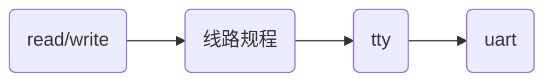
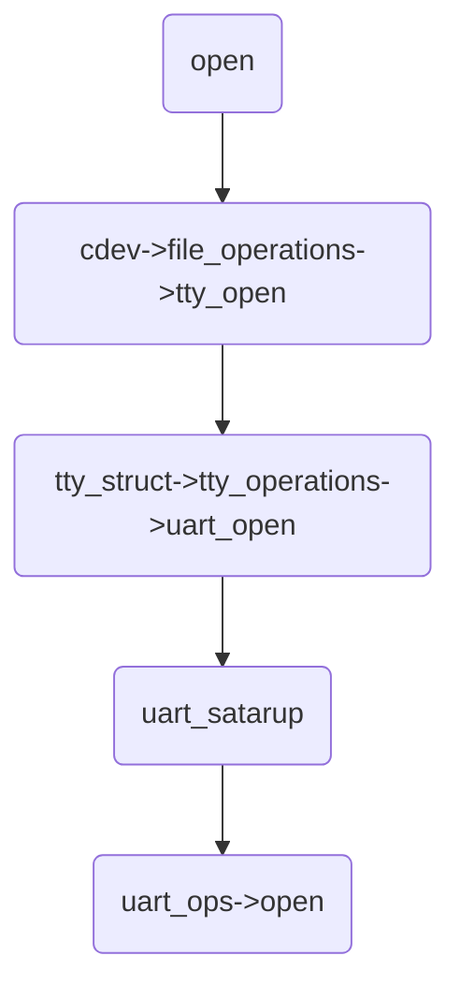

# linux-kernel中的uart驱动

### 目录

[TOC]

uart驱动程序是字符设备驱动程序，但是uart不像其他常见的字符设备驱动程序那样，直接将接口提供给内核系统调用；uart驱动程序提供服务给另一个内核层：tty层；I/O系统调用从顶层的线路规程开始，通过tty层，到达uart驱动程序层；




### uart驱动程序

uart驱动位于drivers/tty/serial目录；

uart驱动程序有三个重要数据结构：


| 数据结构           | 说明                                   |

| ------------------ | -------------------------------------- |

| struct uart_driver | uart驱动程序结构                       |

| struct uart_port   | uart驱动的端口信息                     |

| struct uart_ops    | uart驱动支持的物理硬件上可完成的操作集 |


#### uart_driver

uart_driver包含了串口设备名、串口驱动名、主次设备号、串口控制台等信息；还封装了底层串口驱动tty_driver；

```c
// include/linux/serial_core.h
struct uart_driver {
    struct module       *owner;	// 该模块的拥有者，一般为THIS_MODULE
    const char      *driver_name;	// 串口驱动名，串口设备文件名以驱动名为基础
    const char      *dev_name;	// 串口设备名
    int          major;
    int          minor;
    int          nr;	// 该uart_driver支持串口的最大个数
    struct console      *cons;	// 对应的console
	---------------------------
    struct uart_state   *state;
    struct tty_driver   *tty_driver;
};
```


##### uart驱动的注册和注销

uart驱动的注册，由uart_register_driver()函数完成，用于将串口驱动uart_driver注册到内核（串口核心层），通常在模块初始化函数调用该函数；

```c
// drivers/tty/serial/serial_core.c
int uart_register_driver(struct uart_driver *drv)
{
    struct tty_driver *normal;
    int i, retval;
    BUG_ON(drv->state);
    /*
     * Maybe we should be using a slab cache for this, especially if
     * we have a large number of ports to handle.
     */
    drv->state = kzalloc(sizeof(struct uart_state) * drv->nr, GFP_KERNEL);
    if (!drv->state)
        goto out;
    normal = alloc_tty_driver(drv->nr);
    if (!normal)
        goto out_kfree;
    drv->tty_driver = normal;
    normal->driver_name = drv->driver_name;
    normal->name        = drv->dev_name;
    normal->major       = drv->major;
    normal->minor_start = drv->minor;
    normal->type        = tty_DRIVER_TYPE_SERIAL;
    normal->subtype     = SERIAL_TYPE_NORMAL;
    normal->init_termios    = tty_std_termios;
    normal->init_termios.c_cflag = B9600 | CS8 | CREAD | HUPCL | CLOCAL;
    normal->init_termios.c_ispeed = normal->init_termios.c_ospeed = 9600;
    normal->flags       = tty_DRIVER_REAL_RAW | tty_DRIVER_DYNAMIC_DEV;
    normal->driver_state    = drv;
    tty_set_operations(normal, &uart_ops);
    /*
     * Initialise the uart state(s).
     */
    for (i = 0; i < drv->nr; i++) {
        struct uart_state *state = drv->state + i;
        struct tty_port *port = &state->port;
        tty_port_init(port);
        port->ops = &uart_port_ops;
    }
    retval = tty_register_driver(normal);
    if (retval >= 0)
        return retval;
    for (i = 0; i < drv->nr; i++)
        tty_port_destroy(&drv->state[i].port);
    put_tty_driver(normal);
out_kfree:
    kfree(drv->state);
out:
    return -ENOMEM;
}
```

uart驱动的卸载，由uart_unregister_driver()函数完成，用于注销已注册的uart_driver，通常在模块卸载函数中调用该函数；

```c
// drivers/tty/serial/serial_core.c
void uart_unregister_driver(struct uart_driver *drv)
{
    struct tty_driver *p = drv->tty_driver;
    unsigned int i;
    tty_unregister_driver(p);
    put_tty_driver(p);
    for (i = 0; i < drv->nr; i++)
        tty_port_destroy(&drv->state[i].port);
    kfree(drv->state);
    drv->state = NULL;
    drv->tty_driver = NULL;
}
```

在uart_register_driver()和uart_unregister_driver()函数中，分别调用了tty_register_driver()和tty_unregister_driver()函数；


#### uart_port

uart_port用于描述一个uart端口的I/O端口、I/O内存地址、FIFO大小、端口类型等信息，uart驱动程序拥有的每个端口都有一个uart_port的描述；

```c
// include/linux/serial_core.h
struct uart_port {
    spinlock_t      lock;           /* port lock */
    unsigned long       iobase;         /* in/out[bwl] */
    unsigned char __iomem   *membase;       /* read/write[bwl] */
    										// IO内存基地址，经映射后的IO内存虚拟基地址
    unsigned int        (*serial_in)(struct uart_port *, int);
    void            (*serial_out)(struct uart_port *, int, int);
    void            (*set_termios)(struct uart_port *,
                               struct ktermios *new,
                               struct ktermios *old);
	......
};
```


##### uart端口的添加和删除

在注册uart_driver之后，需要为串口驱动添加一个串口端口，由uart_add_one_port()函数完成，通常在探测到设备后（驱动的设备probe方法）调用该函数；

```c
// drivers/tty/serial/serial_core.c
int uart_add_one_port(struct uart_driver *drv, struct uart_port *uport);
```

uport：要添加的串口端口

uart_remove_one_port()函数用于删除一个已添加到串口驱动中的串口端口，通常在驱动卸载时调用该函数；

```c
// drivers/tty/serial/serial_core.c
int uart_remove_one_port(struct uart_driver *drv, struct uart_port *uport);
```


#### uart_ops

uart驱动程序必须支持的物理硬件上可完成的操作函数集用uart_ops描述；

```c
// include/linux/serial_core.h
struct uart_ops {
    unsigned int    (*tx_empty)(struct uart_port *);
    void        (*set_mctrl)(struct uart_port *, unsigned int mctrl);
    unsigned int    (*get_mctrl)(struct uart_port *);
    void        (*stop_tx)(struct uart_port *);
    void        (*start_tx)(struct uart_port *);
    void        (*throttle)(struct uart_port *);
    void        (*unthrottle)(struct uart_port *);
    void        (*send_xchar)(struct uart_port *, char ch);
    void        (*stop_rx)(struct uart_port *);
    void        (*enable_ms)(struct uart_port *);
    void        (*break_ctl)(struct uart_port *, int ctl);
    int     (*startup)(struct uart_port *);
    void        (*shutdown)(struct uart_port *);
    void        (*flush_buffer)(struct uart_port *);
    void        (*set_termios)(struct uart_port *, struct ktermios *new,
                       struct ktermios *old);
    void        (*set_ldisc)(struct uart_port *, struct ktermios *);
    void        (*pm)(struct uart_port *, unsigned int state,
                  unsigned int oldstate);
	......
};
```


#### 创建

uart驱动程序为了将自身和内核联系起来，必须完成两个重要步骤：

1）通过uart_register_driver()函数，向串行核心注册；

2）通过uart_add_one_port()函数，注册其支持的每个端口；如果串行硬件支持热插拔，那么探测到设备存在后，从入口点向核心注册；


### tty驱动


linux内核中的tty层次结构，包含：tty核心、tty线路规程、tty驱动；

tty核心(tty_core)：整个tty设备的抽象，对用户提供统一的接口，用户空间通过设备文件与tty_core交互；tty_core根据用户空间操作类型，选择将数据交给line discipline和tty_driver；

tty线路规程(line discipline)：对传输数据的格式化，把从用户或硬件接收的数据格式化，这种格式化使用协议完成转换，如：蓝牙；处理之后，将数据交给tty_driver；

tty驱动(tty_driver)：tty设备对应的驱动，将字符转换成硬件可以理解的字符，将其传给硬件设备；并从硬件接收数据；

发送数据流程：tty核心从用户空间获取到将要发送给一个tty设备的数据，tty核心将数据传递给tty线路规程驱动，然后数据被传递到tty驱动，tty驱动将数据转换为可以发送给硬件的格式；

接收数据流程：tty硬件将接收到的数据上交给tty驱动，进入tty线路规程驱动，再进入tty核心，被传递给用户空间；

多数时候tty核心和tty驱动之间的数据传输会经历tty线路规程的转换，但是tty驱动和tty核心之间也可以直接传输数据；


#### tty_driver

tty驱动程序的主要数据结构是struct tty_driver，规定了tty驱动程序和高层之间的编程接口，用来向tty核心注册和注销驱动程序；操作包含在头文件<linux/tty_driver.h>中；


##### tty驱动的注册和注销

tty驱动的注册，由tty_register_driver()函数完成，用于将串口驱动tty_driver注册到内核；

类似uart驱动程序，tty驱动程序也需要完成两个步骤才能向内核注册；

1. 调用tty_register_driver()向tty核心注册自身；

2. 注册它支持的每个单独的tty；

   tty_register_device();


### 线路规程


### 串口驱动操作

需要上图


#### open

1. 用户态使用open()函数打开设备节点；

2. 内核调用cdev结构中的file_operations中的tty_open；

3. tty_open函数调用tty_struct结构中的tty_operations中的uart_open；

4. uart_open函数调用uart_satarup；

5. uart_satarup函数调用uart_ops结构中的具体文件操作函数；



uart_ops结构中的具体文件操作函数，主要完成以下功能

1. 使能串口接收功能

2. 为数据的接收注册中断处理函数

3. 使能串口发送功能

4. 为数据的发送注册中断处理函数

#### read

1. 用户态使用read()函数从串口设备节点读取数据；

2. 内核调用cdev结构中的file_operations中的tty_read；

3. tty_read函数调用tty_ldisc_tty结构中的read指向的n_tty_read函数；

#### write

1. 用户态使用write()函数将数据写入串口设备节点；

2. 内核调用cdev结构中的file_operations中的tty_write；

3. tty_read函数调用tty_ldisc_tty结构中的write指向的n_tty_write；

4. n_tty_write函数调用uart_tty结构中的write指向的uart_write；

5. uart_write函数调用uart_startup；

6. uart_startup函数会调用uart_port结构中的ops操作集中的文件发送函数；


